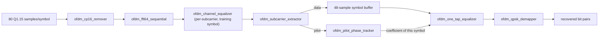

# Lab 8.14 — OFDM RTL: mapper to equalized loopback

## Goal

Take the [Lab 8.5](/zynq-sdr-course/en/labs/lab-8-5-ofdm-mini-link/) OFDM mini-link from a floating-point Python model to a synthesizable, self-checked fixed-point datapath: QPSK mapper, subcarrier allocator/extractor, a streaming radix-2 64-point IFFT/FFT, cyclic-prefix insertion/removal and a one-tap equalizer, each with its own Icarus Verilog testbench, composed into a full TX-to-RX digital loopback and a channel-equalized loopback.

This lab is the software/RTL half of issue #48. Read the [evidence boundary](#what-this-lab-does-and-does-not-prove) before treating any result here as a hardware measurement — it is not one.

## Why a second, RTL-level model of the same chain

[Lab 8.5](/zynq-sdr-course/en/labs/lab-8-5-ofdm-mini-link/) already proves the OFDM algorithm works in floating point. That is not the same claim as "this runs on the FPGA fabric." Every stage here exists twice, on purpose:

- once as a bit-exact Q1.15 fixed-point Python model (`tools/ofdm_ifft_fixed.py`, `tools/ofdm_fft_fixed.py`, `tools/ofdm_equalizer_fixed.py`) that tracks every rounding and saturation decision explicitly;
- once as synthesizable Verilog that is checked against the *same* committed vectors as that fixed-point model, not just against its own testbench's expectations.

That second copy is what makes "the RTL is correct" a falsifiable claim instead of an assumption. The `verification/vectors/block08_ofdm_*.mem` files are the shared ground truth: `tests/test_ofdm_ifft_fixed.py`, `tests/test_ofdm_fft_fixed.py` and `tests/test_ofdm_tx_fixed.py` check the Python model against them, and `tb_ofdm_ifft64_sequential.sv`/`tb_ofdm_fft64_sequential.sv` check the RTL against the same files — so a mismatch between Python and RTL cannot hide.

## TX chain


```mermaid
flowchart LR
    BITS["48 QPSK bit pairs"] --> MAP[ofdm_qpsk_mapper]
    MAP --> ALLOC[ofdm_subcarrier_allocator]
    ALLOC --> IFFT[ofdm_ifft64_sequential]
    IFFT --> CP[ofdm_cp16_inserter]
    CP --> OUT["80 Q1.15 samples/symbol"]
```

| Block | Role | Fixed-point / timing contract |
|---|---|---|
| `ofdm_qpsk_mapper.v` | 2 bits -> one Q1.15 QPSK symbol, matching Lab 8.5's `qpsk_from_bits` sign convention | magnitude `round(32767/sqrt(2)) = 23170`; 1-cycle latency |
| `ofdm_subcarrier_allocator.v` | Places 48 data symbols into a natural-order 64-bin IFFT frame and inserts the four pilot values (`pilot_ref = [+1,+1,+1,-1]`) at `k = -21,-7,+7,+21`, exactly like Lab 8.5's frequency-domain layout | collects 48 symbols, then emits bins 0..63; no new frame accepted mid-emission |
| `ofdm_ifft64_sequential.v` | Streaming radix-2 DIT IFFT, one `ofdm_ifft_butterfly` instance reused for all 6 stages x 32 butterflies | each butterfly divides by 2 -> normalized `1/64` scale; `total_saturation_count` accumulates clipped final components across all 192 butterflies |
| `ofdm_cp16_inserter.v` | Prepends samples `[48..63]` as the cyclic prefix | emits 80 samples/symbol (`out_is_cp` high for indices 0..15); `frame_error` if the input symbol was short |

`ofdm_tx_mapper_ifft_path.v` composes mapper -> allocator -> IFFT; `ofdm_tx_cp16_path.v` adds the CP stage and is the complete TX baseline used by the loopback tests below.

## RX chain


```mermaid
flowchart LR
    IN["80 Q1.15 samples/symbol"] --> CPR[ofdm_cp16_remover]
    CPR --> FFT[ofdm_fft64_sequential]
    FFT --> CEQ["ofdm_channel_equalizer (per-subcarrier, training symbol)"]
    CEQ --> EXT[ofdm_subcarrier_extractor]
    EXT -->|data| BUF["48-sample symbol buffer"]
    EXT -->|pilot| PILOT[ofdm_pilot_phase_tracker]
    BUF --> EQ[ofdm_one_tap_equalizer]
    PILOT -->|"coefficient of this symbol"| EQ
    EQ --> DEMAP[ofdm_qpsk_demapper]
    DEMAP --> BITS["recovered bit pairs"]
```

| Block | Role | Fixed-point / timing contract |
|---|---|---|
| `ofdm_cp16_remover.v` | Drops the 16-sample prefix, forwards samples 16..79 unchanged | fully backpressured on the 64 useful samples |
| `ofdm_fft64_sequential.v` | Scaled forward FFT, built by reusing the IFFT core via `FFT(x)/N = conj(IFFT(conj(x)))` | rare Q1.15 endpoint clips from conjugating `-32768` are counted, not hidden |
| `ofdm_subcarrier_extractor.v` | Splits the 64 bins into 48 data, 4 pilot and 12 null/guard carriers -- the exact inverse of the allocator's layout | data and pilot are independently backpressured sinks; a stalled pilot sink cannot stall data (or vice versa) |
| `ofdm_pilot_phase_tracker.v` | Turns each symbol's four pilots into a Q2.14 phase-correction coefficient (vectoring + rotation CORDIC) | sign-only pilot references, 14 CORDIC iterations, `pilot_ready` low for 31 cycles per symbol; bit-exact with `tools/ofdm_pilot_phase_tracker_fixed.py` |
| `ofdm_channel_equalizer.v` | Estimates `H[k]` on every used carrier from a training symbol and removes its phase from later symbols | `G = Y*conj(sign X)` (additions only); `NORMALIZE = 0`: `Z = Y*conj(G) >> 4`, amplitude not normalized, 3-clock pipeline; `NORMALIZE = 1`: zero-forcing `2^14 * Y/G` with a CORDIC `1/abs(G)^2` per bin, 7-clock pipeline; bit-exact with `tools/ofdm_channel_equalizer_fixed.py` |
| `ofdm_pilot_phase_corrector.v` | Wires the tracker to the equalizer: buffers one symbol's data and applies the coefficient of that same symbol | 48-entry buffer; `data_ready` and `pilot_ready` stay low while the buffer drains, so latency is one symbol plus the tracker's 31 clocks; tracker and equalizer arithmetic unchanged |
| `ofdm_one_tap_equalizer.v` | Multiplies each data symbol by an externally supplied Q2.14 correction coefficient | Q1.15 x Q2.14 -> Q3.29, rounded to Q15 (nearest, half-LSB away from zero), then saturated; `saturation_count` is cumulative from reset |
| `ofdm_cfo_corrector.v` | Time-domain CFO correction before CP removal (stage 2e) | CP correlation accumulated over symbols, 20-step vectoring CORDIC, 32-bit NCO, pipelined 16-step rotation CORDIC; bit-exact with `tools/ofdm_cfo_corrector_fixed.py` |
| `ofdm_qam16_demapper.v` | Gray 16-QAM slicer (stage 2e) | needs the zero-forcing equalizer; threshold `2^14/3 = 5461` |
| `ofdm_qpsk_demapper.v` | Hard-decision inverse of the mapper | transparent ready/valid, zero maps to bit `0` exactly like the Python reference |

## Fixed-point contract, in one place

Every sample in this chain is signed Q1.15 (`±1` represented as `±32767`/`-32768`, the usual asymmetric two's-complement endpoint). The one deliberate exception is the equalizer's correction coefficient, Q2.14, so a correction gain up to almost 2.0 can be represented without silently rescaling the signal path. Every arithmetic stage that can lose precision or range -- IFFT/FFT butterflies, the equalizer's complex multiply -- rounds explicitly (nearest, half-LSB away from zero) and saturates explicitly, and every saturation is *counted*, not just clamped: `total_saturation_count` on the TX/IFFT side, `total_saturation_count` + `conjugation_saturation_count` on the FFT side, `saturation_count` on the equalizer. That satisfies issue #48's "explicit scaling, saturation and overflow counters" requirement directly, and it is what makes the acceptance criterion below checkable rather than assumed:

> "No undocumented saturation at the selected back-off."

Every loopback test below asserts every one of these counters is exactly zero, and would fail loudly if any stage clipped silently.

## Streaming contract

Every block uses one clock, synchronous active-low reset, and a single-register ready/valid handshake: a producer must hold `valid` and its data stable until `ready` is also high, and a consumer's `ready` can depend combinationally on its own occupancy but not create a combinational loop back through `valid`. This is deliberately the same discipline the QPSK modem chain elsewhere in this course already uses. Inside the chain the signal names stay `valid`/`ready`/`re`/`im`/`index`/`last`; `ofdm_axi_modem.v` is the AXI packaging around the whole TX and RX chains:

| Interface | Format |
|---|---|
| `s_axis_tx` | `tdata[1:0]` = one QPSK bit pair; 48 pairs form one symbol (`tlast` is not used, framing is by count) |
| `m_axis_tx` | `tdata = {Q, I}`, Q1.15; 80 samples per symbol, CP first, `tlast` on the 80th |
| `s_axis_rx` | `tdata = {Q, I}`, Q1.15; 80 samples per symbol, `tlast` on the 80th (a misplaced `tlast` sets the RX frame-error flag) |
| `m_axis_rx` | `tdata[7:0] = {data_index, bits}`; 48 per symbol in FFT bin order (data indices 24..47, then 0..23), `tlast` on the 48th |
| `s_axi` (AXI4-Lite) | `0x00` ID `"OFDM"`, `0x04` version (`0x00020000`), `0x08` control (bit 0 datapath reset, bit 1 retrain, bit 8 clear sticky errors), `0x0C` status (bit 6: channel trained), `0x10`-`0x18` TX/FFT/EQ saturation counters, `0x1C`/`0x20` TX/RX symbol counters, `0x24` pilot phase, `0x28` correction coefficient, `0x2C` channel-equalizer saturations, `0x30` training symbols completed |

The RX chain includes the per-subcarrier `ofdm_channel_equalizer.v` of stage 2d (`CHANNEL_EQ = 1`,
zero-forcing `NORMALIZE = 1` by default). The first symbol received after reset, and after writing
`CONTROL[1]`, must therefore be the training symbol: the host sends the equalizer's `train_bits()`
pattern as 48 bit pairs on `s_axis_tx`. That symbol produces no `m_axis_rx` output, and `STATUS[6]`
rises when the coefficients are ready. `tb_ofdm_axi_modem.sv` sends the training symbol and three data
symbols from `s_axis_tx` through a rotated channel into `s_axis_rx` with random stalls on the link and
on `m_axis_rx_tready`, then resets the datapath and retrains through `CONTROL[1]`, each time followed by
one more data symbol. It checks BER=0, the register map, that the pilot phase register reads about 0
once the channel is equalized, and the sticky RX frame error:

```text
PASS: ofdm_axi_modem (NORMALIZE=1) 120-degree channel recovered 480/480 bits in 5 symbols after a training symbol, BER=0; reset, retrain, registers and sticky errors checked
```

The wrapper is not yet connected to the PS, a DMA engine or the AD9361 interface in a block design.

## Pilots: what exists and what does not yet

The allocator/extractor pair does real pilot **insertion and extraction**: the allocator writes the four fixed pilot values into their bins on TX, and the extractor produces a *separate* pilot stream on RX (`pilot_re`/`pilot_im`/`pilot_slot`/`pilot_ref_re`) alongside the data stream, exactly mirroring Lab 8.5's `pilot_k`/`pilot_ref`.

`ofdm_pilot_phase_tracker.v` consumes that pilot stream. Per OFDM symbol it forms `P = sum(sign(pilot_ref) * pilot)` (the references are +-1, so no multipliers), finds `angle(P)` with a 14-iteration vectoring CORDIC, and turns it into the correction coefficient `16384 * exp(-j * angle(P))` in Q2.14 with a rotation CORDIC, which is the input format of `ofdm_one_tap_equalizer`. It is the fixed-point form of Lab 8.5's `pilot_phase = angle(vdot(pilot_ref, y_eq[pilots]))`. `pilot_ready` drops for the 31 cycles of computation, and an all-zero pilot sum returns the identity coefficient with a `zero_energy` flag.

It is verified like the rest of the chain: `tools/ofdm_pilot_phase_tracker_fixed.py` is the bit-exact model, `tools/generate_ofdm_pilot_tracker_vectors.py` writes 49 test symbols (every 15 degrees, the +-90 and +-180 degree edges, amplitudes 300 to 32000, zero energy, and noisy symbols whose four pilots disagree), and `tb_ofdm_pilot_phase_tracker.sv` requires a bit-exact match while holding `pilot_valid` high through the busy cycles:

```bash
python -m pytest tests/test_ofdm_pilot_phase_tracker_fixed.py
python -m tools.generate_ofdm_pilot_tracker_vectors   # regenerate the committed vectors
python tools/run_ofdm_rtl.py                          # all OFDM benches, including the tracker
```

```text
PASS: ofdm_pilot_phase_tracker matched the fixed-point model on 49 symbols (backpressure cycles 1490)
```

Against the ideal `exp(-j * theta)`, the coefficient is within 7 LSB of 16384 (0.04 %) and the phase within 3 units of pi/2^15 (about 3e-4 rad) at every whole degree.

The coefficient belongs to the symbol whose pilots produced it, but that symbol's data has already streamed past by the time the last pilot (bin 57) arrives. `ofdm_pilot_phase_corrector.v` therefore holds the symbol's data in a 48-entry buffer and releases it through the equalizer once the coefficient is ready: same-symbol correction, as in Lab 8.5, at the cost of one symbol of latency. Applying the coefficient to the *next* symbol instead would need no buffer but would track with a one-symbol lag. That correction is one common phase per symbol; a frequency-selective channel also needs the per-subcarrier estimate of stage 2d (`ofdm_channel_equalizer.v`).

## Verification stage 1: float model vs. fixed-point model vs. RTL

```bash
python -m pytest tests/test_ofdm_ifft_fixed.py tests/test_ofdm_fft_fixed.py \
  tests/test_ofdm_equalizer_fixed.py tests/test_ofdm_tx_fixed.py -q
```

These tests check the Q1.15 Python model's arithmetic (including saturation counts) against the committed `verification/vectors/block08_ofdm_*.mem` files. The RTL testbenches below check the *same* files, so a pass on both sides is a bit-exact three-way match: float intent -> fixed-point reference -> synthesizable RTL.

## Verification stage 2: self-checking RTL digital loopback

Every block has its own testbench; run the two end-to-end ones directly with Icarus Verilog:

```bash
RTL=blocks/block_08_modulation_and_synchronization/rtl
TB=blocks/block_08_modulation_and_synchronization/tb

iverilog -g2012 -o /tmp/tb_ofdm_loop.vvp \
  $RTL/ofdm_qpsk_mapper.v $RTL/ofdm_subcarrier_allocator.v \
  $RTL/ofdm_ifft_butterfly.v $RTL/ofdm_iq_bank_ram.v $RTL/ofdm_ifft64_sequential.v \
  $RTL/ofdm_tx_mapper_ifft_path.v $RTL/ofdm_cp16_inserter.v \
  $RTL/ofdm_tx_cp16_path.v $RTL/ofdm_cp16_remover.v \
  $RTL/ofdm_fft64_sequential.v $RTL/ofdm_subcarrier_extractor.v \
  $RTL/ofdm_qpsk_demapper.v \
  $TB/tb_ofdm_tx_rx_digital_loopback.sv
vvp /tmp/tb_ofdm_loop.vvp
```

The loopback through a +90-degree channel and the one-tap equalizer is a separate testbench:

```bash
iverilog -g2012 -o /tmp/tb_ofdm_eq_loop.vvp \
  $RTL/ofdm_qpsk_mapper.v $RTL/ofdm_subcarrier_allocator.v \
  $RTL/ofdm_ifft_butterfly.v $RTL/ofdm_iq_bank_ram.v $RTL/ofdm_ifft64_sequential.v \
  $RTL/ofdm_tx_mapper_ifft_path.v $RTL/ofdm_cp16_inserter.v \
  $RTL/ofdm_tx_cp16_path.v $RTL/ofdm_cp16_remover.v \
  $RTL/ofdm_fft64_sequential.v $RTL/ofdm_subcarrier_extractor.v \
  $RTL/ofdm_one_tap_equalizer.v $RTL/ofdm_qpsk_demapper.v \
  $TB/tb_ofdm_tx_rx_equalized_loopback.sv
vvp /tmp/tb_ofdm_eq_loop.vvp
```

Or run the whole Block 8 OFDM suite the same way CI does:

```bash
bash -c '
RTL=blocks/block_08_modulation_and_synchronization/rtl
TB=blocks/block_08_modulation_and_synchronization/tb
for pair in \
  "tb_ofdm_qpsk_mapper:$RTL/ofdm_qpsk_mapper.v" \
  "tb_ofdm_subcarrier_allocator:$RTL/ofdm_subcarrier_allocator.v" \
  "tb_ofdm_ifft_butterfly:$RTL/ofdm_ifft_butterfly.v" \
  "tb_ofdm_cp16_inserter:$RTL/ofdm_cp16_inserter.v" \
  "tb_ofdm_cp16_remover:$RTL/ofdm_cp16_remover.v" \
  "tb_ofdm_subcarrier_extractor:$RTL/ofdm_subcarrier_extractor.v" \
  "tb_ofdm_one_tap_equalizer:$RTL/ofdm_one_tap_equalizer.v" \
  "tb_ofdm_qpsk_demapper:$RTL/ofdm_qpsk_demapper.v"; do
  name="${pair%%:*}"; src="${pair#*:}"
  iverilog -g2012 -o "/tmp/$name.vvp" $src "$TB/$name.sv" && vvp "/tmp/$name.vvp"
done'
```

Measured results (reproduced by the commands above, on this repository's current RTL):

```text
PASS: OFDM TX->RX digital loopback recovered 96/96 bits with zero errors
PASS: OFDM +90deg channel -> -90deg equalizer recovered 96/96 bits, BER=0
```

The second result is not a trivial passthrough: the testbench applies a genuine +90-degree complex rotation to every transmitted sample in the time domain (`channel_re = -im, channel_im = re`), and the equalizer is given the exact inverse coefficient (`W = -j` in Q2.14) to undo it. Every saturation counter (`tx_saturation_count`, `fft_saturation_count`, `eq_saturation_count`) is asserted to be exactly zero in the same test, so "BER=0" is not concealing an overflow that happened to cancel out numerically.

## Verification stage 2b: pilot-corrected loopback

Here nobody gives the equalizer its coefficient. `ofdm_pilot_phase_corrector.v` buffers each symbol's 48 data samples, lets the tracker measure that symbol's four pilots, and then sends the buffered data through the equalizer with the coefficient of the same symbol. The testbench rotates the channel by `ANGLE_DEG` (120 degrees by default, far outside the +-45 degrees a QPSK slicer tolerates) and sends two symbols back to back:

```bash
for angle in 120 -150; do
  iverilog -g2012 -s tb_ofdm_tx_rx_pilot_corrected_loopback \
    -Ptb_ofdm_tx_rx_pilot_corrected_loopback.ANGLE_DEG=$angle \
    -o /tmp/tb_ofdm_pc_loop.vvp $RTL/ofdm_*.v $TB/tb_ofdm_tx_rx_pilot_corrected_loopback.sv
  vvp /tmp/tb_ofdm_pc_loop.vvp
done
```

```text
PASS: OFDM 120-degree channel -> pilot-corrected RX recovered 192/192 bits in 2 symbols, BER=0 (phase 21851, coeff=(-8201,-14183))
PASS: OFDM -150-degree channel -> pilot-corrected RX recovered 192/192 bits in 2 symbols, BER=0 (phase -27301, coeff=(-14186,8200))
```

The measured phase is the channel angle in units of pi/2^15 (120 degrees = 21845), and the coefficient is `16384 * exp(-j * phase)` in Q2.14. If the corrector is forced to apply the identity coefficient instead, the same test fails with 96/192 bit errors.

## Verification stage 2c: a carrier frequency offset

A static rotation is the easy case: every symbol needs the same coefficient. A carrier frequency
offset (CFO) makes the phase grow through every symbol and inside it. The same testbench takes
`CFO_PPM` (offset in 1e-6 cycles per sample) and `SYMBOLS`, and prints a `RESULT` line before
PASS/FAIL; `tools/run_ofdm_cfo_sweep.py` runs it for a list of offsets:

```bash
python tools/run_ofdm_cfo_sweep.py --angle-deg 30 --symbols 8
```

Measured with Icarus Verilog 12.0 (768 bits per point):

| CFO, ppm | CFO / subcarrier spacing | Phase step per symbol | Bit errors | RTL phase (last symbol) | Float-model phase |
|---:|---:|---:|---:|---:|---:|
| 0 | 0.000 | 0 deg | 0 | 5467 | 5461.3 |
| 1000 | 0.064 | 28.8 deg | 0 | -19767 | -19764.1 |
| 2000 | 0.128 | 57.6 deg | 0 | 20491 | 20487.2 |
| 4000 | 0.256 | 115.2 deg | 0 | -30221 | -30220.4 |
| 5000 | 0.320 | 144.0 deg | 0 | 9907 | 9904.7 |
| 6000 | 0.384 | 172.8 deg | 13 | -15547 | -15540.8 |
| 7000 | 0.448 | 201.6 deg | 71 | 24527 | 24514.3 |
| 8000 | 0.512 | 230.4 deg | 104 | -997 | -1006.0 |

Three things to read from it:

- **Same-symbol correction tracks large phase steps.** Up to 144 degrees per symbol the corrector
  still gives BER = 0, because each symbol is corrected with the phase measured on that symbol's
  own pilots. A receiver that applied the previous symbol's coefficient would be wrong by the whole
  step, and a QPSK slicer only tolerates 45 degrees.
- **What fails is the common-phase model, not the tracking.** Inside one symbol the phase still
  moves by `2*pi*CFO*64`, and the subcarriers stop being orthogonal: energy from every carrier
  leaks into its neighbours (inter-carrier interference, ICI). From about 0.38 of a subcarrier
  spacing the ICI alone flips bits. One coefficient per symbol cannot undo it; that needs CFO
  estimation and correction in the time domain, before the FFT.
- **The pilot estimate is biased, and the bias is not noise.** The tracker's phase differs from
  the mean channel phase of the symbol by an amount that grows with the CFO. The float model
  `tools/ofdm_cfo_pilot_bias.py` builds the same symbols and reproduces the RTL phase to within
  about 13 units (0.07 degrees); with the data carriers left empty the difference is zero. The
  bias is ICI from the data carriers leaking into the four pilot bins, and it depends on the data:

```bash
python tools/ofdm_cfo_pilot_bias.py --angle-deg 30 --symbols 8 --ppm 0 500 2000 4000
```

```text
   CFO ppm   mean phase   pilot estimate   bias (units, deg)   bias with pilots only
         0       5461.3           5461.3       0.0    0.00                   0.0
       500      25367.9          25624.8     256.9    1.41                  -0.0
      2000      19551.6          20487.2     935.6    5.14                  -0.0
      4000     -31894.2         -30220.4    1673.8    9.19                  -0.0
```

With a CFO the testbench therefore checks the BER and only reports the phase. CI runs the 2000 ppm,
8-symbol case.

## Verification stage 2d: a frequency-selective channel

One coefficient per symbol is enough while every subcarrier sees the same channel. A multipath
channel does not: its frequency response `H[k]` has a different gain and phase on every carrier.
`ofdm_channel_equalizer.v` sits between the FFT and the extractor and estimates `H[k]` from a
**training symbol**, the first symbol after reset, whose 48 data carriers carry a fixed known bit
pattern (`train_bits()`) and whose pilots are the usual ones:

- training: `G[k] = Y[k] * conj(sign(X[k]))`, only additions, because the reference signs are +-1;
- every later symbol: `Z[k] = Y[k] * conj(G[k]) >> 4`, rounded and saturated.

`Z[k]` is `|H[k]|^2` times the transmitted symbol: the channel phase is gone on every carrier, so
QPSK hard decisions are right **without a division**. The amplitude is not normalized (carriers in
a fade come out small), which is fine for QPSK and not for 16-QAM or for measuring EVM. Pilots are
equalized as well, so `ofdm_pilot_phase_corrector.v` downstream now measures only what changed
since the training symbol, such as a residual CFO. Lab 8.5 uses a different preamble (known values
on even carriers, interpolation in between, division by `H`); the training symbol here is closer
to the 802.11 long training field.

The block is bit-exact with `tools/ofdm_channel_equalizer_fixed.py` on 6 frames (identity, Lab 8.5
multipath, strong multipath with noise, a deep fade, equalizer saturation, bins near full scale):

```bash
python -m pytest tests/test_ofdm_channel_equalizer_fixed.py
python -m tools.generate_ofdm_channel_eq_vectors      # regenerate the committed vectors
```

```text
PASS: ofdm_channel_equalizer matched the fixed-point model on 6 frames, 768 equalized bins, saturation counts included
```

End to end, `tb_ofdm_tx_rx_multipath_loopback.sv` sends the training symbol and then data through
`h = 0.5 + 0.25 e^{j1.2} z^-3 + 0.15 e^{-j2.0} z^-7` (inside the cyclic prefix):

```bash
iverilog -g2012 -s tb_ofdm_tx_rx_multipath_loopback -o /tmp/tb_mp.vvp \
  $RTL/ofdm_*.v $TB/tb_ofdm_tx_rx_multipath_loopback.sv
vvp /tmp/tb_mp.vvp
```

```text
PASS: OFDM 3-path channel -> per-subcarrier equalizer recovered 384/384 data bits in 4 symbols after 1 training symbol, BER=0 (equalizer saturations 0)
```

With `-Ptb_ofdm_tx_rx_multipath_loopback.USE_CHANNEL_EQ=0` the per-subcarrier equalizer is bypassed
and only the common pilot phase is corrected: `FAIL BER nonzero: 24/384 bit errors`. Adding a CFO
(`CFO_PPM`, 8 data symbols) shows the two corrections working together: 0 errors at 500, 1000 and
2000 ppm, 2 of 768 bits at 3000 ppm, where the carriers in the deepest part of the fade meet the
inter-carrier interference of stage 2c.

### Zero-forcing: one amplitude grid for 16-QAM

QPSK only needs the signs, so `Z = Y*conj(G)` is enough; a 16-QAM slicer also needs every carrier
on the same amplitude grid. With `NORMALIZE = 1` the equalizer divides by `|G|^2` without a divider:
after the training symbol it stalls its input while a sequential linear-mode CORDIC computes
`1/|G[k]|^2` for every bin (shift `|G|^2` so its top bit is bit 35, then 17 iterations of
`y -/+= x >> i, z +/-= 2^(16-i)`), and data bins leave as `2^14 * Y/G`: about +-8192 per component on
every data carrier, about +-16384 on the pilots. The fixed-point model and the RTL agree bit for bit
in both modes (7 frames, one of which changes the channel after training to drive the saturation
path):

```text
PASS: ofdm_channel_equalizer (NORMALIZE=1) matched the fixed-point model on 7 frames, 896 equalized bins, saturation counts included
```

The multipath bench reports how far the decided components are from one grid, `rms(c - sign*A)/A`
with `A` their mean magnitude (`-Ptb_ofdm_tx_rx_multipath_loopback.NORMALIZE=1`, 8 data symbols):

| Equalizer | Bit errors | Mean amplitude `A` | Grid spread |
|---|---:|---:|---:|
| none (common pilot phase only) | 48/768 | 189 | 57.6 % |
| `NORMALIZE = 0` (phase only, `abs(H)^2` left in) | 0/768 | 5790 | 61.7 % |
| `NORMALIZE = 1` (zero-forcing) | 0/768 | 8192 | 0.4 % |
| `NORMALIZE = 1`, CFO 500 / 1000 / 2000 ppm | 0/768 | 8159 / 8113 / 7983 | 8.9 / 17.5 / 35.8 % |

Zero-forcing puts every carrier on one grid. A CFO then spreads it again: inside a symbol the phase
still moves by `2*pi*CFO*64`, which one coefficient per symbol cannot remove. QPSK does not care
(BER stays 0); a 16-QAM slicer would, so a QAM receiver needs CFO correction before the FFT.

## Verification stage 2e: 16-QAM and time-domain CFO correction

Two new blocks turn the chain into a 16-QAM receiver:

- `ofdm_qam16_mapper.v` / `ofdm_qam16_demapper.v`: Gray 16-QAM, four bits per carrier. On each axis
  the first bit is the sign and the second chooses the inner level `1/sqrt(10)` (10362) or the outer
  level `3/sqrt(10)` (31086). `ofdm_tx_cp16_path` selects the mapper with `MODULATION = 1`. The
  training symbol uses the outer points with the QPSK training signs, so the zero-forcing equalizer
  puts the outer level at `2^14/2 = 8192` and the inner one at a third of that: the slicer threshold
  halfway between them is `2^14/3 = 5461`, derived rather than tuned.
- `ofdm_cfo_corrector.v`, in front of the CP removal: it buffers each 80-sample symbol and forms the
  cyclic-prefix correlation `P = sum x[n] * conj(x[n+64])` over the 16 prefix samples (the prefix is a
  copy of the symbol's tail, so `angle(P) = -2*pi*64*CFO`), accumulated since reset. A 20-step
  vectoring CORDIC gives the angle, a 32-bit NCO advances by `angle/64` per sample, and a pipelined
  16-step rotation CORDIC rotates the same symbol back, including the training symbol. Bit-exact with
  `tools/ofdm_cfo_corrector_fixed.py` (6 streams, 1280 samples):

```bash
python -m pytest tests/test_ofdm_qam16_cfo_fixed.py
python -m tools.generate_ofdm_cfo_vectors      # regenerate the committed vectors
```

```text
PASS: ofdm_cfo_corrector matched the fixed-point model on 6 streams, 1280 samples; misplaced in_last flagged
PASS: 16-QAM mapper and slicer match the model (16 codes, thresholds)
```

`tb_ofdm_tx_rx_qam16_loopback.sv` runs 16-QAM through the whole chain (`CHANNEL = 1`: the Lab 8.5
multipath, 6 data symbols, 1152 bits per point) and reports the EVM against the ideal equalized
grid:

| CFO, ppm (spacing) | Without the CFO corrector | With the CFO corrector |
|---:|---:|---:|
| 0 | 0 errors, EVM 0.44 % | 0 errors, EVM 0.44 % |
| 500 (0.032) | 0 errors, EVM 8.4 % | 0 errors, EVM 0.44 % |
| 2000 (0.128) | 88 errors, EVM 34 % | 0 errors, EVM 0.45 % |
| 4000 (0.256) | 281 errors, EVM 74 % | 0 errors, EVM 0.54 % |
| 7000 (0.448) | 495 errors, EVM 162 % | 0 errors, EVM 0.50 % |
| 7700 (0.493) | | 0 errors, EVM 0.49 % |
| 8200 (0.525) | | 550 errors, EVM 146 % |

```bash
iverilog -g2012 -s tb_ofdm_tx_rx_qam16_loopback -Ptb_ofdm_tx_rx_qam16_loopback.CFO_PPM=6000 \
  -o /tmp/tb_qam16.vvp $RTL/ofdm_*.v $TB/tb_ofdm_tx_rx_qam16_loopback.sv
vvp /tmp/tb_qam16.vvp
```

What to read from it:

- **16-QAM needs the CFO removed before the FFT.** QPSK survived 0.32 subcarrier spacings with a
  per-symbol phase (stage 2c); 16-QAM already loses bits at 0.128, because the inter-carrier
  interference blurs the inner/outer decision long before it flips a sign.
- **The CP correlation has a range.** Its angle is unambiguous only while `64 * CFO` stays within
  half a turn, `abs(CFO) < 1/128` cycles per sample (7812.5 ppm, half a subcarrier spacing). At
  8200 ppm the angle wraps (`theta` changes sign) and the correction pushes the wrong way.
- **Multipath biases it slightly.** With no offset at all the corrector still reads a small one
  (up to about 26 ppm on the strong channel): the first samples of the prefix carry the previous
  symbol's echo, so the prefix is not an exact copy. The pilot tracker removes what is left; skipping
  the first prefix samples in the correlation would remove the bias at the cost of fewer samples.
- With the strong multipath (`CHANNEL = 2`) the EVM is 1.7 % at 0, 6000 and -4000 ppm: what remains
  is the equalizer, not the offset.

## What this lab does and does not prove

This closes, in simulation only, issue #48's Initial RTL scope (mapper, subcarrier allocator/extractor, streaming 64-point IFFT/FFT, CP insertion/removal, one-tap equalizer, explicit scaling/saturation/overflow counters) and Verification stages 1-2 (float vs. fixed-point, self-checking digital loopback) with real, reproducible, measured evidence: 96/96 bits at BER=0 for both the plain digital loopback and a loopback through a genuine complex channel rotation with the equalizer actually correcting it.

It does **not** claim:

- Zynq system integration: `ofdm_axi_modem.v` has the AXI4-Stream/AXI4-Lite interfaces and is verified in simulation and out-of-context implementation, but no block design connects it to the PS, a DMA engine or the AD9361 interface;
- a complete 16-QAM modem: the 16-QAM mapper, slicer and time-domain CFO correction are verified end to end in simulation (stage 2e), but the AXI modem still carries QPSK without the CFO corrector, the channel is estimated once per training symbol and not tracked, and no run includes noise;
- Verification stages 3-5 (PL/fabric loopback on Zynq, safe attenuated AD9361/AD9363 cabled loopback, an independent SDR capture) -- these need the physical board and RF path, neither of which was available while writing this lab;
- a board-level clock plan. The out-of-context Vivado 2021.1 implementation on `xc7z020clg400-2` ([report](https://github.com/Lay007/zynq-sdr-course/blob/main/reports/fpga/block8-ofdm-vivado-evidence.md)) routes every OFDM block, the pilot corrector and the AXI modem without DRC errors, with the port paths timed as well (0 ns input/output delay). Every clocked block except the one-clock equalizer meets 100 MHz: the TX path and FFT64 with WNS +1.65 / +1.49 ns (about 120 / 117 MHz), the corrector +0.57 ns, the zero-forcing channel equalizer +2.68 ns, and the complete AXI modem with it +1.24 ns (3509 LUT, 1674 FF, 22 DSP48E1, 3.5 BRAM). That needed the pipelined IFFT/FFT schedule, which is now the default (`PIPELINED = 1`): the butterfly takes four clocks instead of one but accepts one butterfly per clock, so a transform computes in 222 clocks instead of 384. The one-cycle teaching baseline (`PIPELINED = 0`, or `+define+OFDM_IFFT_PIPELINED=0`) missed 100 MHz by about 10 ns (28 logic levels in one clock). The one-clock equalizer (`PIPELINED = 0`, the standalone default) misses by 1.08 ns once its input-port paths are timed; the corrector and the modem use its three-clock `PIPELINED = 1` form. The transforms' working memory is in block RAM by default (`BRAM_MEMORY = 1`: two 32-word banks chosen by the parity of the address, so a butterfly's two points never share a bank): 886 / 833 LUTs instead of 8151 / 7307 with fabric memory, at 229 instead of 222 compute clocks. `--fabric` and `+define+OFDM_IFFT_BRAM=0` select the fabric memory, and the one-cycle baseline always uses it.

## Exercises

Each exercise changes the equalizer coefficient on line `.coeff_re(16'sd0), .coeff_im(-16'sd16384)` of `tb_ofdm_tx_rx_equalized_loopback.sv` (Q2.14, so 16384 = 1.0). The outputs below were observed with Icarus Verilog 12.0.

1. Use the wrong sign, `W = +j` (`.coeff_im(16'sd16384)`). The channel and the equalizer now add up to 180 degrees: `FAIL BER nonzero: 96/96 bit errors`. Every bit is inverted.
2. Turn the equalizer off, `W = 1` (`.coeff_re(16'sd16384), .coeff_im(16'sd0)`), or use `W = -1`. The residual rotation is +90 or -90 degrees: `48/96 bit errors` in both cases. With Gray QPSK a quarter turn flips exactly one of the two bits of every symbol.
3. Correct only half of the rotation, `W = exp(-j pi/4)` (`.coeff_re(16'sd11585), .coeff_im(-16'sd11585)`). The residual is 45 degrees and the points land on the axes (for example data index 22 gives `EQ=(513,1)`): `22/96 bit errors`. Explain why this is the worst case for a hard decision and why the count is not exactly 48.
4. In a real receiver the coefficient is not given by the testbench. Which OFDM symbols or subcarriers would you use to estimate it, and how does Lab 8.5 do it in Python?
5. With a 2000 ppm CFO, how many degrees would a receiver be off on every symbol if it applied the previous symbol's coefficient? Compare with the 45-degree margin of a QPSK slicer and with the table's 57.6-degree step. At which offset would such a receiver start to fail?
6. Run `python tools/ofdm_cfo_pilot_bias.py --ppm 4000` and look at the bias with and without data carriers. Why does a known, deterministic data pattern give a bias rather than random noise, and would more pilots reduce it?

## Report checklist

- [x] Float vs. fixed-point bit-exact match (shared committed vectors).
- [x] Self-checking RTL digital loopback, BER=0, reproducible.
- [x] Self-checking RTL equalized loopback through a real complex channel, BER=0, reproducible.
- [x] Every saturation/overflow counter asserted zero at the tested back-off.
- [x] AXI4-Stream/AXI4-Lite packaging (`ofdm_axi_modem.v`, BER=0 under random backpressure, register map checked).
- [ ] Block design with PS, DMA and the AD9361 interface.
- [x] Pilot phase tracker in RTL, bit-exact with its fixed-point model (49 symbols).
- [x] Tracker coefficient wired into the equalizer (same-symbol correction, BER=0 through 120 and -150 degree channels).
- [x] Per-subcarrier channel estimation from a training symbol (bit-exact; BER=0 through a 3-path channel, also with a 2000 ppm CFO).
- [ ] PL/fabric loopback on Zynq.
- [ ] Safe attenuated AD9361/AD9363 cabled loopback with attenuation/gain metadata.
- [x] Resource and timing report from Vivado OOC implementation, port paths included (all blocks routed; all clocked blocks except the one-clock equalizer meet 100 MHz).
- [x] Pipelined butterfly and schedule: TX/FFT meet 100 MHz, 222 compute clocks; both schedules pass every OFDM testbench.
- [x] Block-RAM working memory for the transforms (two parity banks; about a ninth of the LUTs, more timing margin; every testbench passes in both memory modes).
- [x] Zero-forcing channel equalizer with a CORDIC `1/abs(G)^2` (bit-exact; grid spread 0.4 % through a 3-path channel; meets 100 MHz) and the channel equalizer in the AXI modem.
