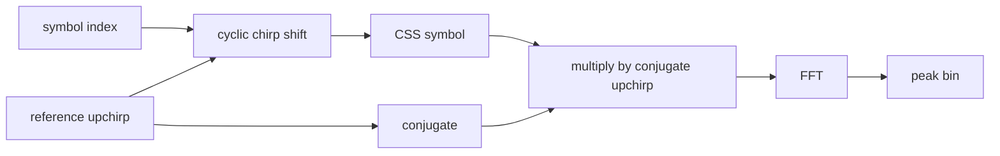

# Lab 8.20 — CSS chirp waveform and symbol mapping

## Goal

Build the signal-level foundation used by chirp spread spectrum (CSS) systems:

- generate a complex baseband upchirp;
- map an integer symbol to a cyclic chirp shift;
- inspect instantaneous frequency and a time-frequency view;
- dechirp the received symbol with a conjugate reference chirp;
- verify that the symbol becomes a single FFT peak.

This lab intentionally implements a **generic educational CSS waveform**. It is not yet a complete LoRa-compatible packet PHY: preamble, header, whitening, interleaving, coding and CRC are outside this step.

## Key relations

For spreading factor `SF` and bandwidth `BW`:

```text
N  = 2^SF
Ts = 2^SF / BW
```

With the default `SF=7` and `BW=125 kHz`, one symbol contains 128 chips and lasts 1.024 ms.

## Processing chain



## Run

```bash
python blocks/block_08_modulation_and_synchronization/python/lab_8_20_css_waveform.py
```

## Generated artifacts

```text
docs/assets/lab820_css_upchirp_frequency.png
docs/assets/lab820_css_symbol_spectrogram.png
docs/assets/lab820_css_dechirped_fft.png
docs/assets/lab820_css_metrics.json
```

## What to verify

- the complex envelope remains constant within numerical precision;
- the upchirp sweeps through the configured bandwidth;
- the cyclic shift changes the encoded symbol without changing envelope power;
- dechirping concentrates the symbol energy into one FFT bin;
- the detected bin matches the configured symbol index in the noiseless case.

## Engineering questions

1. Why is a constant-envelope waveform attractive for a nonlinear or power-limited transmitter?
2. What changes when the sample rate is higher than the signal bandwidth?
3. Why does dechirping convert a chirp into a tone?
4. Which blocks map naturally to FPGA: chirp NCO, complex multiplier, FFT or peak detector?

## Report checklist

- [ ] Record `SF`, `BW`, sample rate and symbol duration.
- [ ] Include the instantaneous-frequency plot.
- [ ] Include the time-frequency plot.
- [ ] Include the dechirped FFT and detected bin.
- [ ] State clearly that this is CSS signal processing, not yet a complete LoRa packet implementation.
