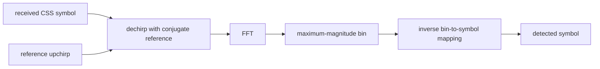

# Lab 8.21 — CSS dechirp and FFT detector

## Goal

Turn the waveform from Lab 8.20 into a reproducible symbol detector and quantify its limits:

- build a complete symbol bank for the selected spreading factor;
- derive the noiseless symbol-to-FFT-bin mapping;
- detect random symbols after dechirping;
- measure symbol error rate (SER) versus SNR;
- measure sensitivity to carrier-frequency offset (CFO);
- report peak-to-second-peak separation as a detector confidence metric.

## Detector structure



## Run

```bash
python blocks/block_08_modulation_and_synchronization/python/lab_8_21_css_dechirp_fft.py
```

## Generated artifacts

```text
docs/assets/lab821_css_ser_vs_snr.png
docs/assets/lab821_css_ser_vs_cfo.png
docs/assets/lab821_css_example_fft.png
docs/assets/lab821_css_detector_metrics.json
```

## Default experiment

- spreading factor: `SF=7`;
- bandwidth: `125 kHz`;
- 800 random symbols per sweep point;
- SNR sweep: `-18 ... 0 dB`;
- normalized CFO sweep: `-0.45 ... +0.45` FFT-bin spacings.

The normalized CFO axis is useful because one FFT-bin spacing equals `BW / 2^SF`. It makes the experiment portable across bandwidth and spreading-factor choices.

## Acceptance criteria

The executable lab checks or exposes enough data to verify that:

- the noiseless symbol-to-bin mapping is a permutation;
- the example symbol is detected correctly;
- SER at 0 dB is zero for the deterministic default seed;
- the lowest-SNR point has a clearly nonzero SER;
- fractional-bin CFO degrades the detector before the FFT peak crosses into a neighbouring bin.

## Why SER, not only SNR

A spectrum or SNR estimate does not prove that a digital link works. This lab therefore reports the actual symbol decisions. The same principle should later be extended to BER, packet error rate (PER), missed detections and false alarms.

## Follow-on work

The next packet-level CSS laboratory should add:

- a repeated-chirp preamble;
- packet-start detection;
- coarse and fine CFO estimation;
- sample-rate offset;
- sync-word and downchirp handling;
- BER/PER and false-alarm measurements.

## Report checklist

- [ ] Include the SER-versus-SNR curve.
- [ ] Include the normalized-CFO sensitivity curve.
- [ ] Include one dechirped FFT example.
- [ ] State the number of compared symbols at every point.
- [ ] Explain why peak-to-second-peak ratio is useful but does not replace SER/PER.
