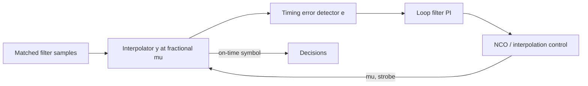

# Lab 8.3 — Symbol Timing Offset and Recovery

## Goal

Inject a timing offset into an oversampled QPSK signal, estimate the best sampling phase and compare EVM/BER before and after timing recovery.

The lab answers the practical question:

> Even when carrier frequency and phase are corrected, how do we choose the correct sample instant for symbol decisions?

## Executable files

| Environment | File | Output |
|---|---|---|
| Python | `blocks/block_08_modulation_and_synchronization/python/lab_8_3_timing_recovery.py` | constellation plots, eye preview, timing search and metrics JSON in `docs/assets` |

Run from the repository root:

```bash
python blocks/block_08_modulation_and_synchronization/python/lab_8_3_timing_recovery.py
```

Generated artifacts:

```text
docs/assets/lab83_timing_constellation_wrong_phase.png
docs/assets/lab83_timing_constellation_recovered.png
docs/assets/lab83_timing_phase_search.png
docs/assets/lab83_timing_eye_preview.png
docs/assets/lab83_timing_metrics.json
```

## Processing chain


## Timing model

For an oversampled signal with `samples_per_symbol = SPS`, the receiver must choose one sample phase:

```text
phase = 0, 1, 2, ..., SPS-1
```

A wrong phase samples the transition region between symbols and increases EVM/BER. A good phase samples near the stable symbol center.

## Educational timing recovery method

This lab uses a simple phase search:

1. try every sampling phase from `0` to `SPS-1`;
2. sample the received waveform;
3. align scalar gain/phase to the known reference symbols;
4. compute EVM for each phase;
5. choose the phase with minimum EVM.

This is intentionally reference-aided. Real receivers use timing error detectors and tracking loops, for example Gardner or Mueller and Müller methods, described next.

## Tracking loops without a reference (Gardner)

The phase search above needs the reference symbols and picks a single fixed phase.
A real link has no reference during payload, and the sampling instant *drifts* when
the transmit and receive sample clocks differ by even a fraction of a percent. The
standard fix is a closed-loop **symbol synchronizer**: estimate the timing error
every symbol and steer an interpolator that produces the sample at the right instant.



**Gardner timing-error detector (TED).** Working at two samples per symbol — the
on-time sample `y_on[k]` and the mid-point sample `y_mid[k]` halfway to the previous
symbol — the error is

```text
e[k] = Re{ y_mid[k] · ( y_on[k] − y_on[k−1] )* }
```

It is zero when `y_on` lands on the symbol peaks (the mid-point then sits at a
zero-crossing) and changes sign with the direction of the timing error. Crucially it
does **not** need the carrier phase to be corrected, so timing and carrier loops can
run independently. For binary signalling the amplitude-independent **sign-Gardner**
form `e[k] = sgn(y_mid[k])·sgn(y_on[k]−y_on[k−1])` keeps the loop gain constant
regardless of AGC / signal level — convenient for fixed-point and FPGA.

**Interpolator.** Because the wanted instant rarely lands on an input sample, an
interpolator evaluates the stream at a fractional offset `mu ∈ [0,1)`. A linear
interpolator `y = x[n−1] + mu·(x[n] − x[n−1])` is enough at high oversampling;
polynomial (Farrow) interpolators are used at low oversampling.

**Interpolation control (NCO) and loop filter.** A decrementing modulo-1 counter
steps by `w ≈ 1/(samples per strobe)` each input sample; an underflow marks a strobe
and yields the fractional `mu`. A proportional-integral (PI) loop filter turns the TED
output into a correction of `w`:

```text
integ += k2 · e[k]          (integral path: tracks a constant rate offset)
w       = w_nominal + k1 · e[k] + integ   (proportional path: damping)
```

The integral path absorbs a fixed samples-per-symbol error (clock-rate mismatch) while
the proportional path provides stability. The **Mueller & Müller** detector is a
decision-directed alternative that needs only one sample per symbol but is more
sensitive to residual carrier phase.

This is exactly the loop implemented (and verified bit-exactly across float Python,
fixed-point Python, MATLAB, Simulink and synthesizable Verilog) in Block 5 — see
`blocks/block_05_fpga_hdl_flow/lab_5_8_bpsk_rx_bit_recovery.md` (the *Timing-recovery
extension*) and `rtl/bpsk_symbol_timing_recovery.v`. There, gating only the fixed
phase search of this lab leaves a ~40 % BER floor on a drifted AD9361 burst, while the
Gardner loop recovers it at BER 0.

## Metrics

| Metric | Meaning |
|---|---|
| true timing offset | injected timing delay in samples |
| estimated best phase | phase selected by minimum EVM search |
| EVM before | error at intentionally wrong sampling phase |
| EVM after | error at recovered sampling phase |
| BER before | decisions using wrong timing phase |
| BER after | decisions using recovered timing phase |

## Expected plots

- constellation with wrong sampling phase;
- constellation after timing recovery;
- EVM versus sampling phase;
- educational eye preview.

## Common mistakes

| Mistake | Symptom | Fix |
|---|---|---|
| sampling at phase 0 by habit | high EVM even with clean signal | search or track timing phase |
| no oversampling | timing recovery cannot be demonstrated | use SPS > 1 |
| CFO still present | timing estimate becomes unstable | correct CFO first |
| phase offset still present | decisions biased | correct phase before BER |
| wrong reference alignment | EVM curve misleading | compensate delay and scalar gain |

## Report checklist

- [ ] State samples per symbol.
- [ ] State injected timing offset.
- [ ] Explain sampling phase search.
- [ ] Plot EVM versus sampling phase.
- [ ] Include constellation before timing recovery.
- [ ] Include constellation after timing recovery.
- [ ] Include eye preview.
- [ ] Report EVM and BER before/after.
- [ ] Explain how real receivers track timing without reference symbols.

## Engineering conclusion template

```text
The oversampled QPSK signal used SPS = ____ and timing offset ____ samples.
The estimated best sampling phase was ____ samples. EVM improved from ____ % to ____ %,
and BER changed from ____ to ____. The result confirms / does not confirm that timing
selection was the dominant impairment because ______.
```
