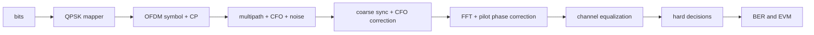

# Lab 8.5 - OFDM mini link (CP, pilots, sync, equalization)

## Goal

Build a compact OFDM chain that includes:

- cyclic prefix handling;
- pilot carriers;
- coarse frame synchronization;
- CFO estimation/correction;
- simple channel estimation and equalization;
- BER/EVM reporting.

## Executable file

| File | Purpose |
|---|---|
| `blocks/block_08_modulation_and_synchronization/python/lab_8_5_ofdm_mini_link.py` | OFDM TX/RX mini link with metrics |

Run from the repository root:

```bash
python blocks/block_08_modulation_and_synchronization/python/lab_8_5_ofdm_mini_link.py
```

## Generated artifacts

```text
docs/assets/lab85_ofdm_sync_metric.png
docs/assets/lab85_ofdm_equalized_constellation.png
docs/assets/lab85_ofdm_channel_estimate.png
docs/assets/lab85_ofdm_metrics.json
```

## Processing chain



## Report checklist

- [ ] Include sync metric plot and estimated start sample.
- [ ] Include CFO estimate and residual error.
- [ ] Include channel estimate and equalized constellation.
- [ ] Report BER and EVM.
- [ ] Explain simplifications compared to full OFDM modem.

