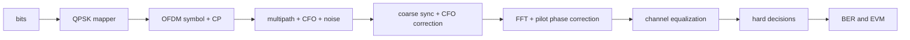

# Lab 8.5 - OFDM mini link (CP, pilots, sync, equalization)

## Goal

Build a compact OFDM chain that includes:

- cyclic prefix handling;
- pilot carriers;
- coarse frame synchronization and CFO estimation (Schmidl & Cox);
- a refinement stage that resolves the coarse estimate's ambiguity;
- channel estimation from a known preamble, plus per-symbol pilot phase tracking;
- BER/EVM reporting.

## Why this lab matters

OFDM's core trick is to turn a frequency-selective multipath channel into many narrow, flat-fading channels: split the data across `N` subcarriers, so each one sees the channel as roughly constant across its (much narrower) bandwidth. A cyclic prefix (CP) — a copy of the symbol's tail, prepended before it — makes this exact rather than approximate: as long as the CP is at least as long as the channel's delay spread, linear convolution with the channel becomes *circular* convolution within the FFT window, which the FFT turns into a per-subcarrier multiplication `Y[k] = H[k]·X[k]`. That single equation is why OFDM equalization is "divide by one complex number per subcarrier" instead of a full time-domain equalizer.

That equation only holds if the receiver's FFT window starts at the right sample and the carrier frequencies match. Get either wrong and every subcarrier picks up cross-talk from its neighbors (inter-carrier interference) instead of a clean `H[k]·X[k]`. So before any equalization can happen, the receiver has to solve two problems from scratch, with no prior knowledge of where the frame is: **where does the symbol start**, and **what is the residual carrier frequency offset (CFO)**.

## The Schmidl & Cox preamble

`build_preamble()` constructs one OFDM symbol carrying BPSK values on the *even-indexed* used subcarriers only, with zeros on the odd ones. Putting energy on only every second subcarrier makes the time-domain preamble **exactly periodic with half the FFT length**: `x[n] = x[n + N/2]` for `n` in the first half. That structure is what makes the preamble self-synchronizing — the receiver does not need to know the transmitted values, only that this repetition property exists.

`schmidl_metric()` implements the classic Schmidl & Cox estimator directly from that property, sliding a window of length `l_half = fft_size // 2` across the received signal:

```text
P(d) = sum_{m=0}^{l_half-1} conj(x[d+m]) * x[d+m+l_half]      -- correlate the two halves
R(d) = sum_{m=0}^{l_half-1} |x[d+m+l_half]|^2                 -- normalize by energy
M(d) = |P(d)|^2 / R(d)^2
```

`M(d)` is near 1 wherever the window fully contains the repeated-half preamble (the two halves are then near-identical up to a phase ramp from the CFO) and falls off outside it. Two things fall out of this one calculation:

- **Coarse timing**: the location of the peak, `d_peak = argmax(M)`, marks roughly where the preamble sits.
- **Coarse CFO**: a residual CFO of `f` Hz rotates the second half relative to the first by `angle(P) = 2*pi*f*l_half/fs`, so `f_est = angle(P(d_peak)) * fs / (2*pi*l_half)` recovers it directly — no search required. The unambiguous range is `±fs/(2*l_half)`, because `angle()` itself wraps at `±pi`.

Run the lab and compare the true and estimated CFO printed at the end; with the default 1250 Hz offset the estimator typically lands within a few Hz, which is precise enough to correct the bulk of the rotation before anything else happens.

### Why the peak alone is not enough: the plateau problem

`M(d)` does not have a sharp single-sample peak — it stays close to its maximum across a plateau roughly `cp_len` samples wide, because the repeated-half property holds for any window position where the *whole* window still sits inside the CP-plus-symbol region. `argmax` picks *some* point on that plateau, not necessarily the true one. In this lab's default run, `coarse_start_sample` typically lands about a CP length before the true frame boundary — good enough to know roughly where to look, not good enough to place the FFT window.

`refine_frame_start()` resolves this the direct way: once the coarse CFO has been removed, it correlates the (now CFO-corrected) signal against the *actual known preamble waveform* — not just its repetition property — over a small search window around the coarse estimate, and keeps the offset with the highest normalized correlation (`fine_sync_score`, close to 1.0 for a clean match). This is only possible because the preamble content is known to the receiver; it is the same idea as matched-filter frame sync used elsewhere in this course, applied here to disambiguate what the energy-based Schmidl metric leaves uncertain.

## Channel estimation: from one preamble to every subcarrier

Once the FFT window is placed correctly, the preamble's FFT gives one equation per even subcarrier: `H[k] = Y_pre[k] / X_pre[k]`, because `X_pre[k]` is known. That only covers half the used subcarriers (the ones with preamble energy) — the odd ones were transmitted as zero and carry no information about `H`. `interpolate_channel()` fills the gap with linear interpolation of the real and imaginary parts across subcarrier index, which is a reasonable estimate as long as the channel's frequency response does not change faster than the spacing between known points. Plot `lab85_ofdm_channel_estimate.png` and you should see `|H[k]|` tracing out the three-tap multipath channel's frequency response — dips where the taps interfere destructively, not a flat line.

## Per-symbol equalization and pilot phase tracking

Every payload OFDM symbol is then decoded the same way: FFT, divide by the interpolated `H[k]` (one-tap equalization), then a **second, smaller correction**. The channel/CFO estimate from the preamble is not perfect — the default run's CFO error is on the order of 10 Hz, small compared to the 1250 Hz offset but not zero — and that residual rotates every subsequent symbol's constellation by a small, slowly accumulating phase. Four pilot subcarriers (`k = -21, -7, 7, 21`, fixed reference values `{+1, +1, +1, -1}`) are transmitted in *every* payload symbol specifically so the receiver can measure that residual phase directly (`pilot_phase = angle(vdot(pilot_ref, y_eq[pilots]))`) and remove it before decoding the data subcarriers. This is the standard reason real OFDM systems (802.11, DVB) carry pilots throughout the whole burst rather than only in the preamble: the preamble buys you a starting estimate, and the pilots keep it honest for the rest of the frame.

## Processing chain


```mermaid
flowchart LR
    BITS[bits] --> MAP[QPSK mapper]
    MAP --> OFDM[OFDM symbol + CP]
    OFDM --> CH[multipath + CFO + noise]
    CH --> SYNC[coarse sync + CFO correction]
    SYNC --> FFT[FFT + pilot phase correction]
    FFT --> EQ[channel equalization]
    EQ --> DEC[hard decisions]
    DEC --> METRICS[BER and EVM]
```

## Executable file

| File | Purpose |
|---|---|
| `blocks/block_08_modulation_and_synchronization/python/lab_8_5_ofdm_mini_link.py` | OFDM TX/RX mini link with metrics |

Run from the repository root:

```bash
python blocks/block_08_modulation_and_synchronization/python/lab_8_5_ofdm_mini_link.py
```

## Generated artifacts

```text
docs/assets/lab85_ofdm_sync_metric.png
docs/assets/lab85_ofdm_equalized_constellation.png
docs/assets/lab85_ofdm_channel_estimate.png
docs/assets/lab85_ofdm_metrics.json
```

## What to expect

With the default configuration (`FFT=64`, `CP=16`, 24 OFDM symbols, CFO = 1250 Hz, SNR = 20 dB, deterministic seed), a correct run prints:

```text
Frame start coarse/refined/true: 410 / 420 / 420
Fine synchronization score: 0.9514
CFO true/estimated/error: 1250.000 / 1260.336 / 10.336 Hz
BER: 0.000000e+00 (0/2304)
EVM: 11.676% (-18.65 dB)
```

Read these together, not in isolation:

- The **coarse start is 10 samples early** (one CP length short of the true boundary) — this is the plateau problem above, not a bug; the **refined start lands exactly on the true boundary**, which is what makes the refinement stage worth having.
- The **CFO error (~10 Hz) is small but nonzero** — this is exactly the residual the pilot phase correction exists to absorb symbol-by-symbol; if you disable that correction in a modified run, expect EVM to grow across the burst as the uncorrected phase drifts.
- **BER = 0 with a nonzero EVM** (11.7%, well inside the noise-limited region for QPSK at 20 dB SNR) is the expected outcome, not a contradiction: BER only fails once decision errors actually cross a symbol boundary, while EVM already reports the accumulated synchronization, estimation and noise error. The same "BER can be perfect while EVM already shows stress" lesson reappears, pushed further, in [Lab 8.10](/zynq-sdr-course/en/labs/lab-8-10-ofdm-papr-clipping/).
- The channel-estimate plot should show `|H[k]|` varying with subcarrier index (the three-tap multipath's frequency response), not a flat line; a flat estimate usually means the preamble or interpolation step is not wired to the actual channel.

## Next step: from this model to RTL

This Python model is the reference for the synthesizable OFDM datapath built and self-tested in [Lab 8.14 — OFDM RTL: mapper to equalized loopback](/zynq-sdr-course/en/labs/lab-8-14-ofdm-rtl-chain/): QPSK mapper, subcarrier allocator/extractor, a streaming radix-2 IFFT/FFT, cyclic-prefix insertion/removal and a one-tap equalizer, each with its own self-checking Icarus Verilog testbench and cross-checked bit-exactly against a Q1.15 fixed-point model of this same chain.

## Report checklist

- [ ] Include sync metric plot and estimated start sample.
- [ ] Include CFO estimate and residual error.
- [ ] Include channel estimate and equalized constellation.
- [ ] Report BER and EVM.
- [ ] Explain simplifications compared to full OFDM modem.
