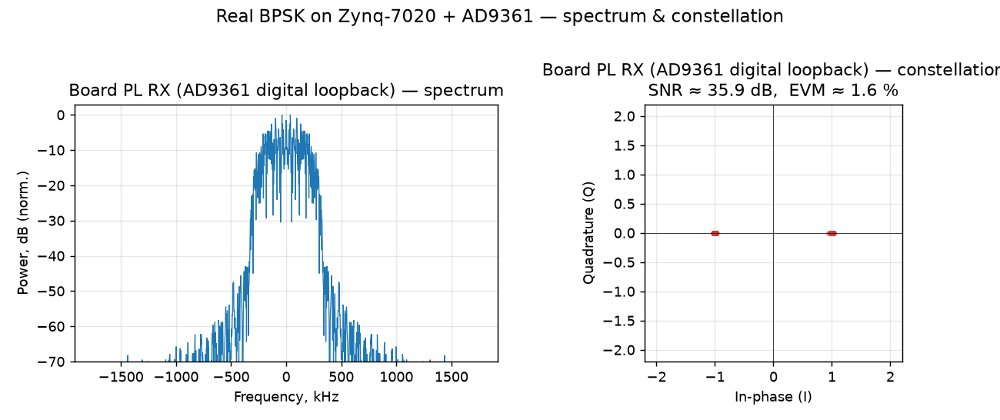
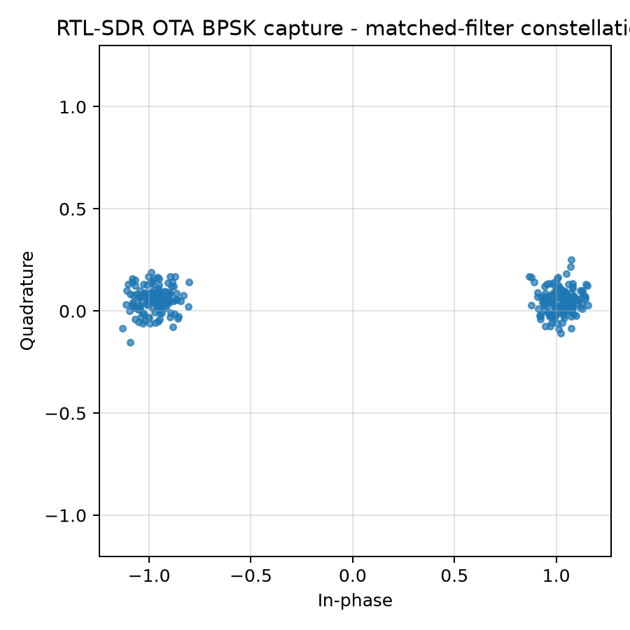
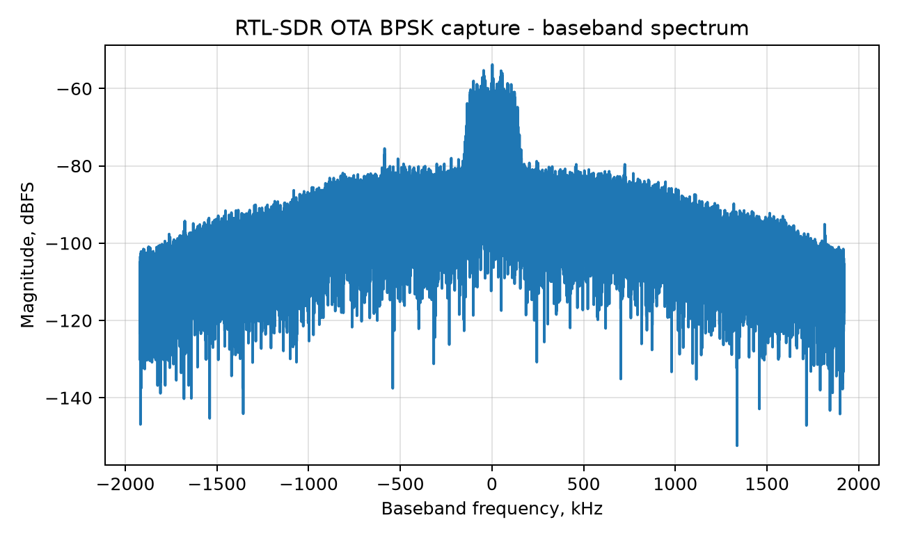

# Lab 8.7 — Real-hardware BPSK: spectrum, constellation and SNR/EVM

## Goal

Tie the synthetic modulation/synchronization theory of this block to **real measured
signals** from the course hardware (Zynq-7020 + AD9361). We look at the same three
quantities you compute on paper — the **power spectrum**, the **signal constellation**,
and the **SNR / EVM** — but taken from the running board, and we compare two vantage
points on the *same transmitter*:

- **Board PL RX** — what the on-chip FPGA receiver actually samples, in the AD9361
  **digital loopback** (the exact `capture_in` samples read back from the in-fabric debug
  tap of the Block 11 PL BPSK modem).
- **RTL-SDR** — what an **independent receiver over the air** sees of the board's BPSK
  transmission (demodulated by the Lab 11.20 reader, which searches carrier offset,
  resamples and matched-filters).

This is an educational comparison: it makes the abstract "eye/constellation gets noisier
and rotates over a real channel" concrete, with numbers.

## What the board sees — AD9361 digital loopback



- **Spectrum (left).** The classic root-raised-cosine (RRC) BPSK shape: a flat-topped main
  lobe about ±300 kHz wide (symbol rate 480 kSym/s at SPS = 8, sample rate 3.84 MHz) with
  the pulse-shaping roll-off on the shoulders and low out-of-band energy.
- **Constellation (right).** Two tight clusters at I = ±1, **Q ≈ 0** — exactly BPSK: one
  bit per symbol on the in-phase axis. Q is zero because the digital loopback carries **no
  carrier**, so there is no phase rotation.
- **Measured quality:** **SNR ≈ 36 dB, EVM ≈ 1.6 %.** This is the receiver's "ideal"
  internal view — no RF channel, no oscillator offset — and it is the reference the OTA
  case is measured against. (BER = 0.)

## What an independent RTL-SDR sees — over the air





The same kind of BPSK, transmitted by the board and captured over the air by an RTL-SDR at
~10 cm, then demodulated offline. The RRC spectrum is still clearly there, but the
constellation tells the channel story:

- The two clusters are **noticeably wider** (thermal noise + multipath) — **EVM ≈ 10.6 %**,
  i.e. **SNR ≈ 19.5 dB** (`SNR ≈ −20·log₁₀(EVM)`), ~16 dB worse than the internal loopback.
- The clusters sit slightly **off the I axis (small +Q)** — a residual **carrier phase**
  from the **+2.7 kHz frequency offset** between the AD9361 TX LO and the RTL-SDR tuner,
  which the reader estimates and removes before slicing (this is exactly the CFO of
  [Lab 8.1](lab_8_1_cfo_estimation_correction.md) and the phase of
  [Lab 8.2](lab_8_2_phase_offset_correction.md), seen on real hardware).
- Despite all that, at 10 cm the link still decodes at **BER = 0** — a real, if short-range,
  radio link.

## Side-by-side

| Metric | Board PL RX (AD9361 digital loopback) | RTL-SDR (over the air, ~10 cm) |
|---|---|---|
| Constellation | 2 tight points on I, Q ≈ 0 | 2 wider clusters, small +Q |
| EVM | ≈ 1.6 % | ≈ 10.6 % |
| SNR (from EVM) | ≈ 36 dB | ≈ 19.5 dB |
| Carrier frequency offset | 0 (digital, no carrier) | ≈ +2.7 kHz |
| BER | 0 | 0 |

**Reading:** the internal loopback isolates the *modem* (clean, no channel), while the
RTL-SDR shows the *radio link* — the constellation spreads with noise and rotates with the
carrier offset, but stays open enough to decode. The gap between the two constellations is,
visually, the RF channel.

## How the numbers are computed

- **EVM** (error-vector magnitude): after the matched filter, sample one symbol per SPS at
  the eye centre; the ideal BPSK point is `±A` on I. `EVM_rms = rms(symbol − ideal) / A`.
- **SNR** from EVM: `SNR_dB ≈ −20·log₁₀(EVM_rms)`.
- **Spectrum:** windowed FFT magnitude of the baseband samples, normalized to the peak.

## Reproduce

- Board figure (from the committed 4.8 kB capture of the real PL RX samples):

  ```bash
  python blocks/block_08_modulation_and_synchronization/python/hardware_bpsk_spectrum_constellation.py \
      --board datasets/lab11_hardware_bpsk_capture/board_pl_rx_loopback_capture.npz
  ```

- RTL-SDR OTA figures + metrics (from the recorded WAV, see the manifest):

  ```bash
  python blocks/block_11_integrated_sdr_project/python/lab_11_20_read_rtl_wav_ota_bpsk_ber.py \
      --manifest datasets/lab11_20_rtl_sdr_ota_bpsk/manifest_live_20260624_stock_10cm_ref.yaml
  ```

## Notes

- The board capture is the PL BPSK modem in loopback; the OTA capture is the stock-shell
  BPSK reference (Lab 11.14) over the air — both are real board-transmitted BPSK, chosen
  because the RF-safe PL transmit power is intentionally very low, so a clean OTA
  constellation is easiest at close range. See [Lab 11.26](../block_11_integrated_sdr_project/lab_11_26_runtime_dds_bypass_bpsk_ota.md)
  for the full Block 11 hardware story (on-chip PL BPSK BER = 0).
- Follow-up: repeat the same three plots for **QPSK** (four constellation points, two bits
  per symbol) once the QPSK modem lands.
