# Block 8 — modulation and synchronization workflow

This block turns the TX/RX chain from Block 7 into a digital data link: modulation, frequency/phase/timing mismatch, error estimation, correction and BER/EVM validation.

## Main engineering chain

```mermaid
flowchart LR
    BITS[Bits / frame] --> MOD[Modulator: BPSK/QPSK]
    MOD --> SHAPE[Pulse shaping]
    SHAPE --> CH[Channel: noise, CFO, phase, timing]
    CH --> CFO[CFO estimation/correction]
    CFO --> TIMING[Timing recovery]
    TIMING --> PHASE[Phase recovery]
    PHASE --> DEC[Decision device]
    DEC --> METRICS[EVM, BER, sync error]
    METRICS --> REPORT[Sync report]
```

## What changes after Block 7

| Block 7 | Block 8 |
|---|---|
| signal is known and synchronization is almost ideal | real synchronization errors are introduced |
| DDC places the signal near DC | residual frequency error must be estimated |
| constellation is plotted after simple correction | constellation becomes a diagnostic tool |
| BER is computed in a simplified model | BER is linked to synchronization and decisions |

## Main synchronization errors

| Error | What it looks like | Consequence |
|---|---|---|
| Carrier frequency offset | rotating constellation | BER increases rapidly |
| Phase offset | constellation is rotated | wrong symbol decisions |
| Timing offset | points are smeared | ISI and EVM growth |
| Sample-rate offset | phase/time slowly drift | tracking loop is needed |
| IQ imbalance | constellation is stretched/tilted | image and EVM penalty |

## Minimal debug order

1. Check spectrum and channel centering.
2. Estimate CFO.
3. Correct CFO.
4. Estimate residual phase.
5. Correct phase offset.
6. Select symbol samples.
7. Plot constellation before/after.
8. Compute EVM and BER.

## Block metrics

| Metric | Meaning |
|---|---|
| CFO estimate | estimated carrier frequency mismatch |
| residual CFO | error after correction |
| EVM | constellation quality after correction |
| BER | final decision quality |
| phase error | residual constellation rotation |
| decision margin | distance margin to decision boundaries |

## Waveform progression

After the common CFO/phase/timing chain, choose one of three executable routes:

1. [QPSK impairments and BER](https://lay007.github.io/zynq-sdr-course/en/labs/lab-8-8-qpsk-modem-impairments/) → [QPSK carrier recovery](https://lay007.github.io/zynq-sdr-course/en/labs/lab-8-9-qpsk-carrier-recovery/).
2. [OFDM mini-link](https://lay007.github.io/zynq-sdr-course/en/labs/lab-8-5-ofdm-mini-link/) → [PAPR, clipping and spectral regrowth](https://lay007.github.io/zynq-sdr-course/en/labs/lab-8-10-ofdm-papr-clipping/).
3. [CSS waveform](https://lay007.github.io/zynq-sdr-course/en/labs/lab-8-20-css-waveform/) → [CSS dechirp/FFT detector](https://lay007.github.io/zynq-sdr-course/en/labs/lab-8-21-css-dechirp-fft/).

## Expected result

After this block, the student should be able to:

- explain why a constellation rotates;
- estimate CFO using a preamble or an `M`-th power method;
- correct CFO;
- separate frequency offset from phase offset;
- interpret EVM/BER after synchronization;
- prepare a report with before/after correction plots.
