# Блок 8 — modulation and synchronization workflow

Этот блок превращает TX/RX тракт из блока 7 в цифровой канал передачи данных: модуляция, рассогласование частоты/фазы/времени, оценка ошибок, коррекция и проверка BER/EVM.

## Главная инженерная цепочка

```mermaid
flowchart LR
    BITS[Bits / frame] --> MOD[Modulator: BPSK/QPSK]
    MOD --> SHAPE[Pulse shaping]
    SHAPE --> CH[Channel: noise, CFO, phase, timing]
    CH --> CFO[CFO estimation/correction]
    CFO --> TIMING[Timing recovery]
    TIMING --> PHASE[Phase recovery]
    PHASE --> DEC[Decision device]
    DEC --> METRICS[EVM, BER, sync error]
    METRICS --> REPORT[Sync report]
```

## Что добавляется после Block 7

| Block 7 | Block 8 |
|---|---|
| сигнал известен и синхронизация почти идеальна | появляются реальные ошибки синхронизации |
| DDC ставит сигнал около DC | нужно оценить остаточную частотную ошибку |
| constellation строится после простой коррекции | constellation анализируется как диагностический инструмент |
| BER считается в простой модели | BER связывается с синхронизацией и решающим устройством |

## Основные ошибки синхронизации

| Ошибка | Как выглядит | Последствие |
|---|---|---|
| Carrier frequency offset | созвездие вращается | BER резко растёт |
| Phase offset | созвездие повернуто | неверные решения символов |
| Timing offset | точки размываются | ISI и рост EVM |
| Sample-rate offset | фаза/время медленно уплывают | нужна tracking loop |
| IQ imbalance | созвездие растянуто/наклонено | image и EVM penalty |

## Минимальный порядок отладки

1. Проверить спектр и центрирование канала.
2. Оценить CFO.
3. Компенсировать CFO.
4. Оценить остаточную фазу.
5. Компенсировать phase offset.
6. Выбрать символьные отсчёты.
7. Построить constellation до/после.
8. Посчитать EVM и BER.

## Метрики блока

| Метрика | Смысл |
|---|---|
| CFO estimate | оценка частотного рассогласования |
| residual CFO | ошибка после компенсации |
| EVM | качество созвездия после коррекции |
| BER | итоговое качество решений |
| phase error | остаточный поворот созвездия |
| decision margin | запас до границ решений |

## Что должно получиться

После блока студент должен уметь:

- объяснить, почему constellation вращается;
- оценить CFO по преамбуле или методу степени `M`;
- компенсировать CFO;
- разделять frequency offset и phase offset;
- интерпретировать EVM/BER после синхронизации;
- подготовить отчёт с графиками до/после коррекции.
