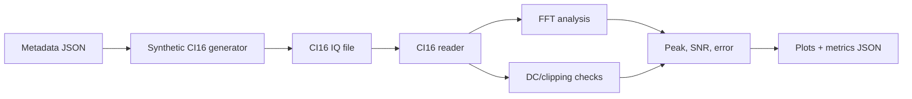

# Lab 9.2 — Read CI16 IQ and Analyze Spectrum

## Goal

Read a CI16 IQ recording using metadata JSON, convert it to normalized complex samples, run basic quality checks and generate spectrum/time-domain report artifacts.

## Executable files

| Environment | File | Output |
|---|---|---|
| Python | `blocks/block_09_recording_and_analysis_tools/python/lab_9_2_read_ci16_iq_and_analyze.py` | synthetic CI16 file, plots and metrics JSON |
| JSON | `blocks/block_09_recording_and_analysis_tools/assets/example_ci16_capture_metadata.json` | capture metadata |

Run from the repository root:

```bash
python blocks/block_09_recording_and_analysis_tools/python/lab_9_2_read_ci16_iq_and_analyze.py
```

Generated artifacts:

```text
docs/assets/lab92_ci16_iq_spectrum.png
docs/assets/lab92_ci16_iq_time_preview.png
docs/assets/lab92_ci16_iq_metrics.json
blocks/block_09_recording_and_analysis_tools/assets/lab92_synthetic_ci16_tone.ci16
```

## Processing chain



## Metrics

| Metric | Meaning |
|---|---|
| `sample_count_read` | number of complex samples read from file |
| `measured_peak_hz` | strongest FFT peak |
| `frequency_error_hz` | measured peak minus expected offset |
| `snr_db` | peak level minus median noise floor estimate |
| `dc_offset_magnitude` | magnitude of average complex sample |
| `clipping_fraction` | fraction of samples near full-scale |
| `quality_pass` | quick pass/fail based on metadata thresholds |

## Transition to real captures

Replace the synthetic `.ci16` file with a real recording and keep the same metadata fields:

```text
real_capture.ci16 + real_capture.metadata.json -> reader -> FFT -> quality checks -> report
```

## Report checklist

- [ ] Attach metadata JSON.
- [ ] Confirm CI16 file size and sample count.
- [ ] State sample rate and center frequency.
- [ ] Include spectrum plot.
- [ ] Include time-domain preview.
- [ ] Report peak frequency and frequency error.
- [ ] Report SNR, DC offset and clipping fraction.
- [ ] Conclude whether the capture is suitable for synchronization and demodulation.

## Engineering conclusion template

```text
The CI16 recording contains ____ complex samples at ____ MS/s. The expected signal offset is ____ kHz,
and the measured peak is ____ kHz. The estimated SNR is ____ dB, clipping fraction is ____,
and quality_pass is ____. The recording is / is not ready for further processing because ______.
```
