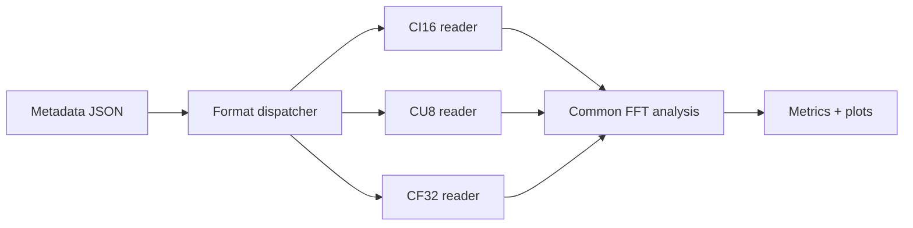

# Lab 9.3 — Multi-Format IQ Reader

## Goal

Extend the IQ analysis workflow from CI16-only reading to a metadata-driven reader that supports `ci16`, `cu8` and `cf32` captures.

## Engineering question

> How can one analysis script read IQ recordings from different tools without rewriting the processing pipeline?

## Supported formats

| Format | Binary layout | Typical source |
|---|---|---|
| `ci16` | signed int16 interleaved I/Q | AD9363, custom SDR |
| `cu8` | unsigned uint8 interleaved I/Q | RTL-SDR raw captures |
| `cf32` | float32 interleaved I/Q | GNU Radio, MATLAB/Python exports |

## Executable file

```bash
python blocks/block_09_recording_and_analysis_tools/python/lab_9_3_multi_format_iq_reader.py
```

Generated artifacts:

```text
docs/assets/lab93_multiformat_iq_metrics.json
docs/assets/lab93_multiformat_iq_spectrum_ci16.png
docs/assets/lab93_multiformat_iq_spectrum_cu8.png
docs/assets/lab93_multiformat_iq_spectrum_cf32.png
```

## Processing chain



## Why this matters

Real SDR experiments often mix tools. A course capture may start from HDSDR/RTL-SDR, then move to AD9363, then be exported through GNU Radio or MATLAB. The analysis stage should be metadata-driven, not hard-coded for one binary layout.

## Report checklist

- [ ] List all tested IQ formats.
- [ ] Show metadata for each format.
- [ ] Confirm sample count and scaling.
- [ ] Compare measured peak frequencies.
- [ ] Compare SNR/DC/clipping indicators.
- [ ] Explain which format is best for the next processing step.

## Engineering conclusion template

```text
The same analysis pipeline successfully read formats ____ and produced consistent peak-frequency estimates.
The largest frequency error was ____ Hz. The preferred format for further processing is ____ because ______.
```
