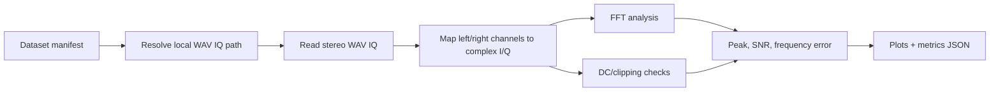

# Lab 9.4 — Read WAV IQ and Analyze Spectrum

## Goal

Read a real or private `WAV IQ` recording through a manifest, convert the stereo WAV channels into normalized complex samples, run basic quality checks, and generate report-ready plots and metrics JSON.

## Executable files

| Environment | File | Output |
|---|---|---|
| Python | `blocks/block_09_recording_and_analysis_tools/python/lab_9_4_read_wav_iq_and_analyze.py` | spectrum plot, time preview, metrics JSON |
| YAML / JSON | dataset manifest | file path hint, sample rate, center frequency, expected signal offset |

Run from the repository root:

```bash
python blocks/block_09_recording_and_analysis_tools/python/lab_9_4_read_wav_iq_and_analyze.py \
  --manifest datasets/lab1_0_rtl_sdr_observation/manifest_narrowband_220860000.yaml
```

For the FM-band recording:

```bash
python blocks/block_09_recording_and_analysis_tools/python/lab_9_4_read_wav_iq_and_analyze.py \
  --manifest datasets/lab1_0_rtl_sdr_observation/manifest_fm_103119454.yaml
```

Generated artifacts:

```text
docs/assets/lab94_<dataset_id>_spectrum.png
docs/assets/lab94_<dataset_id>_time_preview.png
docs/assets/<dataset_id>_metrics.json
```

## Processing chain



## Supported WAV IQ assumptions

- stereo WAV container;
- channel 1 = `I`, channel 2 = `Q` by default;
- little-endian PCM sample data;
- `8-bit`, `16-bit`, or `32-bit` integer PCM;
- `sample_rate_hz` and `center_frequency_hz` come from the manifest.

If the recording uses a different channel order, set `i_first: false` in the manifest.

## Metrics

| Metric | Meaning |
|---|---|
| `sample_count_read` | number of complex samples recovered from the WAV file |
| `measured_peak_hz` | strongest FFT peak relative to baseband |
| `frequency_error_hz` | measured peak minus expected offset |
| `snr_db` | peak level minus median noise floor estimate |
| `dc_offset_magnitude` | magnitude of the average complex sample |
| `clipping_fraction` | fraction of samples close to full-scale |
| `quality_pass` | quick pass/fail based on optional manifest thresholds |

## Transition to real captures

The intended path is:

```text
private WAV IQ file + manifest.yaml -> reader -> FFT + QC -> plots + metrics -> report
```

This keeps the raw file outside Git while still making the analysis reproducible.

## Report checklist

- [ ] Attach the manifest path and SHA256.
- [ ] State sample rate and center frequency.
- [ ] Confirm WAV channel count and sample width.
- [ ] Include spectrum plot.
- [ ] Include time-domain preview.
- [ ] Report peak frequency, SNR, DC offset, and clipping fraction.
- [ ] State where the raw file is stored and why it is not in Git.

## Engineering conclusion template

```text
The WAV IQ recording ____ contains ____ complex samples at ____ MS/s.
The measured peak is ____ kHz relative to baseband, with estimated SNR ____ dB,
DC offset magnitude ____, and clipping fraction ____.
The file is / is not suitable for further replay or demodulation because ______.
```
