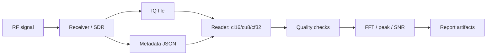

# Block 9 — IQ recording and analysis workflow

This block connects RF experiments to real IQ capture files. The main goal is reproducibility: record the file format, sample rate, center frequency, gain settings, I/Q ordering, endian format, duration and processing settings.

## Engineering chain

## Why metadata is mandatory

An IQ file without metadata is almost useless: frequency, format, scaling, bandwidth and gain settings are ambiguous. Every capture should have a companion JSON file.

## Minimal metadata fields

| Field | Why it matters |
|---|---|
| `sample_rate_hz` | correct FFT frequency axis |
| `center_frequency_hz` | RF reference for baseband data |
| `iq_format` | correct file reader |
| `i_first` | I/Q sample order |
| `endianness` | correct int16/float32 interpretation |
| `sample_count` | duration and file-size check |
| `gain_settings` | level reproducibility |
| `external_attenuation_db` | safety and level context |
| `expected_signal_offset_hz` | frequency-plan validation |

## Common IQ formats

| Format | Description | Typical use |
|---|---|---|
| `ci16` | interleaved signed int16 I/Q | AD9363, custom SDR, SignalHound-like flows |
| `cu8` | interleaved unsigned uint8 I/Q | RTL-SDR raw captures |
| `cf32` | interleaved float32 I/Q | GNU Radio, MATLAB/Python processing |

## Capture quality checks

Before advanced processing, check that:

1. the file is not empty;
2. the size matches the format;
3. clipping is not excessive;
4. DC offset is not dominant;
5. peak frequency matches the frequency plan;
6. the noise floor is reasonable;
7. metadata matches the experimental settings.

## Connection to previous blocks

| Block | Connection to Block 9 |
|---|---|
| Block 6 | frequencies, gain, AD9363 settings |
| Block 7 | TX/RX chain and DUC/DDC frequency plan |
| Block 8 | synchronization, EVM/BER after reading real IQ |

## Minimal report

- capture setup diagram;
- metadata JSON;
- IQ format parameters;
- FFT plot;
- peak frequency / frequency error;
- SNR estimate;
- clipping/DC offset checks;
- conclusion on whether the recording is usable for further processing.
