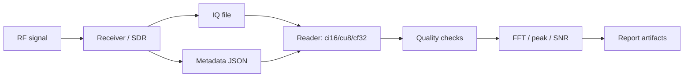

# Блок 9 — workflow записи и анализа IQ

Этот блок связывает RF-эксперименты с реальными файлами IQ-записей. Главная задача — сделать запись воспроизводимой: зафиксировать формат, частоту дискретизации, центральную частоту, gain settings, порядок I/Q, endian, длительность и параметры обработки.

## Инженерная цепочка

## Почему metadata обязательны

Файл IQ без metadata почти бесполезен: невозможно точно понять частоту, формат, масштаб, полосу и настройки усиления. Поэтому рядом с каждой записью должен храниться JSON-файл.

## Минимальные поля metadata

| Поле | Зачем нужно |
|---|---|
| `sample_rate_hz` | правильная частотная ось FFT |
| `center_frequency_hz` | привязка baseband к RF |
| `iq_format` | способ чтения файла |
| `i_first` | порядок I/Q отсчётов |
| `endianness` | корректное чтение int16/float32 |
| `sample_count` | длительность и проверка файла |
| `gain_settings` | воспроизводимость уровня |
| `external_attenuation_db` | безопасность и уровень сигнала |
| `expected_signal_offset_hz` | проверка частотного плана |

## Типовые форматы IQ

| Формат | Описание | Где встречается |
|---|---|---|
| `ci16` | interleaved signed int16 I/Q | AD9363, custom SDR, SignalHound-like flows |
| `cu8` | interleaved unsigned uint8 I/Q | RTL-SDR raw captures |
| `cf32` | interleaved float32 I/Q | GNU Radio, MATLAB/Python processing |

## Контроль качества записи

Перед сложной обработкой нужно проверить:

1. файл не пустой;
2. размер соответствует формату;
3. нет массового клиппинга;
4. DC offset не доминирует;
5. peak frequency соответствует частотному плану;
6. noise floor выглядит разумно;
7. metadata совпадают с настройками эксперимента.

## Связь с предыдущими блоками

| Блок | Связь с Block 9 |
|---|---|
| Block 6 | частоты, gain, AD9363 settings |
| Block 7 | TX/RX chain и DUC/DDC частотный план |
| Block 8 | синхронизация, EVM/BER после чтения реальных IQ |

## Минимальный отчёт

- схема записи;
- metadata JSON;
- параметры формата IQ;
- FFT-график;
- peak frequency / frequency error;
- SNR estimate;
- clipping/DC offset checks;
- вывод о пригодности записи для дальнейшей обработки.
