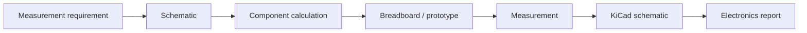

# Block 10 — basic electronics and KiCad workflow

This block connects the SDR course to practical electronics: passive networks, attenuators, safe levels, simple filters and schematic documentation in KiCad.

## Engineering chain

## Why an SDR engineer needs this

Even a digital SDR project depends on the analog part:

- signal levels must be safe;
- the receiver input must not be overloaded;
- the useful band must be separated from interference;
- cables, load impedance and attenuators affect measurements;
- the schematic must be documented so another engineer can reproduce it.

## Main block topics

| Topic | Engineering meaning |
|---|---|
| RC filter | basic bandwidth limitation |
| Attenuator | safe connection of RF/SDR devices |
| Voltage divider | signal-level control |
| 50-ohm load | measurement-chain matching |
| KiCad schematic | reproducible hardware documentation |
| Safety checklist | protection of SDR board and receiver |

## Minimal artifacts

Each lab should produce:

- component calculation;
- connection schematic;
- expected-parameter table;
- measurement checklist;
- conclusion on whether the circuit is suitable for the SDR bench.

## Connection to the course

| Block | Connection |
|---|---|
| Block 6 | RF safety, gain staging, attenuation |
| Block 7 | TX/RX loopback levels |
| Block 9 | real IQ capture quality |
| Block 11 | integrated SDR project hardware setup |
