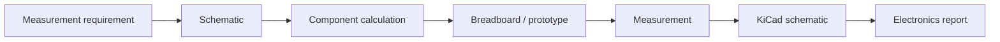

# Блок 10 — workflow базовой электроники и KiCad

Этот блок связывает SDR-курс с практической электроникой: пассивные цепи, аттенюаторы, безопасные уровни, простые фильтры и оформление схемы в KiCad.

## Инженерная цепочка

## Зачем это нужно SDR-инженеру

Даже цифровой SDR-проект зависит от аналоговой части:

- уровни сигнала должны быть безопасными;
- вход приёмника нельзя перегружать;
- полезную полосу нужно отделять от помех;
- кабели, нагрузка и аттенюаторы влияют на измерения;
- схема должна быть оформлена так, чтобы её можно было повторить.

## Основные темы блока

| Тема | Инженерный смысл |
|---|---|
| RC-фильтр | базовое ограничение полосы |
| Аттенюатор | безопасное подключение RF/SDR устройств |
| Делитель напряжения | контроль уровня сигнала |
| Нагрузка 50 Ом | согласование измерительного тракта |
| KiCad schematic | воспроизводимость схемы |
| Safety checklist | защита SDR-платы и приёмника |

## Минимальные артефакты

Каждая лаборатория должна давать:

- расчёт компонентов;
- схему подключения;
- таблицу ожидаемых параметров;
- измерительный checklist;
- вывод о пригодности цепи для SDR-стенда.

## Связь с курсом

| Блок | Связь |
|---|---|
| Block 6 | RF safety, gain staging, attenuation |
| Block 7 | TX/RX loopback levels |
| Block 9 | real IQ capture quality |
| Block 11 | integrated SDR project hardware setup |
