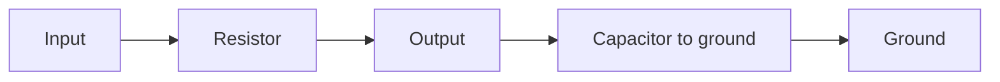

# Lab 10.1 — Passive RC Filter

## Goal

Design a simple passive RC low-pass or high-pass filter and explain how it affects a signal before digitization or SDR capture.

## Engineering question

> How can a simple resistor-capacitor network limit bandwidth and reduce unwanted components before an SDR receiver?

## Low-pass cutoff frequency

```text
f_c = 1 / (2*pi*R*C)
```

## Example calculation

| Parameter | Value |
|---|---:|
| R | 1 kOhm |
| C | 100 nF |
| Expected cutoff | approximately 1.59 kHz |

## Practical steps

1. Choose target cutoff frequency.
2. Select available resistor and capacitor values.
3. Calculate expected cutoff.
4. Draw the circuit.
5. Build or simulate the circuit.
6. Measure or estimate amplitude response.
7. Compare expected and measured cutoff.

## Schematic concept



## Report checklist

- [ ] State target cutoff frequency.
- [ ] State selected R and C.
- [ ] Calculate expected cutoff.
- [ ] Draw the schematic.
- [ ] Explain whether it is low-pass or high-pass.
- [ ] Explain how it can be used in an SDR bench.

## Engineering conclusion template

```text
The selected RC filter uses R = ____ and C = ____, giving an expected cutoff of ____ Hz.
The circuit is suitable / not suitable for the SDR bench because ______.
```
