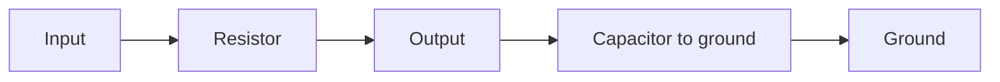

# Lab 10.1 — Passive RC Filter

## Goal

Design a simple passive RC low-pass or high-pass filter and explain how it affects a signal before digitization or SDR capture.

## Engineering question

> How can a simple resistor-capacitor network limit bandwidth and reduce unwanted components before an SDR receiver?

## Low-pass cutoff frequency

```text
f_c = 1 / (2*pi*R*C)
```

## Example calculation

| Parameter | Value |
|---|---:|
| R | 1 kOhm |
| C | 100 nF |
| Expected cutoff | approximately 1.59 kHz |

## Practical steps

1. Choose target cutoff frequency.
2. Select available resistor and capacitor values.
3. Calculate expected cutoff.
4. Draw the circuit.
5. Build or simulate the circuit.
6. Measure or estimate amplitude response.
7. Compare expected and measured cutoff.

## Schematic concept


```mermaid
flowchart LR
    VIN[Input] --> R[Resistor]
    R --> VOUT[Output]
    VOUT --> C[Capacitor to ground]
    C --> GND[Ground]
```

## Reference calculation and what to expect

Compute the example from the table above (the script's default is C = 1 nF, which gives 159 kHz, so pass the values explicitly):

```bash
python blocks/block_10_kicad_and_basic_electronics/python/lab_10_2_rf_passives_design.py \
  --resistance-ohm 1000 --capacitance-f 100e-9 --rc-reference-frequency-hz 1591.55 \
  --json-out lab101_rc.json
```

Expected: `RC cutoff: 1591.549 Hz`, and in `lab101_rc.json` the response is 0 dB at DC, -3.01 dB at the cutoff and -20.04 dB at ten times the cutoff: a first-order filter falls by 20 dB per decade. This is the ideal calculation; measured values must be reported separately.

## Exercises

1. Run the script with its defaults and explain the printed `RC cutoff: 159154.943 Hz` from R and C.
2. Connect the 1 kOhm / 100 nF filter to a 50 Ohm SDR input instead of a high-impedance probe. The load is in parallel with C: the DC gain becomes 50 / 1050 = -26.4 dB, and the cutoff moves to 1 / (2 pi (R || 50 Ohm) C) = 33.4 kHz. Explain why a filter designed for a high-impedance load is the wrong tool in front of a 50 Ohm receiver.
3. Swap R and C to make a high-pass filter with the same cutoff. What is its response at 159 Hz and at 15.9 kHz?

## Report checklist

- [ ] State target cutoff frequency.
- [ ] State selected R and C.
- [ ] Calculate expected cutoff.
- [ ] Draw the schematic.
- [ ] Explain whether it is low-pass or high-pass.
- [ ] Explain how it can be used in an SDR bench.

## Engineering conclusion template

```text
The selected RC filter uses R = ____ and C = ____, giving an expected cutoff of ____ Hz.
The circuit is suitable / not suitable for the SDR bench because ______.
```
