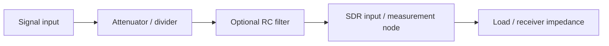

# Lab 10.4 — KiCad Schematic Mini-Project

## Goal

Prepare a small reproducible electronics mini-project for the SDR bench: an RF-safe attenuator/filter interface documented as a schematic, BOM and safety checklist.

## Engineering question

> Can another engineer reproduce the front-end helper circuit and understand its limits before connecting it to SDR hardware?

## Mini-project concept



## Required schematic blocks

| Block | Purpose |
|---|---|
| Input connector | defines signal entry point |
| Attenuator | reduces level before receiver |
| Optional RC filter | limits low-frequency or high-frequency components |
| Output connector | connects to SDR or measurement input |
| Ground reference | avoids ambiguous return path |
| Notes | documents impedance and safety limits |

## BOM template

| Ref | Value | Package | Purpose | Notes |
|---|---:|---|---|---|
| R1 | 9 kOhm | THT/SMD | divider upper resistor | educational example |
| R2 | 1 kOhm | THT/SMD | divider lower resistor | gives about -20 dB unloaded |
| C1 | 100 nF | THT/SMD | optional RC capacitor | choose by target cutoff |
| J1 | connector | SMA/BNC/header | input | depends on bench |
| J2 | connector | SMA/BNC/header | output | depends on receiver |

## KiCad deliverables

A complete mini-project should include:

```text
kicad/
  sdr_frontend_helper.kicad_pro
  sdr_frontend_helper.kicad_sch
  bom.csv
  README.md
```

If KiCad is not available, document the schematic in Markdown first and convert it to KiCad later.

## Safety checklist

- [ ] Maximum input level is stated.
- [ ] Expected attenuation is calculated.
- [ ] Load impedance assumption is written.
- [ ] DC coupling/AC coupling is documented.
- [ ] SDR input protection is considered.
- [ ] Circuit is tested at low level first.
- [ ] Measurement metadata mention the interface circuit.

## Report checklist

- [ ] Include schematic or clear diagram.
- [ ] Include BOM.
- [ ] Include attenuation calculation.
- [ ] Include RC cutoff calculation if filter is used.
- [ ] Explain limitations of the circuit.
- [ ] State whether it is safe for the intended SDR experiment.

## Engineering conclusion template

```text
The KiCad mini-project implements ______ with expected attenuation ____ dB and optional cutoff ____ Hz.
It is suitable / not suitable for the SDR bench because ______. The key limitation is ______.
```
