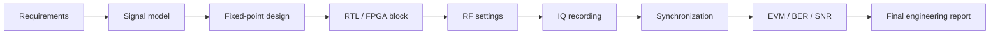

# Block 11 — integrated SDR project workflow

This block combines the whole course into one engineering project: signal model, fixed-point, RTL/FPGA, RF settings, IQ recording, synchronization, metrics and final report.

## Final chain



## Block goal

After Block 11, the student should be able to package an independent SDR project as engineering work:

- define requirements;
- select an architecture;
- justify sample-rate and frequency plans;
- prepare fixed-point and RTL components;
- configure the RF bench safely;
- record IQ data;
- analyze and synchronize the capture;
- present EVM/BER/SNR and limitations.

## Minimal project contents

| Section | Required content |
|---|---|
| Requirements | goal, constraints, success criteria |
| Architecture | block diagram and interfaces |
| Modeling | Python/MATLAB reference |
| Fixed-point | formats, errors, saturation |
| RTL/FPGA | block, testbench, latency |
| RF setup | frequency plan, gain, attenuation |
| Recording | IQ file + metadata |
| Analysis | FFT, sync, EVM/BER/SNR |
| Report | conclusions, limitations, next steps |

## Block output

The final output is a project folder and a report suitable for a portfolio:

```text
project/
  requirements.md
  architecture.md
  metadata.json
  results/
    figures/
    metrics.json
  final_report.md
```
