# Block 11 — integrated SDR project workflow

This block combines the whole course into one engineering project: signal model, fixed-point, RTL/FPGA, RF settings, IQ recording, synchronization, metrics and final report.

## Final chain

```mermaid
flowchart LR
    REQ[Requirements] --> MODEL[Signal model]
    MODEL --> DBG[Debug waveform format]
    DBG --> FXP[Fixed-point design]
    FXP --> RTL[RTL / FPGA block]
    RTL --> RF[RF settings]
    RF --> IQ[IQ recording]
    IQ --> SYNC[Preamble / sync detection]
    SYNC --> METRICS[EVM / BER / SNR]
    METRICS --> REPORT[Final engineering report]
```



## Block goal

After Block 11, the student should be able to package an independent SDR project as engineering work:

- define requirements;
- select an architecture;
- justify sample-rate and frequency plans;
- design a debug waveform for on-air signal search;
- prepare fixed-point and RTL components;
- configure the RF bench safely;
- record IQ data;
- perform preamble detection, synchronization and analysis;
- present EVM/BER/SNR and limitations.

## Minimal project contents

| Section | Required content |
|---|---|
| Requirements | goal, constraints, success criteria |
| Architecture | block diagram and interfaces |
| Modeling | Python/MATLAB reference |
| Debug waveform | preamble, sync word, header, PRBS, CRC, pilot/test modes |
| Fixed-point | formats, errors, saturation |
| RTL/FPGA | block, testbench, latency, `tx_mode`/debug registers |
| RF setup | frequency plan, gain, attenuation |
| Recording | IQ file + metadata |
| Analysis | FFT, preamble detection, sync, EVM/BER/SNR |
| Report | conclusions, limitations, next steps |

## Minimum debug frame for the final project

```text
silence
lead-in tone
preamble
sync word
header
training sequence
payload / PRBS
CRC
silence
```

In the final project, the student should demonstrate not only that something was transmitted, but also the evidence:

- the signal is visible in the expected band;
- the preamble is found by correlation;
- the sync word is found at the correct position;
- `frame_id` allows checking lost frames;
- CRC separates detected frames from correctly received frames;
- PRBS/known payload allows BER computation;
- metadata allows repeating the experiment.

Detailed guide: [Debug Waveform Design for SDR Hardware Bring-up](../debug-waveform-design.md).

## Block output

The final output is a project folder and a report suitable for a portfolio:

```text
project/
  requirements.md
  architecture.md
  debug_waveform.md
  metadata.json
  vectors/
    preamble.csv
    sync_word.csv
    prbs_reference.csv
  captures/
    rx_debug_packet.wav
  results/
    figures/
    metrics.json
  final_report.md
```
