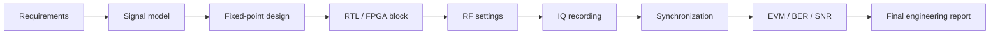

# Блок 11 — workflow интегрированного SDR-проекта

Этот блок собирает весь курс в один инженерный проект: модель сигнала, fixed-point, RTL/FPGA, RF-настройки, IQ-запись, синхронизация, метрики и итоговый отчёт.

## Итоговая цепочка



## Цель блока

После Block 11 студент должен уметь оформить самостоятельный SDR-проект как инженерную работу:

- сформулировать требования;
- выбрать архитектуру;
- обосновать sample-rate и frequency plan;
- подготовить fixed-point и RTL-часть;
- безопасно настроить RF-стенд;
- записать IQ;
- выполнить анализ и синхронизацию;
- представить EVM/BER/SNR и ограничения.

## Минимальный состав проекта

| Раздел | Что должно быть |
|---|---|
| Requirements | цель, ограничения, критерии успеха |
| Architecture | block diagram и интерфейсы |
| Modeling | Python/MATLAB reference |
| Fixed-point | форматы, ошибки, насыщение |
| RTL/FPGA | блок, testbench, latency |
| RF setup | frequency plan, gain, attenuation |
| Recording | IQ file + metadata |
| Analysis | FFT, sync, EVM/BER/SNR |
| Report | выводы, ограничения, next steps |

## Результат блока

Финальный результат — папка проекта и отчёт, которые можно показать как портфолио:

```text
project/
  requirements.md
  architecture.md
  metadata.json
  results/
    figures/
    metrics.json
  final_report.md
```
