# Блок 11 — workflow интегрированного SDR-проекта

Этот блок собирает весь курс в один инженерный проект: модель сигнала, fixed-point, RTL/FPGA, RF-настройки, IQ-запись, синхронизация, метрики и итоговый отчёт.

## Итоговая цепочка

```mermaid
flowchart LR
    REQ[Requirements] --> MODEL[Signal model]
    MODEL --> DBG[Debug waveform format]
    DBG --> FXP[Fixed-point design]
    FXP --> RTL[RTL / FPGA block]
    RTL --> RF[RF settings]
    RF --> IQ[IQ recording]
    IQ --> SYNC[Preamble / sync detection]
    SYNC --> METRICS[EVM / BER / SNR]
    METRICS --> REPORT[Final engineering report]
```



## Цель блока

После Block 11 студент должен уметь оформить самостоятельный SDR-проект как инженерную работу:

- сформулировать требования;
- выбрать архитектуру;
- обосновать sample-rate и frequency plan;
- спроектировать debug waveform для поиска сигнала в эфире;
- подготовить fixed-point и RTL-часть;
- безопасно настроить RF-стенд;
- записать IQ;
- выполнить обнаружение преамбулы, синхронизацию и анализ;
- представить EVM/BER/SNR и ограничения.

## Минимальный состав проекта

| Раздел | Что должно быть |
|---|---|
| Requirements | цель, ограничения, критерии успеха |
| Architecture | block diagram и интерфейсы |
| Modeling | Python/MATLAB reference |
| Debug waveform | preamble, sync word, header, PRBS, CRC, pilot/test modes |
| Fixed-point | форматы, ошибки, насыщение |
| RTL/FPGA | блок, testbench, latency, `tx_mode`/debug registers |
| RF setup | frequency plan, gain, attenuation |
| Recording | IQ file + metadata |
| Analysis | FFT, preamble detection, sync, EVM/BER/SNR |
| Report | выводы, ограничения, next steps |

## Минимальный debug frame для итогового проекта

```text
silence
lead-in tone
preamble
sync word
header
training sequence
payload / PRBS
CRC
silence
```

В итоговом проекте студент должен показать не только факт передачи, но и доказательство:

- сигнал виден в ожидаемой полосе;
- преамбула находится коррелятором;
- sync word найден в правильной позиции;
- `frame_id` позволяет проверить потери кадров;
- CRC отделяет обнаруженный кадр от корректно принятого;
- PRBS/known payload позволяет посчитать BER;
- metadata позволяют повторить эксперимент.

Подробный материал: [Проектирование отладочного сигнала для SDR-стенда](../debug-waveform-design.md).

## Результат блока

Финальный результат — папка проекта и отчёт, которые можно показать как портфолио:

```text
project/
  requirements.md
  architecture.md
  debug_waveform.md
  metadata.json
  vectors/
    preamble.csv
    sync_word.csv
    prbs_reference.csv
  captures/
    rx_debug_packet.wav
  results/
    figures/
    metrics.json
  final_report.md
```
