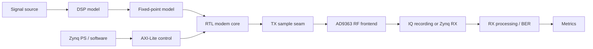

# Lab 11.1 — Project Requirements and System Architecture

## Goal

Define the final SDR project requirements and convert them into a clear system architecture.

## Engineering question

> What exactly should the integrated SDR project do, and which blocks are required to prove that it works?

## Required decisions

| Decision | Description |
|---|---|
| Signal type | tone, QPSK, packet, custom waveform |
| Sample-rate plan | model rate, FPGA rate, RF capture rate |
| Frequency plan | TX LO, RX LO, digital offsets |
| Implementation scope | Python/MATLAB, fixed-point, RTL, RF |
| Control plane | AXI-Lite register map, DMA path, or static replay control |
| Metrics | FFT peak, SNR, EVM, BER |
| First hardware step | discovery burst, conducted loopback, or full BER run |
| Success criteria | numeric pass/fail thresholds |

## Reference architecture



## Current recommended first hardware handoff

The first AD9363 experiment should not be a full measurement campaign. It should be a short discovery burst:

1. program the deterministic frame parameters through AXI-Lite;
2. launch one short burst at minimum TX gain;
3. keep RX gain low and manual;
4. disable AGC for the first observation;
5. check only burst visibility, overload symptoms and deterministic recovery.

Lab 11.7 provides the minimal PS-side register sequence for that step.

That reduces risk before longer runs, BER sweeps or routed loopback experiments are attempted.

## Report checklist

- [ ] State project goal.
- [ ] Define success criteria.
- [ ] Draw system architecture.
- [ ] Define sample-rate plan.
- [ ] Define frequency plan.
- [ ] Define data formats.
- [ ] Define control-plane path.
- [ ] Define metrics and thresholds.
- [ ] Define the first hardware handoff step.
- [ ] State project risks.

## Engineering conclusion template

```text
The integrated SDR project targets ______. The main signal chain is ______.
The project is considered successful if ______. The highest technical risk is ______ because ______.
```
