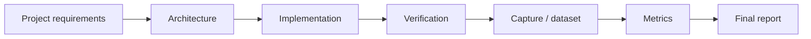

# Block 12 — final project track

Block 12 turns the course into a set of final engineering assignments. Each project should include architecture, reproducible execution, data/metadata, metrics and a report.

## Final track logic

## Project options

| Project | Main focus | Minimum result |
|---|---|---|
| QPSK modem final project | DSP + synchronization | BER/EVM after sync |
| RF capture analysis project | real IQ + metadata | FFT/SNR/DC/clipping report |
| FPGA DSP block project | Verilog + fixed-point | testbench PASS + error analysis |
| Full SDR measurement report | whole chain | final report with pass/fail table |

## Common requirements

Every final project should include:

- goal and success criteria;
- block diagram;
- reproducibility commands;
- metadata or dataset registry entry;
- figures;
- metrics JSON or table;
- limitations;
- next steps.
