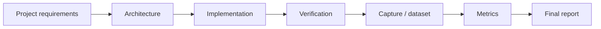

# Блок 12 — трек финальных проектов

Блок 12 превращает курс в набор итоговых инженерных заданий. Каждый проект должен иметь архитектуру, воспроизводимый запуск, данные/metadata, метрики и отчёт.

## Логика финального трека

## Варианты проектов

| Проект | Основной фокус | Минимальный результат |
|---|---|---|
| QPSK modem final project | DSP + synchronization | BER/EVM after sync |
| RF capture analysis project | real IQ + metadata | FFT/SNR/DC/clipping report |
| FPGA DSP block project | Verilog + fixed-point | testbench PASS + error analysis |
| Full SDR measurement report | whole chain | final report with pass/fail table |

## Общие требования

Каждый финальный проект должен содержать:

- цель и критерии успеха;
- block diagram;
- reproducibility commands;
- metadata или dataset registry entry;
- figures;
- metrics JSON или таблицу;
- limitations;
- next steps.
