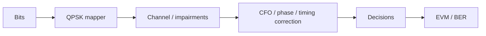

# Project 12.1 — QPSK Modem Final Project

## Goal

Build and document a QPSK transmit/receive chain with synchronization and quantitative metrics.

## Required chain



## Minimum deliverables

- signal model;
- impairment model;
- synchronization stages;
- constellation before/after;
- EVM and BER;
- final report.

## Success criteria

| Criterion | Target |
|---|---:|
| BER after synchronization | defined by student |
| EVM after synchronization | defined by student |
| Reproducible command | required |
| Metrics JSON | required |

## Report conclusion template

```text
The QPSK modem achieved BER ____ and EVM ____ %. The dominant impairment was ____.
The project meets / does not meet the success criteria because ______.
```
