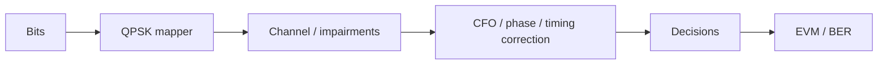

# Project 12.1 — QPSK Modem Final Project

## Goal

Build and document a QPSK transmit/receive chain with synchronization and quantitative metrics.

## Required chain


```mermaid
flowchart LR
    BITS[Bits] --> QPSK[QPSK mapper]
    QPSK --> CH[Channel / impairments]
    CH --> SYNC[CFO / phase / timing correction]
    SYNC --> DEC[Decisions]
    DEC --> METRICS[EVM / BER]
```

## Minimum deliverables

- signal model;
- impairment model;
- synchronization stages;
- constellation before/after;
- EVM and BER;
- final report.

## Success criteria

| Criterion | Target |
|---|---:|
| BER after synchronization | defined by student |
| EVM after synchronization | defined by student |
| Reproducible command | required |
| Metrics JSON | required |

## Report conclusion template

```text
The QPSK modem achieved BER ____ and EVM ____ %. The dominant impairment was ____.
The project meets / does not meet the success criteria because ______.
```

## Reference implementation (Block 11)

You do not have to start from a blank page: Block 11 carries a completed, hardware-validated instance
of exactly this project — an in-fabric QPSK modem on the Zynq-7020 + AD9361, closed on a two-board
915 MHz RF link. Treat it as a worked exemplar of what "meets the criteria" looks like, not as the
answer you must copy; your own track, impairment model and targets are still yours to define.

- **Final measurement report:** [Lab 11.4](lab-11-4-final-measurement-report.md)
  — architecture, setup, pass/fail table, reproducibility.
- **Synchronization chain:** DC blocker → matched RRC → feedforward phase pick → Gardner timing →
  coarse CFO → Costas carrier recovery → hard decision → differential decoder → quadrant-resolving BER
  counter. The debugging story behind each stage is in Labs 11.41 (DC-blocker/bit-189), 11.42
  (frame-sync false lock), 11.43–11.45 (differential QPSK and the preamble that fixed it).
- **Achieved metrics (for calibration, not as your target):** fabric loopback BER < 5.3×10⁻⁷ over
  5.6 M bits; two-board RF payload BER ~4×10⁻⁴ with zero whole-burst rotation failures,
  rotation-invariant.

A good 12.1 submission does not need this depth — but it does need the same discipline: a stated
success criterion, an honest measurement, and a reproducible command that regenerates the metric.
