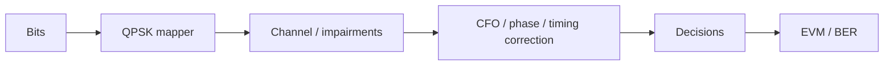

# Project 12.1 — QPSK Modem Final Project

## Goal

Build and document a QPSK transmit/receive chain with synchronization and quantitative metrics.

## Required chain


```mermaid
flowchart LR
    BITS[Bits] --> QPSK[QPSK mapper]
    QPSK --> CH[Channel / impairments]
    CH --> SYNC[CFO / phase / timing correction]
    SYNC --> DEC[Decisions]
    DEC --> METRICS[EVM / BER]
```

## Minimum deliverables

- signal model;
- impairment model;
- synchronization stages;
- constellation before/after;
- EVM and BER;
- final report.

## Success criteria

| Criterion | Target |
|---|---:|
| BER after synchronization | defined by student |
| EVM after synchronization | defined by student |
| Reproducible command | required |
| Metrics JSON | required |

Targets are frozen in the proposal **before** the final run. A result that misses its target can still
be a strong engineering submission when the measurement is valid, the limitation is localized and
the conclusion does not move the goalposts.

## Choose one execution track

The project is intentionally runnable without a specific board. Choose the strongest track supported
by the equipment you actually control; do not claim evidence from a higher track.

| Track | Minimum implementation | Required evidence |
|---|---|---|
| A — offline replay | Python/MATLAB/GNU Radio model over a fixed IQ dataset | dataset manifest + checksum, before/after constellation, BER/SER/EVM JSON |
| B — RTL/FPGA | fixed-point model plus HDL modem or synchronization block | bit-exact vectors, HDL regression, latency/resource/timing report |
| C — measured RF | Track A or B plus a controlled transmitter/receiver path | bench diagram, RF-safe settings, raw or summarized measurement artifact, repeated-run statistics |

Hardware is not a shortcut around replay. Track C still needs an offline-readable artifact or a
machine-readable summary that lets another engineer verify the reported arithmetic.

## Freeze the proposal

Before implementation, write one page containing:

| Field | Required content |
|---|---|
| engineering question | one falsifiable sentence |
| baseline | the simplest chain the improvement must beat |
| independent variable | exactly what changes in the A/B comparison |
| fixed parameters | rate, SPS, RRC roll-off/span, frame and preamble, gains or channel model |
| metrics | BER/SER, EVM and at least one synchronization metric |
| acceptance gate | numeric pass/fail rule |
| stop rule | when the project is complete even if further tuning is possible |
| fallback track | replay-only path if hardware becomes unavailable |

Example question: “At `Eb/N0 = 8 dB`, does the selected carrier/timing recovery reduce BER below
`1e-3` without increasing EVM above the frozen limit?” “Make BER better” is not a testable proposal.

## Verification gates

Advance only when the current gate has a saved artifact:

1. **G0 — contract:** proposal, parameter table, architecture and acceptance gate are committed.
2. **G1 — reference:** an impairment-free model recovers the known payload at BER/SER 0.
3. **G2 — sensitivity:** CFO, phase, timing and noise are swept independently; the baseline failure
   is visible in a plot or metrics table.
4. **G3 — synchronization:** the improved chain is compared against the frozen baseline on identical
   inputs. A paired or deterministic replay is preferred to unrelated runs.
5. **G4 — implementation:** fixed-point/HDL or hardware evidence agrees with the model within a stated
   tolerance. FPGA work must report both functionality and routed timing.
6. **G5 — reproduction:** a clean checkout can run the documented command and regenerate or validate
   the final metrics JSON.

Failed hypotheses belong in the report when they change the diagnosis. Do not delete an honest
negative result merely because it is not the final architecture.

## Evidence package

Use a compact, reviewable layout (equivalent names are fine):

```text
project_12_1/
├── proposal.md
├── config.json
├── manifest.yml
├── run.py
├── metrics.json
├── figures/
│   ├── constellation_before.svg
│   ├── constellation_after.svg
│   └── ber_or_evm_sweep.svg
└── report.md
```

`config.json` owns every parameter that changes the result. `manifest.yml` identifies input data,
format, provenance and checksum. `metrics.json` contains raw counts as well as ratios so percentages
can be independently recomputed. For BER, preserve at least:

```json
{
  "compared_bits": 100000,
  "bit_errors": 17,
  "ber": 0.00017,
  "locked_frames": 398,
  "total_frames": 400
}
```

Never publish only a screenshot of a terminal summary.

## CI-safe starting point

Track A can start from the public deterministic QPSK fixture. From the repository root:

```bash
python tools/generate_demo_qpsk_dataset.py
python tools/analyze_demo_qpsk_dataset.py --generate-if-missing
python tools/check_dataset_manifests.py
python -m pytest tests/test_demo_qpsk_dataset.py -q
```

Track B adds the canonical HDL gate:

```bash
python tools/run_block5_hdl_smoke.py --no-generate
```

Do not put a Vivado rebuild in the only reproduction path. Commit normalized timing/utilization
reports so reviewers without the licensed tool can inspect the implementation result.

## Final acceptance checklist

- [ ] Proposal and numeric targets predate the final measurement.
- [ ] The known payload is recoverable in the impairment-free reference.
- [ ] Baseline and candidate use identical input data and fixed parameters.
- [ ] Every reported ratio can be recomputed from committed counts.
- [ ] At least one limitation or rejected hypothesis is documented.
- [ ] FPGA claims include routed WNS/TNS/WHS/THS and route status.
- [ ] Hardware claims include topology, attenuation/gains and a safe shutdown procedure.
- [ ] A clean-checkout command validates the evidence without access to the original bench.
- [ ] The conclusion says **meets** or **does not meet** the frozen gate.

Grade the submission with the
[final-project grading rubric](/zynq-sdr-course/final-project-grading-rubric/) and write the report
from the
[Block 12 report template](https://github.com/Lay007/zynq-sdr-course/blob/main/blocks/block_12_final_projects/reports/report_template_en.md).

## Report conclusion template

```text
The QPSK modem achieved BER ____ and EVM ____ %. The dominant impairment was ____.
The project meets / does not meet the success criteria because ______.
```

## Reference implementation (Block 11)

You do not have to start from a blank page: Block 11 carries a completed, hardware-validated instance
of exactly this project — an in-fabric QPSK modem on the Zynq-7020 + AD9361, closed on a two-board
915 MHz RF link. Treat it as a worked exemplar of what "meets the criteria" looks like, not as the
answer you must copy; your own track, impairment model and targets are still yours to define.

- **Final measurement report:** [Lab 11.4](/zynq-sdr-course/en/labs/lab-11-4-final-measurement-report/)
  — architecture, setup, pass/fail table, reproducibility.
- **Synchronization chain:** DC blocker → matched RRC → feedforward phase pick → Gardner timing →
  coarse CFO → Costas carrier recovery → hard decision → differential decoder → quadrant-resolving BER
  counter. The debugging story behind each stage is in Labs 11.41 (DC-blocker/bit-189), 11.42
  (frame-sync false lock), 11.43–11.45 (differential QPSK and the preamble that fixed it).
- **Achieved metrics (for calibration, not as your target):** fabric loopback BER < 5.3×10⁻⁷ over
  5.6 M bits; two-board RF payload BER ~4×10⁻⁴ with zero whole-burst rotation failures,
  rotation-invariant.
- **Machine-readable final evidence:** `docs/assets/lab1144_diff_qpsk_live.json` records the
  absolute/differential A/B, and `docs/assets/lab1145_diff_long_preamble_live.json` records the final
  800-frame long-preamble run.

A good 12.1 submission does not need this depth — but it does need the same discipline: a stated
success criterion, an honest measurement, and a reproducible command that regenerates the metric.
