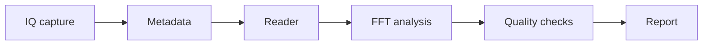

# Project 12.2 — RF Capture Analysis Final Project

## Goal

Analyze a real or synthetic IQ capture with complete metadata and produce an engineering-quality report.

## Required chain



## Minimum deliverables

- dataset registry entry;
- metadata JSON;
- IQ reader command;
- FFT plot;
- SNR estimate;
- DC offset and clipping check;
- final report.

## Success criteria

| Criterion | Target |
|---|---:|
| Metadata completeness | required |
| Frequency error | defined by student |
| SNR | defined by student |
| Clipping fraction | below threshold |

## Report conclusion template

```text
The RF capture contains ____ samples in ____ format. The measured peak is ____ Hz,
SNR is ____ dB and clipping fraction is ____. The capture is / is not suitable for further processing because ______.
```
