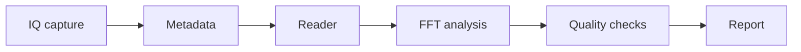

# Project 12.2 — RF Capture Analysis Final Project

## Goal

Analyze a real or synthetic IQ capture with complete metadata and produce an engineering-quality report.

The point of this project is not to make a pretty spectrum. It is to show that another
engineer, given only your files, can reach the same numbers and the same conclusion — and to
show that you know which of those numbers can be trusted and which cannot.

## Why this project matters

Every claim in an SDR report ultimately rests on a recording: "the signal is at +3 kHz", "SNR is
30 dB", "the front end was not overloaded". A recording without metadata is a list of numbers
with no units; a spectrum without a stated sample rate has no frequency axis; an SNR without a
definition is not comparable. This project practises the unglamorous discipline that separates
a measurement from a screenshot: metadata first, quality checks before conclusions, and an
explicit statement of what the capture is and is not suitable for.

## Required chain


```mermaid
flowchart LR
    CAP[IQ capture] --> META[Metadata]
    META --> READ[Reader]
    READ --> FFT[FFT analysis]
    FFT --> QC[Quality checks]
    QC --> REPORT[Report]
```

## Minimum deliverables

- dataset registry entry;
- metadata JSON;
- IQ reader command;
- FFT plot;
- SNR estimate;
- DC offset and clipping check;
- final report.

## Success criteria

| Criterion | Target |
|---|---:|
| Metadata completeness | required |
| Frequency error | defined by student |
| SNR | defined by student |
| Clipping fraction | below threshold |

Targets are frozen in the analysis plan **before** the final run. A capture that fails its own
quality gate is still a valid submission if the report says so and explains why; a capture that
is declared "good" without the checks is not.

## Choose your input

| Input | Where it comes from | What it teaches |
|---|---|---|
| Synthetic replay | `datasets/demo_qpsk_capture` (deterministic, 64 KiB, SHA256 in the manifest) | the full workflow with a known ground truth, so errors are visible |
| Existing real capture | `datasets/lab1_0_rtl_sdr_observation` (RTL-SDR WAV), `datasets/lab6_6_zynq_rx_observation` or `datasets/lab6_8_zynq_ota_tone_observation` (Zynq AD9361 CI16) | real impairments, unknown ground truth |
| Your own capture | your receiver, your metadata | the whole path from hardware to report; needs RF-safe settings recorded |

Do not claim evidence from a higher rung than the one you used: a synthetic capture must be
labelled synthetic in the report and in the manifest.

## Freeze the analysis plan

Before you look at results, write half a page:

| Field | Required content |
|---|---|
| question | one falsifiable sentence, for example "the tone is within 200 Hz of the expected offset and the capture is not clipped" |
| capture facts | format, sample rate, centre frequency, channel order, gain settings, duration |
| expected signal | where you expect it (offset from centre) and how you will recognise it |
| metrics | peak frequency, frequency error, SNR (with its definition), DC offset, clipping fraction |
| thresholds | numeric limits for each quality check |
| stop rule | when the analysis is finished |

## Verification gates

1. **G0 — metadata:** the manifest passes `python tools/check_dataset_manifests.py` and states format,
   sample rate, centre frequency, channel order, provenance and checksum.
2. **G1 — read-back:** the reader recovers the documented number of samples and the checksum
   matches; the first samples look like what the format says they should.
3. **G2 — sanity:** the spectrum peak is where the metadata says it should be, or the difference is
   explained (swapped I/Q mirrors the spectrum; a wrong sample rate scales the axis).
4. **G3 — quality:** DC offset, clipping fraction and SNR are computed with stated definitions and
   compared against the frozen thresholds.
5. **G4 — reproduction:** a clean checkout regenerates the plots and metrics JSON with one command.

## Analysis pitfalls to check for explicitly

| Pitfall | Symptom | How to rule it out |
|---|---|---|
| swapped I/Q | spectrum mirrored, signal at −f instead of +f | repeat with `i_first` flipped; a real tone moves to the mirror frequency |
| DC spike read as signal | a strong peak at exactly 0 Hz | retune the receiver by a known step: a real signal moves, the DC spike does not |
| wrong sample rate | correct-looking spectrum with a wrong frequency scale | compare a known reference (a tone at a known offset, a broadcast carrier) |
| clipping | broadband splatter, raised noise floor, flat-topped waveform | report the fraction of near-full-scale samples; look at the time preview |
| unstated SNR definition | numbers that cannot be compared | state whether SNR is peak over median noise, in-band power ratio, or from EVM |
| FFT scalloping / leakage | peak amplitude depends on where the tone falls | use a window and say which; do not compare peak heights across different bins without it |

## Evidence package

```text
project_12_2/
├── plan.md
├── manifest.yaml
├── run.py            # or the reader command from Labs 9.2–9.4
├── metrics.json
├── figures/
│   ├── spectrum.png
│   └── time_preview.png
└── report.md
```

`metrics.json` should hold raw values (sample count, peak bin, noise-floor estimate) as well as
derived ones, so the reported SNR can be recomputed by a reviewer.

## CI-safe starting point

From the repository root:

```bash
python tools/check_dataset_manifests.py
python blocks/block_09_recording_and_analysis_tools/python/lab_9_4_read_wav_iq_and_analyze.py \
  --manifest datasets/lab1_0_rtl_sdr_observation/manifest_narrowband_220860000.yaml
```

The second command is [Lab 9.4](/zynq-sdr-course/en/labs/lab-9-4-read-wav-iq-and-analyze/), which
is the worked example of this project's chain; its output shows exactly the metric set (peak,
frequency error, SNR, DC offset, clipping fraction, pass/fail) expected in your report.

## Final acceptance checklist

- [ ] The manifest is complete and the checksum verifies.
- [ ] The analysis plan and thresholds predate the final run.
- [ ] The synthetic or real nature of the capture is stated.
- [ ] The three most likely misreadings (I/Q swap, DC spike, wrong sample rate) were explicitly checked.
- [ ] SNR has a written definition.
- [ ] Every reported ratio can be recomputed from the stored raw values.
- [ ] The conclusion says **is** or **is not** suitable for further processing, and why.
- [ ] A clean-checkout command reproduces the figures and metrics.

Grade with the [final-project grading rubric](/zynq-sdr-course/final-project-grading-rubric/) and write
the report from the
[Block 12 report template](https://github.com/Lay007/zynq-sdr-course/blob/main/blocks/block_12_final_projects/reports/report_template_en.md).

## Report conclusion template

```text
The RF capture contains ____ samples in ____ format. The measured peak is ____ Hz,
SNR is ____ dB and clipping fraction is ____. The capture is / is not suitable for further processing because ______.
```
