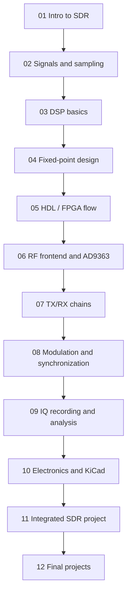

# Visual Course Map

This page gives a compact map of the complete SDR engineering route covered by the course.

## Complete route



## Engineering layers

| Layer | Course blocks | Main evidence |
|---|---|---|
| Theory | 01–02 | concepts, sampling, SDR model |
| DSP | 03 | FFT, FIR, mixing, decimation |
| Implementation | 04–05 | fixed-point models, Verilog RTL, testbenches |
| Hardware interface | 06–07 | RF frontend, DUC/DDC, TX/RX chain |
| Receiver quality | 08 | CFO, phase, timing, EVM/BER |
| Data workflow | 09 | IQ files, metadata, CI16/CU8/CF32 readers |
| Electronics | 10 | RC filters, attenuators, safety, KiCad workflow |
| Project integration | 11–12 | final report, reproducibility, portfolio output |

## Fast reader path

For a quick review of the course quality, read these pages first:

1. Course demo dashboard.
2. Model → FPGA → RF → Measurement.
3. Block 8 end-to-end synchronization chain.
4. Block 9 IQ recording and analysis workflow.
5. Block 11 integrated SDR project workflow.
6. Portfolio view.

## Executable path

Run the executable proof path locally:

```bash
make install
make smoke
```

Or run only the representative Python labs:

```bash
make labs
```

## What the course proves

By the end of the course, the repository demonstrates the full engineering chain:

```text
signal theory -> DSP model -> fixed-point constraints -> RTL verification -> RF setup -> IQ capture -> synchronization -> metrics -> report
```

This is the same route used in practical SDR prototyping and measurement-driven digital communication projects.
