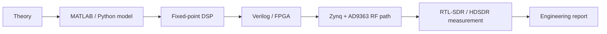

# Course quality roadmap

This page defines what the repository should contain to look like a complete engineering SDR course rather than a collection of separate notes.

## Target course level

The course should demonstrate the complete path from signal theory to a measured RF result:



## Content checklist

| Area | Required content | Status target |
|---|---|---|
| Course navigation | Landing page, RU/EN pages, block map, lab map | Keep synchronized |
| DSP labs | Python reference, MATLAB reference, plots, explanation | One reproducible package per lab |
| FPGA bridge | Fixed-point model, latency estimate, HDL mapping, testbench idea | Add for every DSP block |
| RF practice | Frequency plan, gain plan, bandwidth plan, measurement setup | Add to hardware labs |
| Measurements | IQ format, metadata, FFT/SNR/EVM/BER method | Use one common reporting style |
| CI | MkDocs build, link check, figure generation | Keep green on every PR |
| Final project | Integrated SDR chain with report template | Make portfolio-ready |

## Definition of done for a lab

A lab is complete only when it contains:

1. A clear engineering goal.
2. Input/output signal definitions.
3. Python implementation for reproducible open execution.
4. MATLAB implementation for DSP/engineering workflow.
5. Fixed-point discussion when the block is hardware-relevant.
6. FPGA/Verilog mapping notes.
7. IEEE-style plots.
8. Measurement or replay plan using IQ data.
9. A short checklist for report conclusions.

## Priority backlog

### P0 — make the course easy to evaluate

- Add a single page that explains how to reproduce all figures.
- Add a lab report template.
- Add a common measurement-metadata format for IQ recordings.
- Add a course completion matrix: model, code, plots, HDL notes, measurement notes.

### P1 — make it engineering-heavy

- Add fixed-point error tables for FIR, mixer, NCO and decimator labs.
- Add streaming FPGA diagrams for each DSP block.
- Add latency/resource estimation tables.
- Add testbench strategy for Verilog modules.

### P2 — make it publication/portfolio-ready

- Add final project scenarios.
- Add example report screenshots.
- Add comparison tables: simulation vs measured spectrum, floating point vs fixed point, software vs FPGA.
- Add a reproducible dataset guide for real IQ captures.

## Recommended repository structure

```text
docs/
  ru/
  en/
  labs/
  assets/
examples/
  python/
  matlab/
  cpp/
fpga/
  rtl/
  tb/
measurements/
  metadata_examples/
reports/
  templates/
tools/
  generate_ieee_plots.py
  validate_links.py
```

## Engineering tone

Every page should answer three questions:

- What signal processing problem is solved?
- How does the implementation map to hardware?
- How is the result verified by plots, metrics or measurement?
