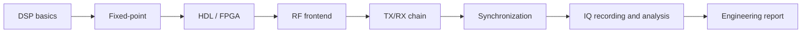

# Course Demo Dashboard

This page is the fast engineering overview of the course: what is executable, what is measured and how the full SDR chain is reproduced.

## End-to-end route



## Executable lab map

| Block | Executable focus | Main artifacts |
|---|---|---|
| Block 3 | FFT, FIR, mixing, decimation | spectra, frequency-response plots |
| Block 4 | fixed-point FIR and mixer | quantization/error plots |
| Block 5 | Verilog RTL + testbenches | VCD, PASS/FAIL logs |
| Block 6 | RF capture analysis | FFT, SNR, overload checks |
| Block 7 | DUC/DDC and TX/RX metrics | spectrum, constellation, EVM/BER |
| Block 8 | synchronization | CFO, phase, timing, EVM/BER |
| Block 9 | IQ recording and analysis | CI16 reader, metadata, quality checks |

## Reproducible figure families

| Figure family | What it demonstrates |
|---|---|
| FFT / window plots | spectral leakage and resolution trade-offs |
| FIR response plots | filtering and anti-aliasing design |
| DUC/DDC spectra | frequency-plan correctness |
| QPSK constellations | modulation quality and impairments |
| CFO/phase/timing plots | synchronization behavior |
| CI16 IQ spectrum | real-recording analysis workflow |

## Engineering credibility checklist

- executable Python labs;
- Verilog RTL testbenches;
- MkDocs site build in strict mode;
- GitHub Actions for generated artifacts;
- metadata-driven IQ analysis;
- report checklists for each lab;
- Russian and English navigation.

## How to reproduce generated figures

Run the relevant workflow or execute the lab scripts locally from the repository root:

```bash
python blocks/block_07_tx_rx_chains/python/lab_7_2_duc_ddc_frequency_translation.py
python blocks/block_07_tx_rx_chains/python/lab_7_3_tx_rx_loopback_metrics.py
python blocks/block_08_modulation_and_synchronization/python/lab_8_4_end_to_end_sync_chain.py
python blocks/block_09_recording_and_analysis_tools/python/lab_9_2_read_ci16_iq_and_analyze.py
```

Generated figures are written to `docs/assets` and can be attached to lab reports, README sections or MkDocs pages.

## Recommended reader path

1. Start with the system page: `Model → FPGA → RF → Measurement`.
2. Run one DSP lab from Block 3.
3. Run one RTL testbench from Block 5.
4. Run Block 7 TX/RX loopback metrics.
5. Run Block 8 synchronization chain.
6. Run Block 9 CI16 IQ analysis.

This path demonstrates the full chain from mathematical model to measured/reproducible signal artifacts.
