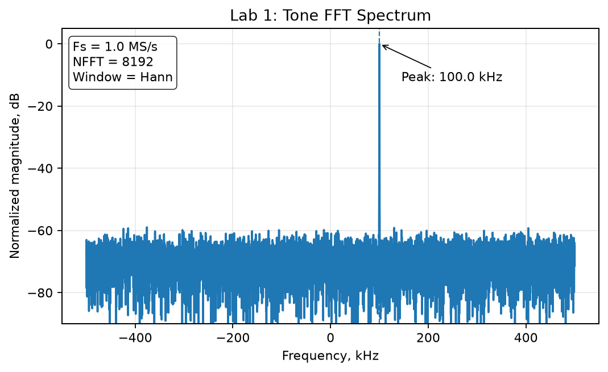
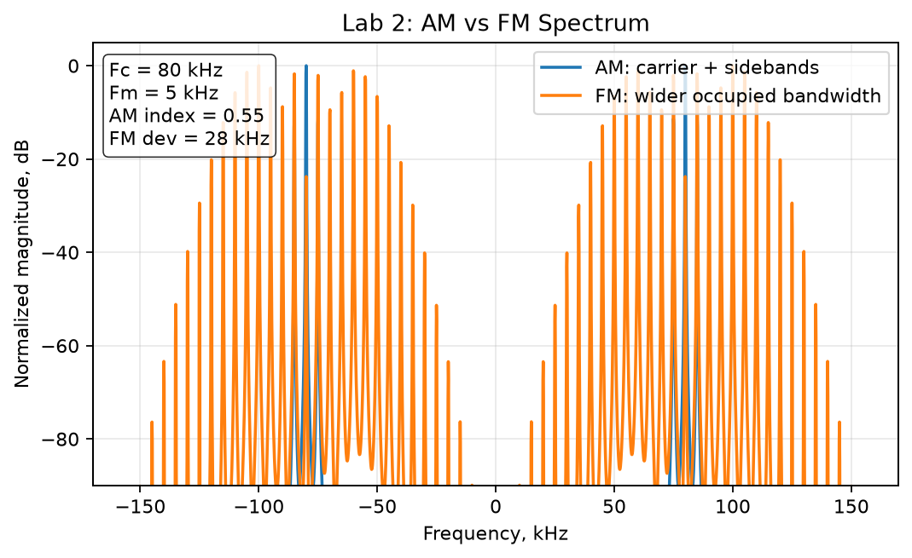
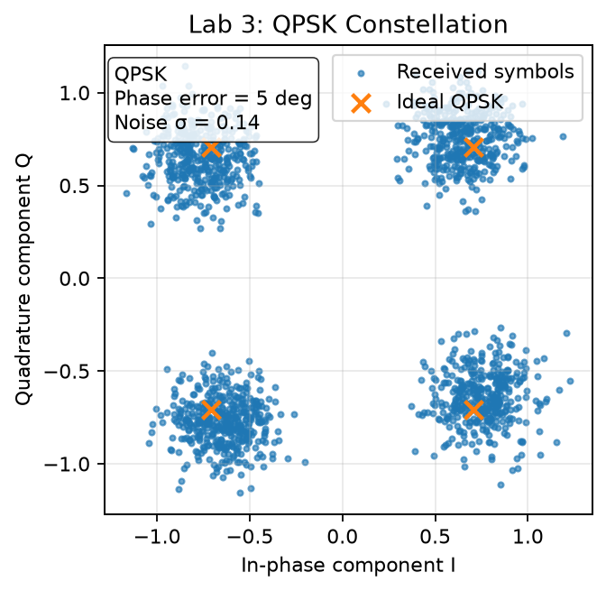
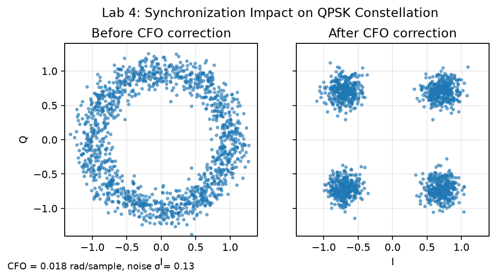
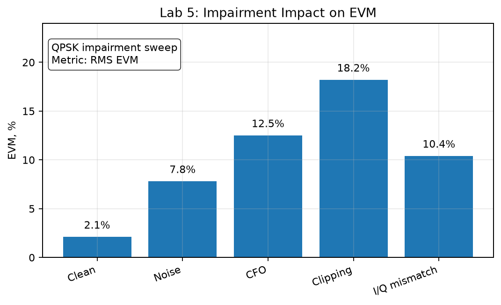
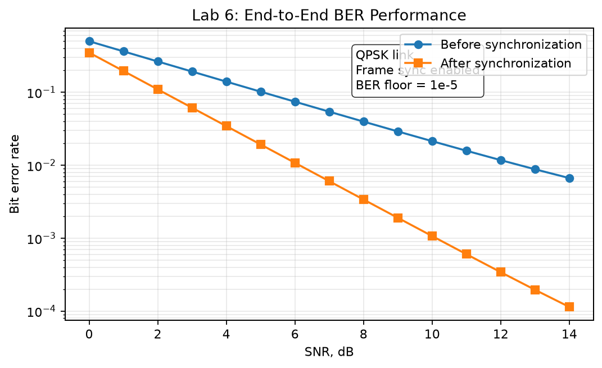

# Demo: IEEE-style SDR figures

This page shows automatically generated engineering figures for the SDR course.

The figures are generated by:

```bash
python tools/generate_ieee_plots.py
```

and updated by GitHub Actions.

## Metrics summary

| Lab | Figure | Engineering question |
|---|---|---|
| Lab 1 | Tone FFT | Is the generated tone at the expected frequency? |
| Lab 2 | AM vs FM | How does modulation type affect occupied bandwidth? |
| Lab 3 | QPSK constellation | How do noise and phase error affect IQ symbols? |
| Lab 4 | Synchronization | How does CFO correction improve the constellation? |
| Lab 5 | EVM | Which impairment degrades the signal most? |
| Lab 6 | BER | How much does synchronization improve receiver quality? |

## Lab 1 — Tone FFT



## Lab 2 — AM vs FM Spectrum



## Lab 3 — QPSK Constellation



## Lab 4 — Synchronization Impact



## Lab 5 — EVM vs Impairments



## Lab 6 — BER Performance


