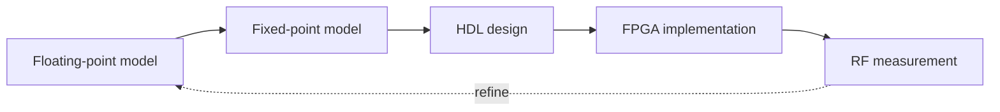

# DSP → FPGA Bridge

This page connects modeling with hardware implementation.

---

## Flow

---

## Key problems

| Stage | Problem |
|---|---|
| Fixed-point | quantization noise |
| HDL | latency / pipeline |
| FPGA | timing closure |
| RF | distortion |

---

## Engineering takeaway

Bridging DSP and FPGA is the hardest and most valuable part of SDR engineering.
