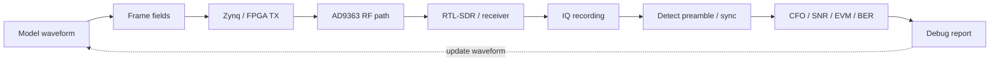

# Debug Waveform Design for SDR Hardware Bring-up

This guide complements hardware debug with a practical technique: **the debug waveform should be designed so that it is easy to find on air, measure and analyze offline**.

In a real SDR experiment, it is not enough to transmit an arbitrary BPSK/QPSK/OFDM stream. If the signal is not found, the spectrum looks strange or BER does not converge, a dedicated diagnostic format is required. It helps answer these questions:

- is anything being transmitted at all;
- at which frequency did it appear;
- are I and Q swapped;
- do NCO/mixer/FIR/interpolation work correctly;
- where does the packet start;
- what are the symbol rate and timing;
- is there clipping, overload or wrong gain;
- does the received payload match the expected one.

## Main idea

```text
A debug signal should be not only payload,
but also a diagnostic instrument.
```

For the course, it is therefore useful to have a dedicated **debug waveform format** — a training frame that can be transmitted through Zynq/AD9363 and observed through RTL-SDR/HDSDR or another independent receiver chain.

## Recommended debug frame format

```text
silence
lead-in tone
preamble
sync word
header
training sequence
payload / PRBS
CRC
silence
```

| Field | Purpose |
|---|---|
| `silence` | separates packets on the waterfall and allows measuring the noise floor |
| `lead-in tone` | helps quickly find the transmission in the spectrum |
| `preamble` | enables correlation-based packet start search |
| `sync word` | fixes the exact frame start and reduces false detections |
| `header` | carries mode, length, frame number and test parameters |
| `training sequence` | helps estimate CFO, phase, timing, SNR/EVM |
| `payload / PRBS` | verifies the bit pipeline and BER |
| `CRC` | separates packet detection from correct packet reception |

## Diagnostic route



## Preamble

A preamble is a known sequence transmitted before the useful part of the frame. It is used for signal search and coarse synchronization.

| Preamble type | Where it helps | What it verifies |
|---|---|---|
| Pure tone | first RF experiments | frequency, level, transmission presence |
| `101010...` | BPSK/FSK/simple packets | symbol rate and timing |
| Barker code | short training packets | correlation peak with short length |
| PN/m-sequence | noise-like search | robust correlation search |
| Zadoff-Chu | synchronization and offset estimation | good correlation profile |
| Chirp/sweep | visual waterfall search | bandwidth and frequency direction |

For the first labs, a simple option is enough:

```text
preamble_bits = 10101010101010101010101010101010
```

Later, the course can move to PN, Barker or Zadoff-Chu sequences.

## Sync word

After the preamble, transmit a unique synchronization word:

```text
sync_word = 0xA5A55A5A
```

It helps:

- distinguish a real packet from a random correlation peak;
- find the exact header/payload start;
- detect wrong bit order;
- detect wrong byte order;
- check bitstream inversion.

For the course, it is useful to show several variants and demonstrate how bit-order/endian mistakes look.

## Debug frame header

A minimal header:

```text
magic        uint32  0xA5A55A5A
version      uint8
mode_id      uint8
frame_id     uint32
payload_len  uint16
pattern_id   uint8
flags        uint8
```

| Field | Why it is needed |
|---|---|
| `version` | allows changing the frame format without ambiguity |
| `mode_id` | indicates which test was enabled |
| `frame_id` | helps find lost and duplicated frames |
| `payload_len` | gives the parser data length |
| `pattern_id` | describes payload: zeros, PRBS, counter, ASCII |
| `flags` | modes such as inversion, loopback, pilot enabled, etc. |

## Known payload

For debug, the payload should be predictable.

| Payload | What it diagnoses |
|---|---|
| `0x00 0x00 ...` | DC offset, reset, spurious components |
| `0xFF 0xFF ...` | saturation and logic inversion |
| `0xAA 0xAA ...` | timing and alternating bits |
| `0xCC 0xCC ...` | bit and symbol grouping |
| counter `0,1,2,3...` | lost words, frames, byte order |
| ASCII `ZYNQ-SDR-TEST` | quick visual decode check |
| seeded PRBS | BER and reproducible noise-like stream |

A good minimum payload for the course:

```text
frame_id
counter_0
counter_1
counter_2
...
crc16
```

## PRBS and seed

For BER tests, PRBS is useful. But the seed must be recorded explicitly:

```text
prbs_seed = 0x12345678
```

This allows:

- reconstructing the expected payload offline;
- computing BER;
- repeating the experiment;
- comparing MATLAB/fixed-point/RTL/hardware results.

## Pilot tone

A pilot tone can be added as a separate diagnostic element.

```text
pilot_offset = +50 kHz
pilot_level  = -20 dBc relative to useful signal
```

It helps:

- quickly find the transmission in the spectrum;
- estimate CFO and drift;
- verify the frequency-shift sign;
- monitor gain staging;
- detect overload through harmonics and spurs.

Important: the pilot must not break the useful signal. In training mode, it can be enabled separately through `mode_id` or `flags`.

## Training sequence

A training sequence is a known symbol sequence before the payload. It is useful for channel estimation and synchronization.

For BPSK:

```text
+1, +1, -1, +1, -1, -1, +1, ...
```

For QPSK, a known complex pattern can be used:

```text
(+1 + j), (-1 + j), (-1 - j), (+1 - j), ...
```

It can be used to estimate:

- CFO;
- phase offset;
- timing offset;
- SNR;
- EVM;
- IQ imbalance;
- channel frequency response;
- fixed-point/RTL scaling error.

## Packet transmission with gaps

For the first RF labs, do not transmit continuously. Use bursts:

```text
100 ms silence
packet
100 ms silence
packet
100 ms silence
packet
```

This gives:

- visible packets on the waterfall;
- noise measurement before and after the packet;
- convenient frame-start search;
- AGC behavior checks;
- simple TX-log and RX IQ alignment.

## Amplitude ladder

An amplitude ladder helps tune levels and find overload:

```text
packet at -30 dBFS
packet at -24 dBFS
packet at -18 dBFS
packet at -12 dBFS
packet at  -6 dBFS
```

Look for:

- clipping;
- harmonics;
- noise floor rise;
- BER/EVM change with level;
- normal operating boundary of ADC/RF frontend;
- effect of the external attenuator.

This mode is especially useful for a bench with a controlled digital attenuator.

## Frequency ladder

A frequency ladder verifies the frequency plan and frequency-shift signs:

```text
-200 kHz
-100 kHz
   0 kHz
+100 kHz
+200 kHz
```

It helps detect:

- wrong NCO sign;
- swapped I/Q;
- mirrored spectrum;
- frequency-axis error;
- wrong sample-rate interpretation;
- incorrect DUC/DDC settings.

## I/Q diagnostic modes

These modes should be included because I/Q mistakes are very common in SDR.

| Mode | What it diagnoses |
|---|---|
| `I = tone, Q = 0` | I channel, images, wrong complex path |
| `I = 0, Q = tone` | Q channel, quadrature sign |
| `I = Q` | constellation rotation/mirroring |
| `Q = -I` | sign inversion of one channel |
| `exp(+jωt)` | positive complex shift |
| `exp(-jωt)` | negative complex shift |
| swap I/Q flag | protection against wrong I/Q order |

If the student sees the signal on the wrong side of the spectrum, the first suspects are complex-tone sign and I/Q order.

## Two-tone test

A two-tone test:

```text
f1 = -100 kHz
f2 = +100 kHz
```

Useful for checking:

- linearity;
- intermodulation;
- clipping;
- spectral symmetry;
- gain effects;
- spurious components.

When overloaded, additional peaks can appear:

```text
2f1 - f2
2f2 - f1
f1 + f2
```

## Multitone / comb signal

A tone comb:

```text
-300 kHz, -200 kHz, -100 kHz, 0, +100 kHz, +200 kHz, +300 kHz
```

Used for:

- bandwidth verification;
- frequency-response estimation;
- edge roll-off search;
- FIR/CIC/interpolation checks;
- AD9363 RF bandwidth checks;
- model vs real IQ-capture comparison.

## Transmitter modes

The PS/FPGA should expose a controllable `tx_mode`:

```text
tx_mode = 0: off
tx_mode = 1: pure tone
tx_mode = 2: two-tone
tx_mode = 3: multitone / comb
tx_mode = 4: preamble only
tx_mode = 5: repeated sync word
tx_mode = 6: PRBS packet
tx_mode = 7: amplitude sweep
tx_mode = 8: frequency sweep
tx_mode = 9: full debug packet
```

This allows switching debug modes without rebuilding the bitstream.

## Minimal register map

| Register | Purpose |
|---|---|
| `tx_mode` | select debug mode |
| `frame_period_ms` | packet gap |
| `tone_offset_hz` | single-tone offset |
| `pilot_enable` | enable pilot |
| `pilot_offset_hz` | pilot offset |
| `amplitude_step_db` | amplitude ladder step |
| `frequency_step_hz` | frequency ladder step |
| `prbs_seed` | seed for BER test |
| `frame_id_reset` | reset frame counter |
| `status_frames_sent` | number of transmitted frames |

## What the experiment should save

For reproducibility, every IQ capture should include metadata:

```yaml
debug_waveform:
  mode_id: 9
  frame_format_version: 1
  preamble: alternating_1010
  sync_word: 0xA5A55A5A
  payload_pattern: prbs
  prbs_seed: 0x12345678
  frame_period_ms: 100
  pilot_enabled: true
  pilot_offset_hz: 50000
  tx_gain_db: -20
  external_attenuation_db: 40
  sample_rate_sps: 2400000
  rf_center_frequency_hz: 915000000
```

## Minimum success criteria

A debug-waveform experiment is successful if:

1. the signal is visible on the waterfall in the expected band;
2. the lead-in tone or packet burst is detected automatically;
3. preamble correlation produces a stable peak;
4. the sync word is found at the expected position;
5. `frame_id` increases without unexplained gaps;
6. CRC passes for a sufficient share of frames;
7. measured CFO/SNR/EVM/BER are saved in the report;
8. the result can be repeated from metadata and seed.

## Connection to course labs

This guide is useful across several blocks:

- Block 5: plan `tx_mode`, debug mux and testbench for modes;
- Block 6: find the signal in RF and verify levels;
- Block 7: verify the TX/RX chain;
- Block 8: use preamble and training sequence for synchronization;
- Block 9: record IQ and run offline replay;
- Block 11: assemble everything into a complete end-to-end SDR project.

## Takeaway

The preamble is only the first step. A good SDR bench should include a full set of debug signals: tone, preamble, sync word, PRBS, pilot, two-tone, multitone, amplitude sweep, frequency sweep and I/Q diagnostic modes.

These modes turn the experiment from guesswork into an engineering procedure:

```text
see signal → detect packet → verify sync → measure errors → prove the chain works
```
