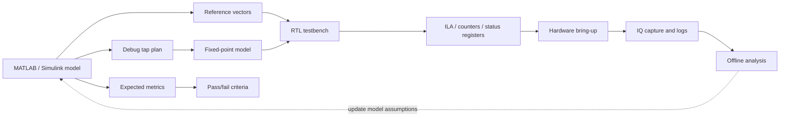

# Hardware Debug as Part of the Model

This guide adds an important engineering principle to the course: **hardware debug must be designed in advance**, not improvised after the first failed bitstream.

In an SDR/FPGA project, a bug rarely appears as a clear single log line. More often, the student only sees a system-level symptom: no signal, shifted spectrum, broken constellation, BER does not converge, AXI-Stream stalls, or the RTL-SDR shows something that looks close but not quite right. For that reason, the MATLAB/Simulink/fixed-point/RTL model must already define **how each part of the chain will be proven correct on real hardware**.

## Main idea

```text
The model should design not only the algorithm, but also the future hardware observability.
```

This means that the mathematical model should be accompanied by:

- signal tap points;
- expected spectra and levels;
- fixed-point/RTL error tolerances;
- latency budget;
- control/status register map;
- ILA/VIO or embedded-debug plan;
- test modes that can be enabled without rewriting RTL;
- IQ recording rules and offline-analysis alignment.

## Debug-by-design in the course flow



## What should be planned at model level

| Object | What to define in the model | How it helps on the board |
|---|---|---|
| Observation points | input, output of each DSP block, NCO output, mixer output, FIR output, rate-change output | makes it clear where the signal stopped matching the expectation |
| Data format | Q-format, signed/unsigned, I/Q order, scaling | helps find overflow, sign inversion and swapped I/Q |
| Latency | latency of each block and total chain latency | allows checking `valid` alignment, frames and timestamps |
| Amplitude budget | expected levels before/after filters, mixer and interpolation | exposes saturation, clipping and wrong gain early |
| Spectral expectation | center frequency, bandwidth, images, image rejection | turns RTL-SDR/spectrum observations into a testable hypothesis |
| Error tolerance | max abs error, RMS error, EVM, BER, SNR degradation | makes tests quantitative instead of visual only |
| Stimulus modes | tone, impulse, PRBS, packet, loopback | each mode isolates a different class of bugs |

## Minimum debug tap set

For the SDR chain in this course, it is useful to specify these taps early:

1. `tap_input_iq` — input stream after source/DMA/generator.
2. `tap_nco_iq` — NCO sine/cosine before mixing.
3. `tap_mixer_out_iq` — complex multiply result.
4. `tap_fir_out_iq` — pulse-shaping or matched-filter output.
5. `tap_rate_out_iq` — stream after interpolation/decimation/CIC.
6. `tap_frame_sync` — preamble/frame detection.
7. `tap_metric` — correlation metric, power estimate or RSSI-like estimate.
8. `tap_output_iq` — last digital stream before the RF frontend or after RX DSP.

Not every tap has to be physically routed at the same time. The important part is that the specification explains **which points can be connected to ILA, DMA snapshot or a debug mux**.

## Debug mux instead of repeated bitstream rebuilds

A small observation mux is often worth the cost:

```text
register debug_select
0: final output
1: input stream
2: NCO output
3: mixer output
4: FIR output
5: rate-change output
6: detector metric
```

Then the same capture path can observe different internal signals. This is especially useful on Zynq: the PS can switch `debug_select` through AXI-Lite, while the PL exposes the selected stream to ILA, DMA or a test RF/DAC path.

## Registers worth planning early

| Register | Purpose |
|---|---|
| `control.enable` | start/stop the block without rebuilding the bitstream |
| `control.reset_counters` | reset error and event counters |
| `debug_select` | choose the internal observation point |
| `status.locked` | synchronization/acquisition status |
| `status.overflow` | arithmetic, FIFO or DMA overflow |
| `status.underflow` | missing stream data |
| `status.frame_count` | number of processed frames |
| `status.error_count` | CRC/BER/packet-check errors |
| `status.max_abs_iq` | maximum amplitude for clipping search |
| `status.last_event` | code of the last diagnostic event |

Even if the first lab does not implement all registers, the model and HDL specification should show which status indicators will be needed at the bench.

## Required test modes

| Mode | What it verifies |
|---|---|
| Zero input | DC offset, spurious tones, reset problems |
| Constant tone | frequency plan, NCO, mixer, frequency sign, spectral images |
| Impulse | FIR/CIC response, latency, coefficient symmetry |
| PRBS bits | bit pipeline, BER, packet framing |
| Internal loopback | DSP without RF channel or external instruments |
| RF loopback through attenuator | combined PL, AD9363, analog path and measurement behavior |
| External RTL-SDR observation | independent proof of what is actually transmitted/received |

## How to reflect this in MATLAB/Simulink

The model should produce not only final plots, but also saved reference artifacts:

```text
artifacts/
  vectors/
    block_input_ci16.csv
    mixer_output_ci16.csv
    fir_output_ci16.csv
  plots/
    expected_spectrum.png
    expected_constellation.png
  reports/
    latency_budget.md
    debug_tap_plan.md
```

For each tap point, it is useful to save:

- sample rate;
- Q-format;
- complex convention: `I + jQ`;
- valid/ready assumptions;
- expected latency from the previous tap;
- expected frequency shift;
- acceptable numerical error.

## How to reflect this in RTL

The RTL block should contain not only the datapath, but also a diagnostic wrapper:

```text
DSP core
  ├── data path
  ├── valid/ready alignment
  ├── saturation/overflow flags
  ├── counters
  ├── debug mux
  └── AXI-Lite control/status registers
```

Minimum HDL checks:

- the testbench compares tap outputs against reference vectors;
- latency is verified numerically, not only by looking at waveforms;
- overflow/saturation cases are tested separately;
- the debug mux has a test for every selectable channel;
- reset does not leave stale values in status registers;
- valid/ready does not lose or duplicate samples.

## ILA/VIO plan before synthesis

Before running Vivado synthesis, fill in a table like this:

| Signal | Width | Clock domain | Trigger | Why it is needed |
|---|---:|---|---|---|
| `in_valid` | 1 | sample clk | rising edge | check incoming data |
| `out_valid` | 1 | sample clk | rising edge | check latency |
| `debug_iq_i` | 16 | sample clk | trigger on overflow | inspect internal stream |
| `debug_iq_q` | 16 | sample clk | trigger on overflow | inspect internal stream |
| `status_overflow` | 1 | AXI/control clk | high | find saturation/FIFO overflow |
| `frame_sync` | 1 | sample clk | rising edge | verify packet detector |
| `metric` | 16/32 | sample clk | threshold crossing | verify correlator/detector |

The main limitation is that ILA consumes BRAM and can make timing closure harder. The course should therefore teach that debug signals are part of the architecture, not a free afterthought.

## Connection to RF measurements

SDR hardware debug does not end at ILA. The internal digital points must be aligned with external observations:

| Inside FPGA | Outside the board |
|---|---|
| NCO/mixer frequency word | tone frequency on RTL-SDR or spectrum analyzer |
| FIR output level | signal level after RF gain/attenuator |
| packet/frame marker | packet appearance in the IQ recording |
| overflow flag | clipping, spurs or broken constellation |
| CFO estimate | shifted spectral peak in recorded IQ |
| BER/error counter | offline BER from a replay file |

## Typical bugs caught early by debug-by-design

- swapped I and Q;
- wrong frequency-shift sign;
- one lost sample around valid/reset boundaries;
- filter latency accounted incorrectly;
- FIR coefficients loaded with the wrong scale;
- saturation hidden until RF measurement;
- testbench passes, but hardware has no internal observation points;
- RTL-SDR shows a signal, but there is no evidence which block generated it.

## Minimum hardware-readiness criterion

Before programming the board, the student should answer:

1. Which internal points can be observed?
2. Which reference vectors correspond to these points?
3. What latency is expected between tap points?
4. Which registers show block state?
5. How can test tone, loopback or PRBS be enabled without rebuilding the bitstream?
6. Which signs should be visible in RTL-SDR/HDSDR?
7. What is the pass/fail result?

If these questions have no answers, moving to the board becomes guesswork.

## Takeaway

Debug-by-design connects modeling, RTL and the bench. It teaches the student to think not only about **how to implement a DSP block**, but also about **how to prove that this block works inside a real Zynq/SDR chain**.

For the course, this is essential: every lab should gradually reinforce that a good engineering result is not just a signal on the screen, but a reproducible chain:

```text
model expectation → RTL evidence → hardware observation → offline measurement → engineering decision
```
