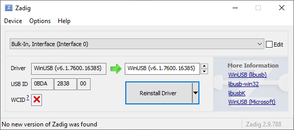
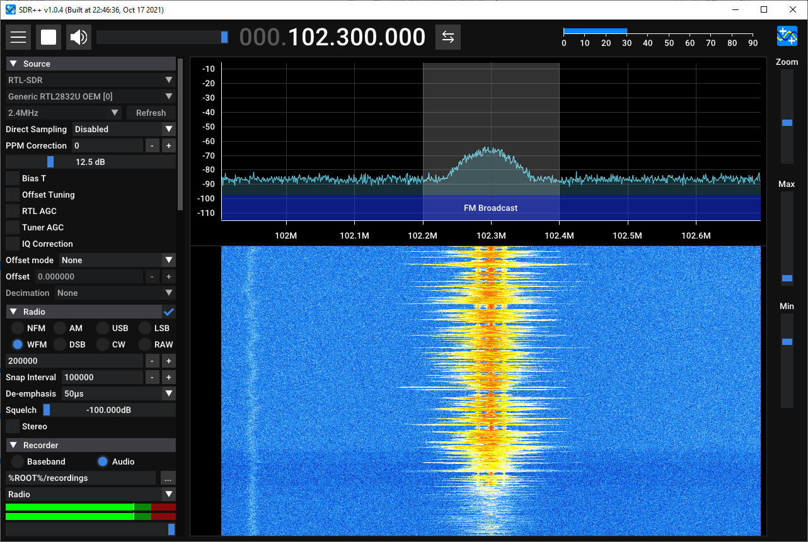
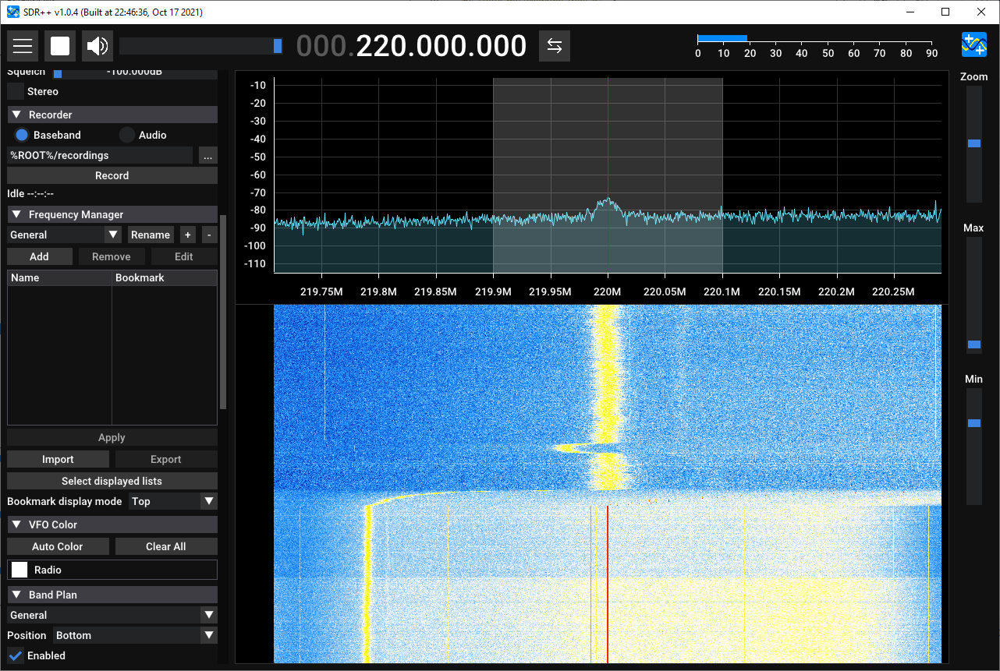

# Lab 1.0 — First RF Observation with RTL-SDR

## Purpose

This lab provides a gentle entry point before the controlled experiments with the **Zynq7020 + AD9363** SDR board. The student first observes a real RF spectrum, a waterfall display, and a short IQ recording using an accessible **RTL-SDR** receiver. The observations are then connected to later course topics: FFT, filtering, frequency translation, decimation, IQ formats, and FPGA implementation of DSP blocks.

Main idea: **SDR is not just a USB receiver and a colorful spectrum display. It is a way to move many functions of a classical radio receiver into digital signal processing.**

## Learning goals

After completing this lab, the student should be able to:

- connect an RTL-SDR receiver and check that it works;
- configure center frequency, sample rate, gain, and observation bandwidth;
- distinguish between spectrum and waterfall views;
- receive a wideband FM signal as a safe and visible first example;
- record a short IQ fragment;
- document the experiment in a reproducible way;
- explain which classical receiver blocks are replaced by SDR DSP blocks.

## Minimal setup

- RTL-SDR compatible receiver;
- antenna for the selected band;
- PC with HDSDR, SDRSharp, SDR++, or GNU Radio;
- RTL-SDR driver;
- folder for IQ recordings and the lab report.

The Zynq7020 + AD9363 board is not required for this lab. It appears in the next step, where the course moves from passive RF observation to the controlled loop: generation → RF → reception → IQ → analysis.

## Safety and legal notes

1. The lab is receive-only.
2. Do not connect RTL-SDR directly to a strong transmitter without attenuation and level control.
3. Do not publish the content of non-public service, aviation, governmental, or private communications.
4. For the lab report, a spectrum/waterfall screenshot, receiver settings, and a technical signal description are sufficient.
5. When operating near your own SDR transmitter, use attenuation, shielding, and minimum output power.

## Procedure

### 1. Device check

Connect RTL-SDR and confirm that the software detects it. Record:

- receiver model;
- software package;
- driver;
- sample rate;
- gain mode.

### 2. First spectrum view

Open a band with strong and easy-to-observe signals. Broadcast FM is a convenient first target.

Suggested starting parameters:

| Parameter | Initial value |
|---|---:|
| Mode | WFM |
| Sample rate | 2.048 MS/s or 2.4 MS/s |
| RF gain | manual, start low |
| FFT size | 4096...16384 |
| Audio bandwidth | default for WFM |
| Frequency correction | 0 ppm, then refine if needed |

Find a strong station, adjust gain so that the receiver is not overloaded, and capture a screenshot of the spectrum and waterfall.

### 3. Narrowband signal observation

Select one narrowband signal in an available band. The exact service is not important for the lab; the signal shape is important:

- narrow occupied bandwidth;
- visible peak or channel;
- clear difference from wideband FM;
- approximate bandwidth can be estimated from the spectrum.

Record center frequency, approximate bandwidth, and demodulation mode if known.

### 4. IQ recording

Record a short IQ fragment, 5...20 seconds long. Store the following parameters in the file name or in a sidecar text file:

```text
receiver: RTL-SDR
center_frequency_hz: <...>
sample_rate_hz: <...>
gain_db: <...>
format: complex IQ
software: <HDSDR / SDRSharp / SDR++ / GNU Radio>
duration_s: <...>
comment: first RF observation lab
```

These metadata are more important than the file itself: without them, an IQ recording is difficult to reproduce and interpret.

### 5. Link to DSP blocks

Fill in the mapping between what the SDR application displays and what will later be implemented in the DSP/FPGA chain.

| SDR application observation | DSP/FPGA meaning |
|---|---|
| Center frequency | RF frontend tuning or digital DDC setting |
| Signal offset from center | Residual frequency error, CFO, or tuning error |
| Signal bandwidth | Channel filter bandwidth |
| Waterfall | Spectrum evolution over time |
| Gain too high | ADC or RF-chain overload |
| Weak signal | SNR limitation, AGC and filtering problem |
| IQ file | Dataset for MATLAB/Python/C++/GNU Radio analysis |

## Real run examples

The figures below were collected from the first `RTL-SDR V3 Pro` and `SDR++` setup session. Together they show three practical states: binding `WinUSB` to the receive interface, tuning `WFM` to a broadcast FM station, and switching the recorder to `Baseband` before an IQ capture.



This is the real `Zadig` screenshot from this session: `Bulk-In, Interface (Interface 0)` is selected, the driver is `WinUSB`, and the receiver reports `USB ID 0BDA:2838:00`. This is the step that cleared the earlier `ProblemCode 28` driver error and brought the receive interface into an operational state.



`SDR++` after the initial broadcast-FM setup: `RTL-SDR` as the source, `102.3 MHz`, `2.4 MS/s`, manual gain, and `WFM` mode. This matches the lab's recommended starting point before the first broad spectrum survey.



The next practical step: the recorder is switched to `Baseband`, and the waterfall already shows an active narrowband signal near `220 MHz`. This is a suitable example state just before a short `5...20 s` IQ recording with sidecar metadata.

### Short recordings saved in this session

These short `WAV IQ` files are now part of the dataset package through `Git LFS`, while the manifests keep the checksums, capture settings, and offline-analysis command.

| Recording | Duration | Frequency | Manifest |
|---|---:|---:|---|
| `baseband_103119454Hz_08-55-55_19-06-2026.wav` | `5.422 s` | `103119454 Hz` | `datasets/lab1_0_rtl_sdr_observation/manifest_fm_103119454.yaml` |
| `baseband_220860000Hz_09-08-33_19-06-2026.wav` | `5.309 s` | `220860000 Hz` | `datasets/lab1_0_rtl_sdr_observation/manifest_narrowband_220860000.yaml` |

Both captures were recorded in `SDR++` at `2.4 MS/s` in a two-channel `WAV IQ` container (`int16 + int16`, little-endian) and can serve as the first real artifacts for Block 9 exercises on IQ file formats and metadata.
Before pushing to a public remote, review the legal/publication status of the narrowband recording near `220.860 MHz`.

For immediate offline analysis of these files, use `Lab 9.4 — Read WAV IQ and analyze spectrum`: `python blocks/block_09_recording_and_analysis_tools/python/lab_9_4_read_wav_iq_and_analyze.py --manifest <path-to-manifest>`.

## Report

The minimal report should include:

1. lab goal;
2. setup description;
3. spectrum and waterfall screenshot;
4. receiver parameter table;
5. short technical signal description;
6. IQ recording metadata;
7. conclusion: which operations were performed by the SDR software and which DSP blocks stand behind them.

## Control questions

1. What is the difference between a spectrum display and a waterfall display?
2. Why can excessive gain make reception worse?
3. What does sample rate mean in an SDR receiver?
4. Why is an IQ file without metadata almost useless?
5. Which digital block corresponds to the local oscillator of a classical receiver?
6. Which digital block corresponds to an intermediate-frequency filter?
7. Why are filtering and decimation usually performed after translating a signal toward zero frequency?

## Connection to following labs

This lab prepares the following course topics:

- Lab 1 — controlled tone: Zynq7020 + AD9363 → RTL-SDR → IQ analysis;
- Block 2 — sampling, spectrum, aliasing, and sample-rate selection;
- Block 3 — FFT, windows, FIR, digital mixing, and decimation;
- Block 5 — RTL implementation of DSP blocks;
- Block 6 — RF frontend, gain, frequency plan, and overload;
- Block 9 — IQ file format, metadata, and reproducible analysis.

## Practical outcome

After completing the lab, the student has the first independent RF artifact of the course: a spectrum screenshot, receiver settings, and a short IQ recording that can be reused in later sections for analysis, filtering, and tool comparison.
