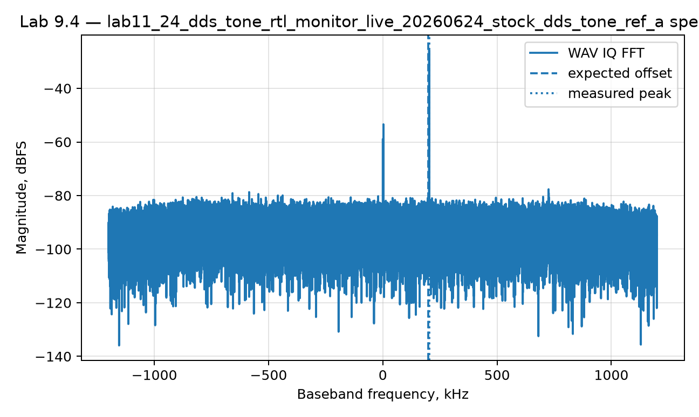
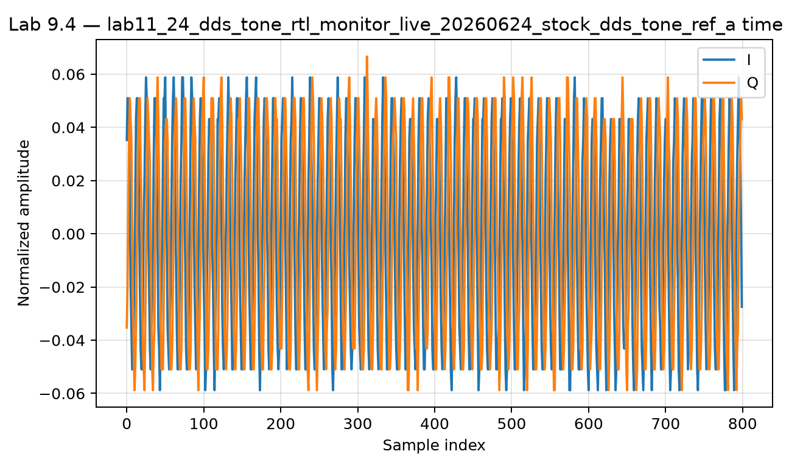

# Lab 1.1 — Controlled Zynq DDS Tone with RTL-SDR

## Purpose

This lab is the first controlled RF loop of the course:

```text
Zynq + AD9361 DDS tone -> short RF path -> RTL-SDR capture -> WAV IQ -> offline spectrum analysis
```

Unlike Lab 1.0, the signal source is no longer the outside world. The student now knows what the transmitter is supposed to generate and can check whether the external receiver confirms it.

## Why this matters

A single tone is the simplest controlled witness for:

- carrier tuning;
- sample-rate consistency;
- TX/RX gain discipline;
- clipping and overload checks;
- reproducible IQ recording with metadata.

If this step works, later BPSK/QPSK labs have a trustworthy RF baseline.

## Live reference run

The repository now includes a real `stock-shell` reference run captured on `2026-06-24` with:

| Parameter | Value |
|---|---:|
| Carrier frequency | `915 MHz` |
| Tone offset | `200 kHz` |
| Zynq sample rate | `3.84 MS/s` |
| RTL-SDR sample rate | `2.4 MS/s` |
| TX attenuation | `-40 dB` |
| RTL-SDR tuner gain | `20.0 dB` |
| Tone scale | `0.25` |

Measured result from the offline WAV analyzer:

| Metric | Value |
|---|---:|
| Measured peak | `202624.512 Hz` |
| Frequency error | `+2624.512 Hz` |
| SNR estimate | `66.40 dB` |
| Clipping fraction | `0` |
| Quality gate | `PASS` |

## Artifacts

- Capture report: `docs/assets/lab1124_dds_tone_rtl_monitor_live_20260624_stock_dds_tone_ref_a.json`
- Metrics JSON: `docs/assets/lab11_24_dds_tone_rtl_monitor_live_20260624_stock_dds_tone_ref_a_metrics.json`
- Dataset manifest: `datasets/lab11_24_dds_tone_rtl_monitor/manifest_live_20260624_stock_dds_tone_ref_a.yaml`
- Spectrum plot:



- Time preview:



## Reproduction

Capture:

```powershell
python blocks/block_11_integrated_sdr_project/python/lab_11_24_capture_dds_tone_rtl_monitor_wav.py `
  --mode stock `
  --run-tag live_20260624_stock_dds_tone_ref_a `
  --tone-offset-hz 200000 `
  --tone-scale 0.25 `
  --tx-attenuation-db -40 `
  --rx-gain-db 10 `
  --rtl-tuner-gain-db10 200 `
  --no-reboot-after
```

Offline analysis:

```powershell
python blocks/block_09_recording_and_analysis_tools/python/lab_9_4_read_wav_iq_and_analyze.py `
  --manifest datasets/lab11_24_dds_tone_rtl_monitor/manifest_live_20260624_stock_dds_tone_ref_a.yaml
```

## Engineering interpretation

This run closes the first controlled external-receiver example for Block 1:

- the tone is visible at the expected offset;
- the frequency error is small and explainable by LO/tuner mismatch;
- the SNR is high enough for a clear student report;
- the same WAV manifest can be replayed later in Block 9.

## Runtime extension

The same helper was first run on the true `runtime bridge_txrx_mux` overlay:

- report: `docs/assets/lab1124_dds_tone_rtl_monitor_live_20260624_runtime_dds_tone_ref_a.json`
- metrics: `docs/assets/lab11_24_dds_tone_rtl_monitor_live_20260624_runtime_dds_tone_ref_a_metrics.json`

That runtime run failed the tone quality gate: the expected `200 kHz` tone disappeared, and the strongest external peak collapsed near DC instead.

The witness was then repeated on progressively smaller runtime payloads:

| Payload | Measured peak | SNR estimate | Quality gate | Interpretation |
|---|---:|---:|---|---|
| `stock-shell` | `202624.5 Hz` | `66.4 dB` | `PASS` | Expected external `200 kHz` tone is visible |
| `vendor_only` | `2600.1 Hz` | `35.9 dB` | `FAIL` | Dominant peak collapses near DC |
| `gpreg_only` | `2636.7 Hz` | `36.9 dB` | `FAIL` | Same near-DC collapse |
| `bridge_rx_only` | `2636.7 Hz` | `36.9 dB` | `FAIL` | Same near-DC collapse |
| `bridge_txrx_mux` | `2636.7 Hz` | `38.7 dB` | `FAIL` | Same near-DC collapse |

Extended artifacts:

- `docs/assets/lab1124_dds_tone_rtl_monitor_live_20260624_vendor_only_dds_tone_a.json`
- `docs/assets/lab1124_dds_tone_rtl_monitor_live_20260624_gpreg_only_dds_tone_a.json`
- `docs/assets/lab1124_dds_tone_rtl_monitor_live_20260624_bridge_rx_only_dds_tone_a.json`
- `docs/assets/lab1125_stock_vs_runtime_dds_tone_sweep_live_20260624_sync_arm_test_a.json`

This was stronger than the original `bridge_txrx_mux`-only observation. Even the minimal editable non-stock shells already lost the external DDS witness, which localized the blocker to the runtime shell / hot-load RF path itself rather than the later course BPSK bridge logic.

A follow-up repair experiment then applied an explicit runtime post-reload DDS-core re-init:

| Payload + repair | Measured peak | SNR estimate | Quality gate | Interpretation |
|---|---:|---:|---|---|
| `vendor_only + cf_axi_dds rebind + RATECNTRL=3` | `202624.5 Hz` | `66.5 dB` | `PASS` | External `200 kHz` tone fully restored |
| `bridge_txrx_mux + cf_axi_dds rebind + RATECNTRL=3` | `202624.5 Hz` | `66.0 dB` | `PASS` | Full course overlay regains the external TX witness |

Repair artifacts:

- `docs/assets/lab1124_dds_tone_rtl_monitor_live_20260624_vendor_only_dds_tone_rebind_dds_a.json`
- `docs/assets/lab1124_dds_tone_rtl_monitor_live_20260624_vendor_only_dds_tone_rebind_dds_rate3_a.json`
- `docs/assets/lab1124_dds_tone_rtl_monitor_live_20260624_bridge_txrx_mux_dds_tone_rebind_dds_rate3_a.json`

An intermediate `cf_axi_dds` rebind without restoring `RATECNTRL` already brought the signal back, but at about `800 kHz` instead of `200 kHz`. That isolated a second missing post-reload step: the DAC rate-control register had to be restored to the stock value `3`.

This makes the lab useful well beyond Block 1. It is now both:

- the first controlled external-receiver lab of the course;
- a clean Block 11 witness proving that the external TX-path failure after runtime reload is repairable through post-reload AXI DDS re-initialization.
