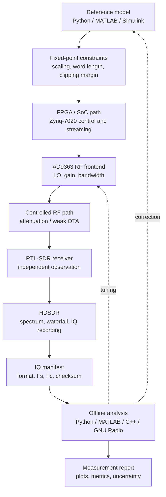

# End-to-end SDR demo roadmap

This page defines the flagship demonstration for the course: a complete route from a reference model to RF observation, IQ recording, offline analysis and final measurement reporting.

## Demo goal

Show that the course is not only theoretical. The learner should see one complete engineering chain:

```text
reference model -> fixed-point constraints -> HDL/FPGA path -> Zynq/AD9363 RF signal -> RTL-SDR/HDSDR observation -> IQ recording -> offline analysis -> measurement report
```

## Target demonstration

The recommended first flagship demo is a narrowband tone or simple QPSK signal because it is easy to validate visually and numerically.

| Variant | Benefit | Risk |
|---|---|---|
| Single tone | Simple FFT peak validation and RF path debugging. | Too simple for final project demonstration. |
| Two-tone signal | Adds linearity and intermodulation discussion. | Needs careful gain discipline. |
| QPSK burst | Demonstrates IQ, constellation, EVM and synchronization. | Requires more receiver processing. |
| OFDM mini-link | Strong final demo for modern SDR. | More complex and should come after QPSK. |

## Recommended v1: single tone hardware observation

### Stage 1: Reference model

Generate a complex baseband tone in Python, MATLAB or Simulink.

Required outputs:

- time-domain waveform plot;
- FFT / PSD plot;
- expected frequency offset;
- sample rate and duration;
- scaling assumptions.

### Stage 2: Fixed-point preparation

Convert the model to an implementation-friendly representation.

Required notes:

- sample width;
- amplitude scaling;
- clipping margin;
- quantization error;
- expected frequency bin location.

### Stage 3: FPGA / board path

Prepare the signal for Zynq/AD9363 transmission or replay.

Required notes:

- FPGA or software path used;
- interpolation / DAC rate assumption;
- TX LO frequency;
- TX gain;
- expected occupied bandwidth.

### Stage 4: RF safety and connection

Use the [RF safety guide](rf-safety.md) before connecting hardware.

Minimum connection record:

```text
TX source:
TX center frequency:
TX gain:
RF path:
Attenuation:
Receiver:
RX gain:
Sample rate:
Bandwidth:
Overload check:
```

### Stage 5: External observation

Use RTL-SDR and HDSDR as an independent observation path.

Required screenshots or exported data:

- HDSDR spectrum screenshot;
- waterfall screenshot when useful;
- IQ recording file;
- IQ metadata manifest.

### Stage 6: Offline analysis

Analyze the recorded IQ in at least two environments.

Recommended v1:

- Python for reproducible spectrum and peak detection;
- MATLAB or Simulink for educational comparison;
- optional C++ reader for portfolio-level engineering.

Required metrics:

| Metric | Purpose |
|---|---|
| Peak frequency offset | Checks frequency plan and sample rate. |
| Noise floor estimate | Checks receiver gain and environment. |
| Clipping indicator | Checks RF overload. |
| DC offset | Checks receiver quality and preprocessing. |
| IQ imbalance estimate | Optional for advanced analysis. |

### Stage 7: Final report

The final report should include:

- model parameters;
- implementation parameters;
- RF path and safety notes;
- IQ metadata;
- plots before and after capture;
- measurement metrics;
- discrepancy analysis;
- conclusion and next steps.

## Demo artifact checklist

| Artifact | Path suggestion |
|---|---|
| Reference model script | `blocks/block_11_integrated_sdr_project/scripts/` |
| Generated reference plots | `docs/assets/` |
| IQ manifest | `datasets/manifests/` |
| Analysis script | `tools/` or block-specific `scripts/` |
| Measurement report | `docs/lab01-tone-rf-iq-analysis.md` or project page |
| Safety checklist | Linked from `docs/rf-safety.md` |

## Mermaid system diagram



## V1 acceptance criteria

The first end-to-end demo is accepted when:

- the reference model and captured signal use the same documented frequency plan;
- the recorded IQ file has a manifest;
- the FFT peak is detected within the expected tolerance;
- the report includes RF safety notes;
- the demo can be repeated from documented commands;
- at least one generated plot is produced by a script;
- the result is linked from the MkDocs navigation.

## Future upgrade path

1. Replace the single tone with a QPSK burst.
2. Add EVM and BER metrics.
3. Add synchronization impairments and correction.
4. Add C++ fixed-point analysis for the recorded IQ.
5. Add Verilog block comparison for a selected DSP stage.
6. Add a final IEEE-style measurement report page.
