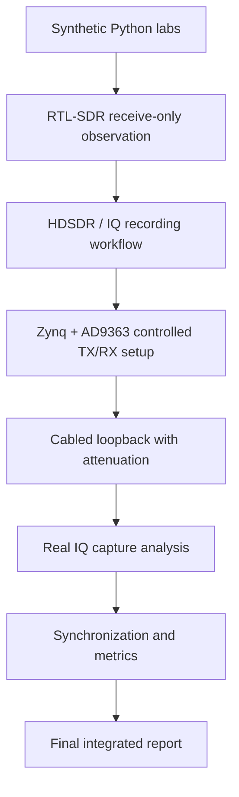
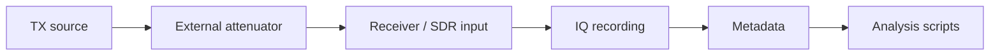

# Hardware Experiment Roadmap

This page defines the practical transition from synthetic labs to real SDR hardware experiments.

## Roadmap overview



## Experiment levels

| Level | Hardware | Goal | Required evidence |
|---|---|---|---|
| 0 | no hardware | run synthetic labs and CI | generated plots, metrics JSON |
| 1 | RTL-SDR only | observe external RF signals safely | spectrum screenshots, IQ metadata |
| 2 | RTL-SDR + HDSDR | record IQ and replay analysis | IQ file, metadata, FFT report |
| 3 | Zynq + AD9363 receive | configure RF frontend and capture | AD9363 settings, capture metrics |
| 4 | Zynq + AD9363 TX/RX loopback | controlled signal chain measurement | attenuation, frequency plan, EVM/SNR |
| 5 | FPGA-assisted DSP chain | verify RTL block in measurement loop | RTL PASS log, RF capture, metrics |
| 6 | integrated SDR project | full engineering report | final report, reproducibility package |

## Minimum safe hardware chain



## What to capture first

| Capture | Purpose | Expected analysis |
|---|---|---|
| noise floor | baseline receiver behavior | noise statistics, DC offset |
| single tone | frequency-plan validation | FFT peak, frequency error, SNR |
| two-tone | dynamic range sanity check | intermodulation/spur inspection |
| QPSK loopback | synchronization validation | constellation, EVM, BER |
| RTL-generated waveform | FPGA integration proof | latency, scaling, RF metrics |

## Metadata requirements

Every real capture should use:

```text
templates/capture_metadata.template.json
```

Required fields:

- sample rate;
- center frequency;
- IQ format;
- I/Q ordering;
- gain settings;
- external attenuation;
- expected signal offset;
- capture duration;
- hardware device names;
- analysis command.

## Safety gates

Before increasing experiment complexity, check:

- [ ] External attenuation is installed for any TX-to-RX loopback.
- [ ] TX starts at minimum gain.
- [ ] RX gain is manual and documented.
- [ ] FFT shows no overload/clipping.
- [ ] Metadata is complete.
- [ ] Capture can be analyzed with Block 9 tools.
- [ ] Results are summarized in a report template.

## Recommended sequence

1. Run `make smoke` without hardware.
2. Record a short RTL-SDR/HDSDR IQ file and create metadata.
3. Analyze the file with Block 9 workflow.
4. Configure AD9363 receive-only settings and repeat the analysis.
5. Add a safe attenuated loopback.
6. Measure a tone, then QPSK.
7. Apply Block 8 synchronization.
8. Package the result as a Block 11 integrated project.

## Success criteria

A hardware experiment is considered reproducible when another engineer can:

- identify the hardware setup;
- obtain or generate the IQ file;
- verify metadata;
- rerun the analysis command;
- reproduce the main FFT/constellation/metrics;
- understand limitations and safety assumptions.
