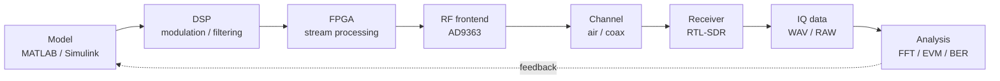

<div class="hero">

# Zynq SDR Course

**From mathematical model to real RF signal — engineering-grade SDR pipeline**

A complete path:
**Model → DSP → FPGA → RF → Measurement → Analysis**

<div class="hero-actions">
<a class="hero-button" href="model-to-measurement/">Explore pipeline</a>
<a class="hero-button secondary" href="demo/">View IEEE demo</a>
<a class="hero-button secondary" href="ru/">Русская версия</a>
</div>

<div class="badge-line">
<span class="badge-soft">DSP</span>
<span class="badge-soft">FPGA</span>
<span class="badge-soft">RF</span>
<span class="badge-soft">Measurement</span>
<span class="badge-soft">Zynq</span>
</div>

</div>

---

## 🚀 Engineering pipeline



---

## 📊 IEEE-style figures

<div class="figure-strip">


</div>

---

## 🧠 What makes this course different

- Full chain: **theory → hardware → measurement**
- Real RF signal, not simulation-only
- External validation via independent receiver
- IEEE-style reproducible figures

---

## ⚙️ Reproducibility

```bash
bash tools/reproduce_all.sh
```

All figures are generated automatically via CI.
