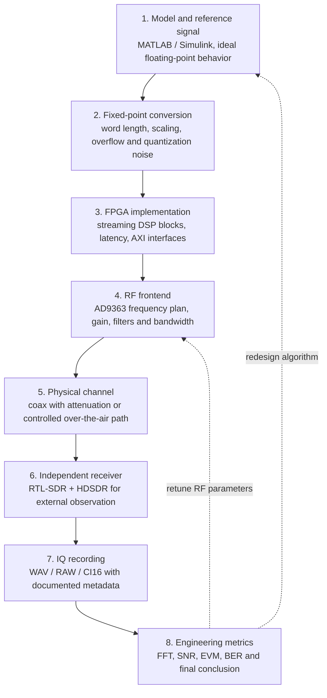

<div class="hero">

# Zynq SDR Course

**Engineering-grade SDR course: from mathematical model to measured RF signal**

This site is the main course workspace. It connects theory, MATLAB/Simulink modeling, fixed-point DSP, FPGA implementation, AD9363 RF hardware, RTL-SDR reception, IQ recording and reproducible analysis.

<div class="hero-actions">
<a class="hero-button" href="model-to-measurement/">Start with the system pipeline</a>
<a class="hero-button secondary" href="demo/">View IEEE-style figures</a>
<a class="hero-button secondary" href="ru/">Русская версия</a>
<a class="hero-button secondary" href="en/">English version</a>
</div>

<div class="badge-line">
<span class="badge-soft">MATLAB / Simulink</span>
<span class="badge-soft">Fixed-point DSP</span>
<span class="badge-soft">FPGA / HDL</span>
<span class="badge-soft">Zynq-7020</span>
<span class="badge-soft">AD9363</span>
<span class="badge-soft">RTL-SDR</span>
</div>

</div>

---

## Core engineering route



!!! tip "Main idea"
    The course is not simulation-only. Every important model decision must eventually be connected to a hardware signal and verified through measured data.

---

## What you will build

<div class="card-grid">

<div class="course-card">
<h3>1. Signal model</h3>
<p>Reference waveforms, sample-rate planning, modulation, filtering and expected spectra.</p>
</div>

<div class="course-card">
<h3>2. Fixed-point DSP</h3>
<p>Scaling, quantization, coefficient precision, overflow control and hardware-oriented validation.</p>
</div>

<div class="course-card">
<h3>3. FPGA signal path</h3>
<p>DDS/NCO, mixer, FIR, interpolation, AXI-Stream and real-time processing on Zynq.</p>
</div>

<div class="course-card">
<h3>4. RF measurement loop</h3>
<p>AD9363 transmit path, external reception through RTL-SDR, HDSDR observation and IQ recording.</p>
</div>

</div>

---

## Course quality pack

These pages turn the repository into a more complete engineering course workspace:

| Page | Purpose |
|---|---|
| [Course quality roadmap](course-quality-roadmap.md) | Defines the target level, checklist and backlog for course completion |
| [Course readiness matrix](course-readiness-matrix.md) | Tracks whether each block is documented, runnable, plotted and measurable |
| [Hardware bring-up checklist](hardware-bringup-checklist.md) | Gives a repeatable procedure for board, RF path and receiver setup |
| [SDR measurement report template](sdr-measurement-report-template.md) | Standardizes hardware/RF/IQ lab conclusions |
| [Lab report template](lab-report-template.md) | Gives a repeatable structure for each DSP/RF/FPGA lab report |
| [IQ recording metadata guide](iq-recording-metadata.md) | Standardizes real-signal captures so measurements can be reproduced |

---

## Hardware baseline

<div class="figure-strip">


</div>

---

## IEEE-style generated figures

<div class="figure-strip">


</div>

---

## Learning tracks

| Track | Start here | Engineering output |
|---|---|---|
| System view | [Model → FPGA → RF → Measurement](model-to-measurement.md) | End-to-end understanding of the SDR stand |
| Demo figures | [IEEE-style figures](demo.md) | Reproducible plots and validation examples |
| Hardware readiness | [Hardware bring-up checklist](hardware-bringup-checklist.md) | Repeatable board and RF setup |
| Course quality | [Course readiness matrix](course-readiness-matrix.md) | Transparent progress and engineering maturity |
| Russian course | [Русский обзор](ru/index.md) | RU learning path and block navigation |
| English course | [English overview](en/index.md) | EN learning path and block navigation |

---

## Reproducibility

```bash
bash tools/reproduce_all.sh
mkdocs serve
```

The project is designed so that figures, documentation and the learning path can evolve together through GitHub Actions and MkDocs.
