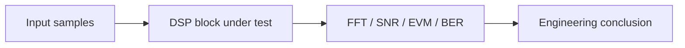

# SDR lab report template

Use this template for every practical lab and final project report. The goal is to make each result reproducible, measurable and easy to review.

## 1. Lab title

**Lab:** `<number and name>`  
**Author:** `<name>`  
**Date:** `<YYYY-MM-DD>`  
**Hardware:** `<board, RF module, receiver, cables, attenuators>`  
**Software:** `<MATLAB, Python, GNU Radio, HDSDR, Vivado, OS>`

## 2. Engineering objective

Describe the practical problem in one paragraph.

Example:

> Design and verify a digital mixer that shifts a complex baseband signal by a controlled frequency offset, then confirm the shift in the FFT spectrum and prepare the algorithm for FPGA implementation.

## 3. Signal and experiment parameters

| Parameter | Value | Comment |
|---|---:|---|
| Sample rate |  | Hz or MS/s |
| Signal bandwidth |  | Hz |
| Carrier / NCO frequency |  | Hz |
| Number of samples |  |  |
| Data type |  | float, int16, ci16, fixed-point |
| Window |  | rectangular, Hann, Blackman, etc. |
| FFT length |  |  |
| RF gain |  | dB |
| RF bandwidth |  | Hz |

## 4. Processing chain



Add a second diagram when the lab includes hardware:


## 5. Reference model

Explain the Python/MATLAB model:

- input signal generation;
- mathematical formula or algorithm;
- expected spectrum or constellation;
- numerical assumptions.

## 6. Fixed-point and FPGA mapping

| Item | Decision | Risk |
|---|---|---|
| Input word length |  | clipping / quantization |
| Coefficient word length |  | passband ripple / stopband leakage |
| Accumulator width |  | overflow |
| Scaling strategy |  | loss of dynamic range |
| Latency estimate |  | synchronization mismatch |
| Streaming interface |  | valid/ready stalls |

## 7. Results

Insert IEEE-style figures and short explanations.

### Figure checklist

- Axes have units.
- Frequency axis is centered or clearly defined.
- Legend does not overlap important data.
- Caption explains the engineering meaning.
- The script that generated the figure is referenced.

## 8. Metrics

| Metric | Value | Method |
|---|---:|---|
| SNR |  | signal/noise power estimate |
| EVM |  | RMS error vector |
| BER |  | bit errors / total bits |
| Frequency error |  | peak or estimator |
| Implementation error |  | floating-point vs fixed-point |

## 9. Measurement notes

Describe the real setup:

- RF path: coax, attenuator or antenna;
- gain values;
- sample rates;
- recording format;
- observed overload or clipping;
- environmental assumptions.

## 10. Engineering conclusion

Write 3–5 bullet points:

- what worked;
- what limited accuracy;
- what should be changed for FPGA or RF implementation;
- what should be measured next.

## 11. Reproducibility

```bash
python <script>.py
matlab -batch "run('<script>.m')"
mkdocs serve
```

Attach or reference:

- source code;
- generated figures;
- IQ metadata file;
- commit hash;
- hardware configuration.
