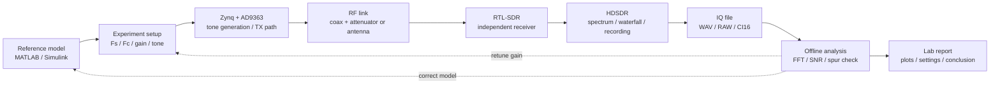
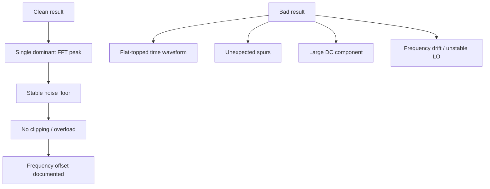

# Lab 1 — Tone → RF → IQ → Analysis

This showcase is the first complete engineering loop of the course. A simple tone is intentionally used because it makes every mistake visible: wrong sample rate, gain overload, frequency offset, clipping, image components and incorrect IQ interpretation.

---

## Goal

Build a minimal but real SDR experiment:

```text
reference tone → FPGA/RF transmitter → independent receiver → IQ file → offline analysis → engineering conclusion
```

---

## Measurement scenario



---

## Hardware setup

| Block | Role | Notes |
|---|---|---|
| Zynq-7020 + AD9363 | RF source | Generates or plays the tone through the SDR TX path |
| Coax / attenuator / antenna | RF channel | Coax + attenuation is preferred for repeatable early experiments |
| RTL-SDR | Independent receiver | Confirms that the signal is really present outside the board |
| HDSDR | Visual inspection and recording | Spectrum, waterfall, gain adjustment, IQ recording |
| MATLAB / Python / GNU Radio | Offline verification | Reproducible FFT and quantitative checks |

!!! warning "Do not start with maximum gain"
    The first lab should teach measurement discipline. Start with conservative TX and RX gain, then increase only after checking overload and clipping.

---

## Signal definition

Recommended initial parameters:

| Parameter | Example | Why |
|---|---:|---|
| Tone offset | 50 kHz | Clearly visible away from DC |
| Receiver sample rate | 2.4 MS/s | Common stable RTL-SDR setting |
| Capture duration | 2–10 s | Enough for FFT averaging and repeatability |
| RF path | coax + attenuator | Safer and more repeatable than over-the-air |
| File format | WAV or raw IQ | Easy to replay and analyze |

The exact values are less important than documenting them. Every plot must be traceable to the settings that produced it.

---

## Expected observations



---

## Analysis checklist

| Check | Pass condition | Engineering action if failed |
|---|---|---|
| Tone frequency | Peak appears at expected offset | Verify sample rate, LO, mixer sign and FFT axis |
| Noise floor | Stable and below the tone | Adjust gain and bandwidth |
| Clipping | No saturated IQ samples | Reduce TX/RX gain or add attenuation |
| Spurs | No unexpected strong images | Check DDS, mixer, filters and RF gain settings |
| Repeatability | Similar result after rerun | Save configuration and capture metadata |

---

## Demo figure


This generated FFT is the documentation target style: readable labels, visible peak, clean grid and enough context for a lab report.

---

## Minimum lab report

A completed Lab 1 report should include:

1. Hardware photo or connection diagram.
2. TX configuration: carrier, sample rate, tone offset, gain.
3. RX configuration: center frequency, sample rate, gain, bandwidth.
4. IQ recording format and duration.
5. FFT plot with frequency axis and units.
6. Engineering conclusion: correct / overloaded / wrong frequency / needs retuning.

---

## Why this lab matters

A tone looks simple, but it validates the entire experimental discipline:

```text
configuration → physical signal → independent capture → reproducible analysis
```

After this loop works, the same method scales to AM/FM, BPSK/QPSK, synchronization, EVM and BER experiments.
