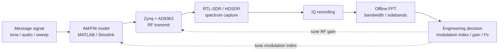

# Lab 2 — AM/FM → Spectrum → Bandwidth

Lab 2 extends the tone experiment into classical analog modulation. The goal is not only to generate AM/FM signals, but to compare model expectations with measured spectrum and bandwidth.

---

## Goal

```text
baseband signal → AM/FM model → RF transmission → spectrum capture → bandwidth decision
```

---

## Experiment flow



---

## What to compare

| Item | AM | FM |
|---|---|---|
| Main observable | carrier and sidebands | occupied bandwidth |
| Main tuning parameter | modulation depth | frequency deviation |
| Typical problem | overmodulation | too large deviation |
| Metric | sideband level | estimated occupied bandwidth |

---

## Common failure modes

| Symptom | Likely reason | Action |
|---|---|---|
| AM carrier dominates everything | modulation depth too small | increase modulation depth carefully |
| AM envelope distortion | overmodulation or clipping | reduce modulation depth or gain |
| FM spectrum too wide | excessive frequency deviation | reduce deviation |
| asymmetric spectrum | IQ imbalance, DC offset, LO leakage | check receiver and RF settings |

---

## Demo figure


---

## Minimum report

1. Modulation type and parameters.
2. TX/RX sample rates and RF frequency.
3. Captured spectrum plot.
4. Bandwidth estimate.
5. Explanation of mismatch between model and measurement.

---

## Engineering takeaway

Lab 2 teaches that modulation is not only a formula. In real SDR work, modulation parameters are engineering trade-offs between bandwidth, power, distortion and receiver limits.
