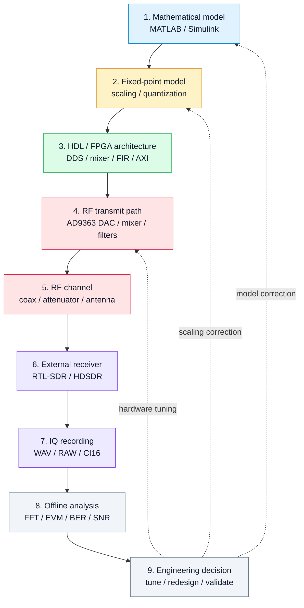
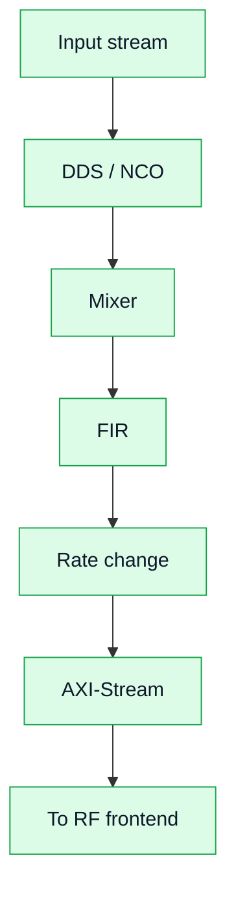

# Model → FPGA → RF → Measurement

This page explains the central engineering route of the course: how a signal moves from a mathematical model to real RF hardware and then returns as measured IQ data.

Эта страница показывает центральный инженерный маршрут курса: как сигнал проходит путь от математической модели к RF-железу и возвращается в виде измеренных IQ-данных.

## End-to-end route



## Why this route matters

The same signal is observed at several engineering levels:

| Level | Representation | Main question |
|---|---|---|
| Model | floating-point samples | Does the algorithm work ideally? |
| Fixed-point | quantized samples | Is numerical accuracy still acceptable? |
| FPGA | streaming hardware pipeline | Can it run in real time? |
| RF frontend | analog/RF waveform | Does the physical signal exist and stay clean? |
| Receiver | captured IQ data | What does an independent receiver observe? |
| Metrics | FFT, EVM, BER, SNR | Is the result good enough? |

## 1. Model

The model defines the intended signal. At this level it is convenient to work with floating-point values, visual scopes, and reference plots.

Typical tasks:

- generate a tone or modulation waveform;
- define sample rate and center frequency assumptions;
- validate spectrum and time-domain behavior;
- prepare reference vectors.

## 2. Fixed-point

Before moving to FPGA, the model must be converted to finite word length arithmetic.

Key risks:

- quantization noise;
- overflow;
- clipping;
- incorrect scaling;
- coefficient precision loss.

!!! warning "Engineering discipline"
    Fixed-point conversion is not a mechanical step. Every scaling decision can change the measured RF result.

## 3. FPGA architecture

The FPGA implementation is a streaming pipeline, not sequential software.

Typical blocks:

- DDS / NCO;
- digital mixer;
- FIR filter;
- interpolator / decimator;
- AXI-Stream interface.



## 4. RF frontend

The AD9363 converts the digital stream into a physical RF signal.

Important parameters:

- carrier frequency;
- sample rate;
- analog bandwidth;
- TX/RX gain;
- filtering;
- LO and frequency accuracy.

## 5. Measurement

The external receiver closes the loop. RTL-SDR and HDSDR provide a simple way to observe the emitted signal independently.

Measurement artifacts to watch:

- receiver overload;
- weak SNR;
- spurious components;
- frequency offset;
- wrong gain settings;
- missing or incorrect IQ metadata.

## 6. Metrics

The course uses visual and quantitative checks:

| Metric | Used for |
|---|---|
| FFT | tone frequency, bandwidth, spurs |
| SNR | signal/noise estimate |
| EVM | constellation quality |
| BER | final digital receiver quality |

## Example figures

### FFT validation


### QPSK constellation


### BER performance


## Engineering takeaway

A good SDR experiment is not complete when the signal is visible. It is complete when the chain is measured, documented, and explained:

```text
model expectation → hardware behavior → measured data → engineering conclusion
```
