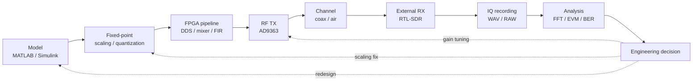
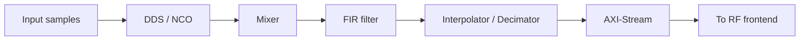
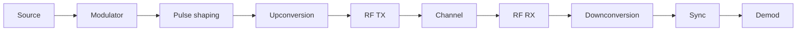
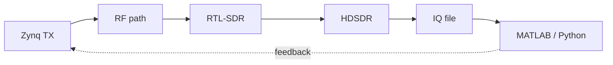

# Model → FPGA → RF → Measurement

This page is the **core of the course**. It describes how a signal travels from a mathematical idea to a real RF waveform and back to data.

---

## End-to-end system view



---

## Engineering interpretation

| Stage | Key risk | What you verify |
|---|---|---|
| Model | wrong assumptions | spectrum, waveform |
| Fixed-point | quantization | SNR degradation |
| FPGA | architecture | real-time capability |
| RF | analog effects | distortions, gain |
| Receiver | measurement errors | independent observation |
| Analysis | wrong metrics | false conclusions |

---

## FPGA signal path



---

## SDR TX/RX chain



---

## Measurement loop



---

## Key takeaway

```text
Model → Hardware → Measurement → Decision
```

If any stage is skipped, the engineering result is unreliable.
