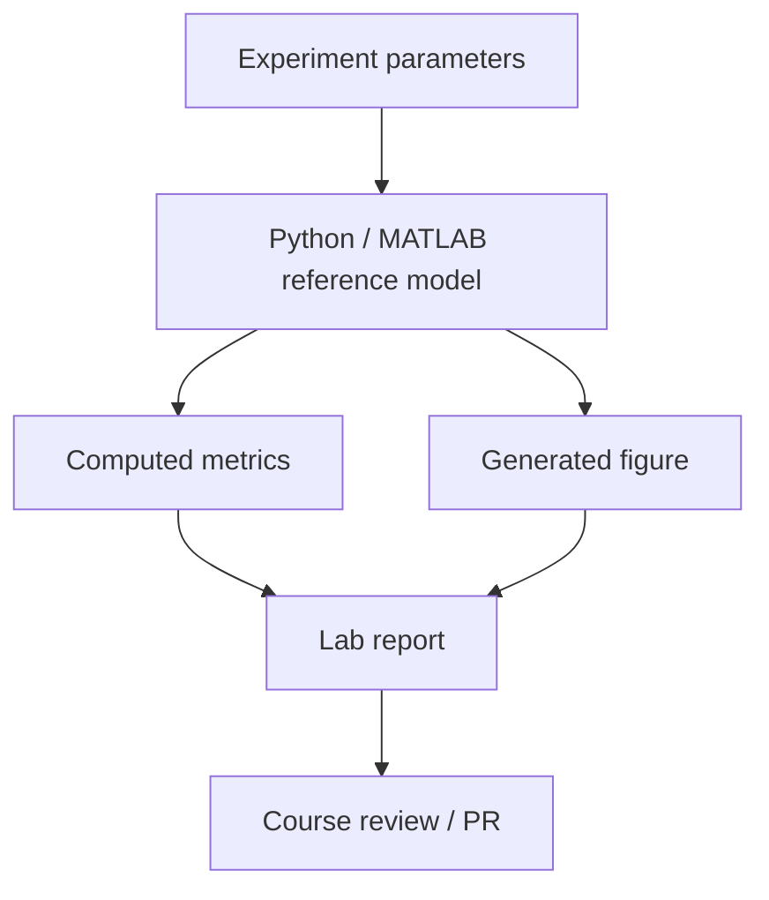

# Reproducibility guide

This guide explains how to rebuild the documentation, regenerate figures and keep lab results traceable.

## Local documentation build

Install the documentation dependencies:

```bash
python -m venv .venv
source .venv/bin/activate
pip install mkdocs mkdocs-material pymdown-extensions
```

Build the site strictly:

```bash
mkdocs build --strict
```

Preview locally:

```bash
mkdocs serve
```

## Figure generation

The repository uses IEEE-style generated figures. The expected workflow is:

```bash
python tools/generate_ieee_plots.py
```

After generation, verify that the following paths are updated only when the corresponding lab data or plotting logic changed:

```text
docs/assets/lab01_fft.png
docs/assets/lab02_am_vs_fm.png
docs/assets/lab03_constellation.png
docs/assets/lab04_sync_constellation.png
docs/assets/lab05_evm.png
docs/assets/lab06_ber.png
```

## Block 4 executable labs

Block 4 contains executable fixed-point labs. Install the Python dependencies:

```bash
python -m pip install numpy matplotlib
```

Run the labs:

```bash
python blocks/block_04_simulink_and_fixed_point/python/lab_4_1_fixed_point_fir.py
python blocks/block_04_simulink_and_fixed_point/python/lab_4_2_fixed_point_digital_mixer.py
```

Expected generated figures:

```text
docs/assets/lab41_fixed_point_fir_response.png
docs/assets/lab41_fixed_point_fir_spectrum.png
docs/assets/lab41_fixed_point_fir_error.png
docs/assets/lab42_fixed_point_mixer_spectrum.png
docs/assets/lab42_fixed_point_mixer_error.png
docs/assets/lab42_nco_frequency_resolution.png
```

The GitHub Actions workflow `.github/workflows/block4_labs.yml` runs these Python labs and validates that all expected figures are generated.

## Recommended lab execution flow



## Reproducible lab package

Each lab should eventually provide:

```text
lab-name/
  README.md
  python/
    run_lab.py
  matlab/
    run_lab.m
  cpp/
    CMakeLists.txt
    main.cpp
  data/
    README.md
  figures/
    generated_plot.png
  report/
    lab_report.md
```

For small labs, the files may remain in shared `examples/`, `tools/` and `docs/assets/` folders, but the report must clearly reference the exact scripts and figure paths.

## Metrics reproducibility

| Metric | Required reproducibility notes |
|---|---|
| FFT peak | sample rate, FFT length, window, normalization |
| SNR | signal band, noise band, exclusion region around carrier |
| EVM | reference symbols, synchronization method, RMS normalization |
| BER | bit mapping, frame alignment, number of compared bits |
| Frequency error | estimator method, averaging interval, expected frequency |
| Fixed-point error | reference type, word length, scaling, saturation/wrap mode |

## IQ recording reproducibility

Every real IQ recording must include metadata:

```text
capture_name.ci16
capture_name.json
```

The metadata file should follow the [IQ recording metadata guide](iq-recording-metadata.md).

## Pull request checklist

Before merging a lab or course update, check:

- `mkdocs build --strict` passes;
- all new pages are linked from `mkdocs.yml`;
- generated figures are referenced from at least one page;
- scripts have deterministic parameters or documented random seeds;
- real IQ data is not committed if it is too large;
- large recordings are stored externally or through Git LFS with a small metadata stub;
- the lab includes a short engineering conclusion.

## CI target

The ideal CI pipeline should contain these jobs:

| Job | Purpose |
|---|---|
| `docs-build` | Run `mkdocs build --strict` |
| `plot-generation` | Regenerate IEEE-style figures |
| `block4-labs` | Run fixed-point Python labs and validate generated figures |
| `link-check` | Validate internal and external links |
| `python-labs` | Run Python examples and smoke tests |
| `cpp-labs` | Build C++ examples with CMake |
| `metadata-check` | Validate IQ metadata JSON files |

## Determinism rules

- Use fixed random seeds for generated examples.
- Store figure-generation parameters near the script.
- Do not manually edit generated images.
- Prefer small synthetic datasets for CI.
- Keep real recordings documented but avoid repository bloat.
